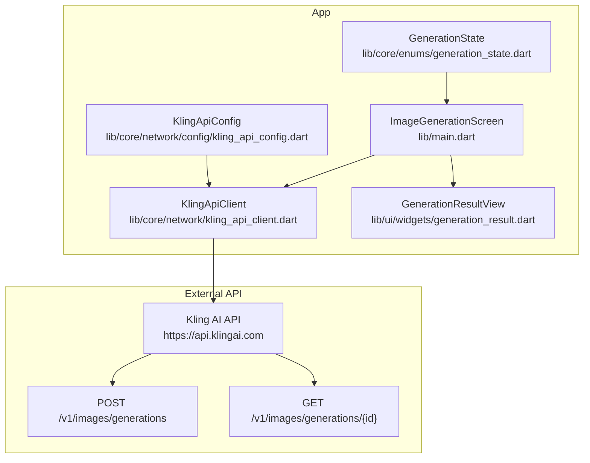
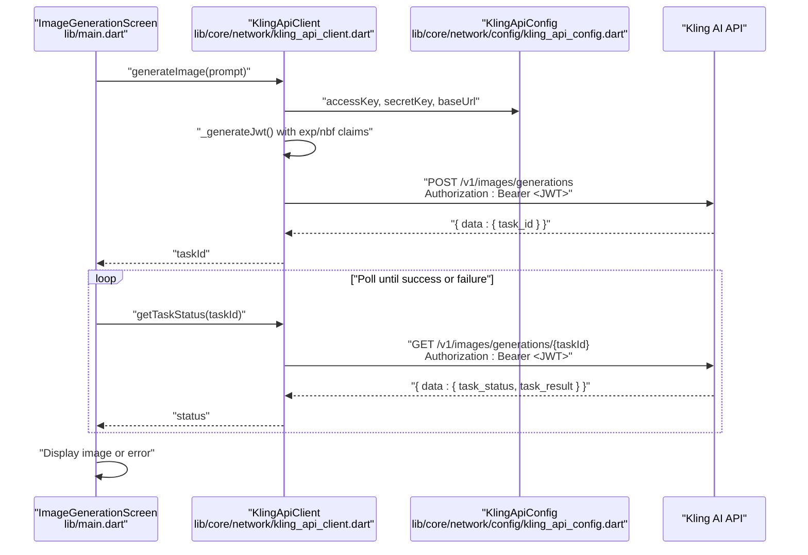
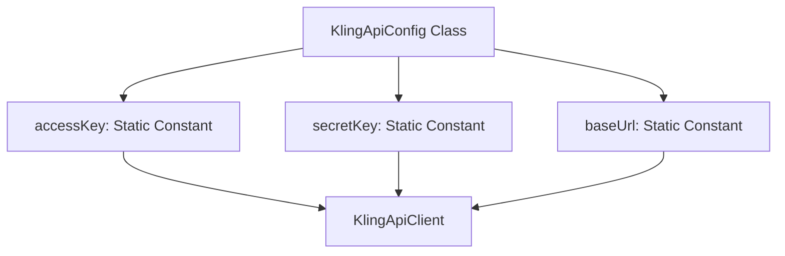
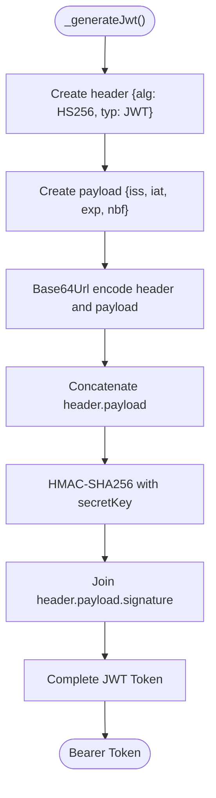
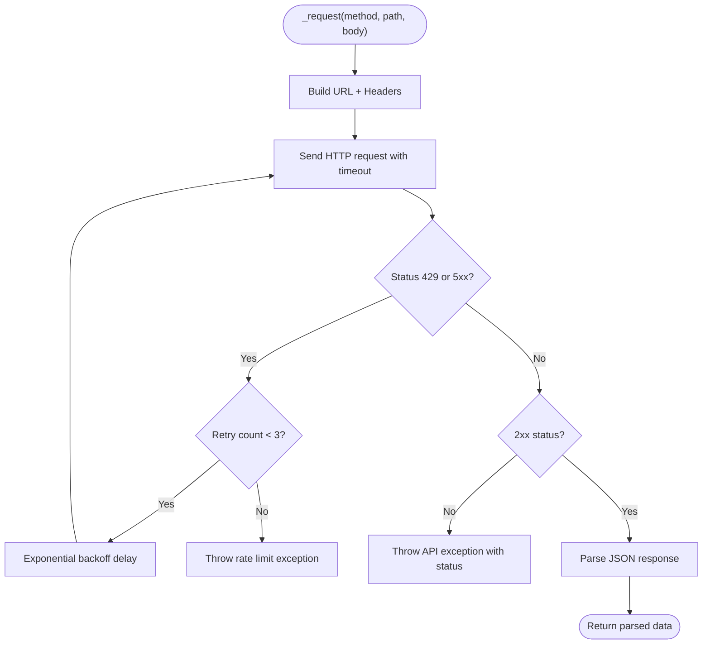
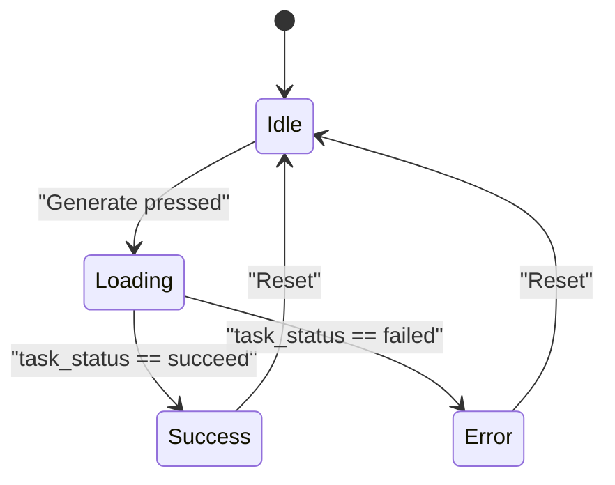
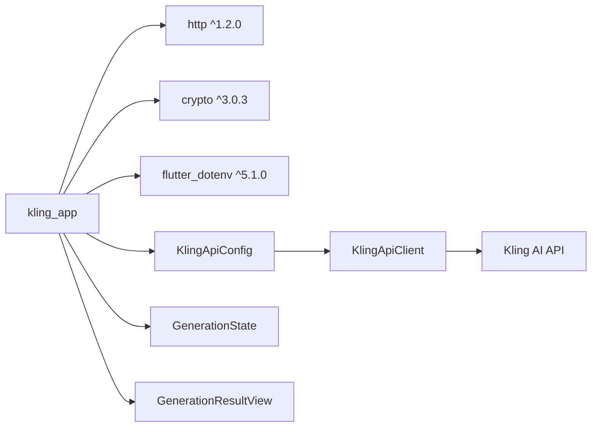

# API Integration

<cite>
**Referenced Files in This Document**
- [kling_api_config.dart](file://lib/core/network/config/kling_api_config.dart)
- [kling_api_client.dart](file://lib/core/network/kling_api_client.dart)
- [main.dart](file://lib/main.dart)
- [generation_state.dart](file://lib/core/enums/generation_state.dart)
- [generation_result.dart](file://lib/ui/widgets/generation_result.dart)
- [pubspec.yaml](file://pubspec.yaml)
- [env.txt](file://env.txt)
</cite>

## Update Summary
**Changes Made**
- Updated authentication system from environment variable-based to centralized JWT-based configuration
- Added new kling_api_config.dart with accessKey, secretKey, and baseUrl constants
- Enhanced JWT token generation with proper expiration handling (1-hour validity)
- Updated client authentication to use centralized configuration instead of environment variables
- Removed environment loading dependency (flutter_dotenv) from main implementation

## Table of Contents
1. [Introduction](#introduction)
2. [Project Structure](#project-structure)
3. [Core Components](#core-components)
4. [Architecture Overview](#architecture-overview)
5. [Detailed Component Analysis](#detailed-component-analysis)
6. [Dependency Analysis](#dependency-analysis)
7. [Performance Considerations](#performance-considerations)
8. [Troubleshooting Guide](#troubleshooting-guide)
9. [Conclusion](#conclusion)
10. [Appendices](#appendices)

## Introduction
This document provides API integration documentation for the Kling AI service used by the Flutter application. It focuses on the RESTful API endpoints for asynchronous image generation, including the POST /v1/images/generations endpoint and the GET /v1/images/generations/{id} endpoint used for polling task status. The system now uses a centralized JWT-based authentication system with embedded credentials for secure API access.

## Project Structure
The API integration is now organized with a centralized configuration system and dedicated client classes. The architecture separates concerns between configuration management, authentication, and API interaction.

**Diagram sources**
- [kling_api_client.dart:23-117](file://lib/core/network/kling_api_client.dart#L23-L117)
- [kling_api_config.dart:1-6](file://lib/core/network/config/kling_api_config.dart#L1-L6)
- [main.dart:29-164](file://lib/main.dart#L29-L164)
- [generation_state.dart:1-2](file://lib/core/enums/generation_state.dart#L1-L2)
- [generation_result.dart:4-58](file://lib/ui/widgets/generation_result.dart#L4-L58)

**Section sources**
- [kling_api_client.dart:23-117](file://lib/core/network/kling_api_client.dart#L23-L117)
- [kling_api_config.dart:1-6](file://lib/core/network/config/kling_api_config.dart#L1-L6)
- [main.dart:29-164](file://lib/main.dart#L29-L164)
- [generation_state.dart:1-2](file://lib/core/enums/generation_state.dart#L1-L2)
- [generation_result.dart:4-58](file://lib/ui/widgets/generation_result.dart#L4-L58)

## Core Components
- **Centralized Configuration**: Static constants for accessKey, secretKey, and baseUrl managed in KlingApiConfig class
- **Enhanced JWT Authentication**: HS256 algorithm with proper expiration (1 hour) and not-before claims
- **Robust Request Layer**: HTTP client with timeouts, exponential backoff, and comprehensive error handling
- **Asynchronous Image Generation**: Task-based workflow with polling mechanism for completion status
- **State Management**: Enum-based state tracking for UI responsiveness and user feedback

Key behaviors:
- JWT tokens include iss (issuer), exp (expiration), and nbf (not-before) claims with 1-hour validity
- POST /v1/images/generations returns task_id for asynchronous processing
- GET /v1/images/generations/{id} provides task status and results upon completion
- Automatic retry logic for 429 and 5xx errors with exponential backoff (1s, 2s, 4s)
- Comprehensive exception handling for network, parsing, and API errors

**Section sources**
- [kling_api_config.dart:1-6](file://lib/core/network/config/kling_api_config.dart#L1-L6)
- [kling_api_client.dart:24-41](file://lib/core/network/kling_api_client.dart#L24-L41)
- [kling_api_client.dart:59-94](file://lib/core/network/kling_api_client.dart#L59-L94)
- [kling_api_client.dart:96-116](file://lib/core/network/kling_api_client.dart#L96-L116)
- [generation_state.dart:1-2](file://lib/core/enums/generation_state.dart#L1-L2)

## Architecture Overview
The updated architecture implements a centralized configuration system with enhanced security through embedded JWT credentials. The UI triggers image generation, which delegates to the client that handles authentication and asynchronous task management.

**Diagram sources**
- [main.dart:59-99](file://lib/main.dart#L59-L99)
- [kling_api_client.dart:24-41](file://lib/core/network/kling_api_client.dart#L24-L41)
- [kling_api_client.dart:96-116](file://lib/core/network/kling_api_client.dart#L96-L116)

## Detailed Component Analysis

### Centralized Configuration System
The new configuration approach replaces environment variables with static constants for improved security and reliability.

**Configuration Constants:**
- `accessKey`: Primary authentication identifier for JWT issuer
- `secretKey`: Cryptographic key for JWT signature verification
- `baseUrl`: API endpoint base URL for all requests

**Diagram sources**
- [kling_api_config.dart:1-6](file://lib/core/network/config/kling_api_config.dart#L1-L6)

**Section sources**
- [kling_api_config.dart:1-6](file://lib/core/network/config/kling_api_config.dart#L1-L6)

### Enhanced JWT Authentication and Token Generation
The authentication system now generates properly structured JWT tokens with comprehensive claims and expiration handling.

**JWT Structure:**
- **Algorithm**: HS256 (HMAC-SHA256)
- **Issuer (iss)**: accessKey from configuration
- **Expiration (exp)**: Current timestamp + 3600 seconds (1 hour)
- **Not Before (nbf)**: Current timestamp
- **Signature**: HMAC-SHA256 over encoded header.payload using secretKey

**Diagram sources**
- [kling_api_client.dart:24-41](file://lib/core/network/kling_api_client.dart#L24-L41)

**Section sources**
- [kling_api_client.dart:24-41](file://lib/core/network/kling_api_client.dart#L24-L41)

### Request Layer and Retry Logic
The request handling system provides robust error handling with comprehensive retry mechanisms and timeout management.

**Request Processing Flow:**
- URL construction using centralized baseUrl
- Header inclusion with Content-Type and Authorization
- HTTP client with 30-second timeout for all requests
- Automatic retry logic for 429 and 5xx status codes
- Exponential backoff (1s, 2s, 4s) with maximum 3 attempts
- Comprehensive exception handling for various error scenarios

**Diagram sources**
- [kling_api_client.dart:59-94](file://lib/core/network/kling_api_client.dart#L59-L94)

**Section sources**
- [kling_api_client.dart:59-94](file://lib/core/network/kling_api_client.dart#L59-L94)

### Image Generation Endpoint: POST /v1/images/generations
The image generation endpoint initiates asynchronous image creation with comprehensive parameter handling.

**Request Details:**
- **Method**: POST
- **Endpoint**: /v1/images/generations
- **Headers**: Content-Type: application/json, Authorization: Bearer <JWT>
- **Request Body**:
  - `prompt`: User description of desired image
  - `n`: Number of images (default: 1)
  - `size`: Image dimensions (default: "1024x1024")

**Response Handling:**
- Extracts `task_id` from response data
- Throws exception if task_id is missing
- Initiates polling mechanism for completion status

**Section sources**
- [kling_api_client.dart:96-110](file://lib/core/network/kling_api_client.dart#L96-L110)

### Task Status Endpoint: GET /v1/images/generations/{id}
The task status endpoint retrieves completion status and results for asynchronous image generation.

**Request Details:**
- **Method**: GET
- **Endpoint**: /v1/images/generations/{id}
- **Headers**: Content-Type: application/json, Authorization: Bearer <JWT}

**Response Schema:**
- `data.task_status`: Generation status ("succeed", "failed", etc.)
- `data.task_result`: Contains images array when succeed
  - `images.url`: Direct download URL for generated image

**Polling Behavior:**
- UI polls every 2 seconds until completion
- Handles both success and failure states
- Extracts first image URL upon successful completion

**Section sources**
- [kling_api_client.dart:112-116](file://lib/core/network/kling_api_client.dart#L112-L116)
- [main.dart:73-87](file://lib/main.dart#L73-L87)

### UI Integration and State Management
The UI provides comprehensive state management with responsive feedback and error handling.

**State Management:**
- `GenerationState` enum: idle, loading, success, error
- Real-time UI updates based on generation progress
- Loading indicators during asynchronous processing
- Error messages for user feedback

**UI Features:**
- Prompt input with validation
- Disabled button during generation
- Loading spinner with status text
- Image display upon successful completion
- Error state with detailed messaging

**Diagram sources**
- [main.dart:59-99](file://lib/main.dart#L59-L99)
- [generation_state.dart:1-2](file://lib/core/enums/generation_state.dart#L1-L2)

**Section sources**
- [main.dart:59-99](file://lib/main.dart#L59-L99)
- [generation_state.dart:1-2](file://lib/core/enums/generation_state.dart#L1-L2)
- [generation_result.dart:4-58](file://lib/ui/widgets/generation_result.dart#L4-L58)

## Dependency Analysis
The project maintains minimal external dependencies focused on core functionality.

**External Dependencies:**
- `http: ^1.2.0`: HTTP client for API communication
- `crypto: ^3.0.3`: Cryptographic functions for JWT signing
- `flutter_dotenv: ^5.1.0`: Environment variable loading (declared but unused in current implementation)

**Internal Dependencies:**
- `KlingApiConfig`: Centralized configuration management
- `GenerationState`: State management for UI consistency
- `GenerationResultView`: UI component for displaying results

**Diagram sources**
- [pubspec.yaml:30-39](file://pubspec.yaml#L30-L39)
- [kling_api_config.dart:1-6](file://lib/core/network/config/kling_api_config.dart#L1-L6)
- [kling_api_client.dart:23-117](file://lib/core/network/kling_api_client.dart#L23-L117)

**Section sources**
- [pubspec.yaml:30-39](file://pubspec.yaml#L30-L39)
- [kling_api_config.dart:1-6](file://lib/core/network/config/kling_api_config.dart#L1-L6)
- [kling_api_client.dart:23-117](file://lib/core/network/kling_api_client.dart#L23-L117)

## Performance Considerations
The system implements several performance optimizations for reliable API interaction.

**Optimization Strategies:**
- **Timeout Management**: 30-second timeout for all requests to prevent hanging connections
- **Exponential Backoff**: Reduces API load during rate limiting (1s, 2s, 4s delays)
- **Polling Intervals**: 2-second intervals balance responsiveness with API efficiency
- **Token Reuse**: JWT tokens are generated per-request with proper expiration handling
- **Memory Management**: Proper disposal of controllers and resources in UI lifecycle

**Security Considerations:**
- Embedded credentials provide immediate availability but require careful deployment
- 1-hour token expiration prevents long-term credential exposure
- HMAC-SHA256 ensures cryptographic integrity of tokens

## Troubleshooting Guide
Comprehensive troubleshooting for common issues and error scenarios.

**Authentication Issues:**
- **Invalid Credentials**: Verify accessKey and secretKey match API requirements
- **Token Expiration**: Tokens expire after 1 hour; system automatically regenerates
- **Missing Configuration**: Ensure KlingApiConfig constants are properly set

**Network and API Issues:**
- **Rate Limiting (429)**: Automatic retry with exponential backoff
- **Server Errors (5xx)**: Automatic retry with progressive delays
- **Connection Failures**: SocketException indicates network connectivity issues
- **Parsing Errors**: FormatException suggests malformed API responses

**UI and State Issues:**
- **Loading State Stuck**: Check polling mechanism and task status updates
- **No Image Display**: Verify task completion and image URL extraction
- **Error Messages**: Review exception handling and user feedback

**Debugging Techniques:**
- Enable debug mode for detailed logging of JWT payloads and API requests
- Monitor request/response timing and status codes
- Track retry attempts and backoff delays
- Inspect exception stack traces for root cause identification

**Monitoring Approaches:**
- Track request latency and success rates per endpoint
- Monitor retry counts and failure patterns
- Observe UI state transitions and user experience metrics
- Log authentication token generation and validation events

**Section sources**
- [kling_api_client.dart:59-94](file://lib/core/network/kling_api_client.dart#L59-L94)
- [kling_api_client.dart:24-41](file://lib/core/network/kling_api_client.dart#L24-L41)
- [main.dart:93-98](file://lib/main.dart#L93-L98)

## Conclusion
The updated API integration provides a robust, secure, and efficient solution for Kling AI image generation. The centralized configuration system with embedded JWT credentials ensures reliable authentication while the enhanced error handling and retry mechanisms provide resilience against network issues and rate limiting. The modular architecture supports maintainability and future enhancements while the comprehensive UI state management delivers excellent user experience.

## Appendices

### API Reference Summary

**Base URL**: https://api.klingai.com
**Authentication**: Authorization: Bearer <JWT with HS256 signature>
**Headers**:
- Content-Type: application/json
- Authorization: Bearer <JWT>

**Endpoints**:
- POST /v1/images/generations
  - Body: `{ prompt: string, n?: integer, size?: string }`
  - Response: `{ data: { task_id: string } }`
- GET /v1/images/generations/{id}
  - Response: `{ data: { task_status: string, task_result?: { images: [{ url: string }] } } }`

**Error Codes**:
- 429 Too Many Requests: Automatic retry with exponential backoff
- 5xx Server Error: Automatic retry with exponential backoff
- Other non-2xx: Request failed with status code

**Polling and Completion**:
- Poll GET /v1/images/generations/{id} every 2 seconds
- Continue until task_status is "succeed" or "failed"
- On success, extract first image URL from task_result.images[0].url

**Timeout and Retries**:
- Request timeout: 30 seconds
- Retry strategy: Up to 3 attempts with exponential backoff on 429/5xx
- Token expiration: 1 hour (3600 seconds)

**Configuration Constants**:
- accessKey: Primary authentication identifier
- secretKey: Cryptographic key for JWT signatures
- baseUrl: API endpoint base URL

**Section sources**
- [kling_api_client.dart:65-69](file://lib/core/network/kling_api_client.dart#L65-L69)
- [kling_api_client.dart:96-116](file://lib/core/network/kling_api_client.dart#L96-L116)
- [kling_api_config.dart:1-6](file://lib/core/network/config/kling_api_config.dart#L1-L6)
- [main.dart:73-87](file://lib/main.dart#L73-L87)