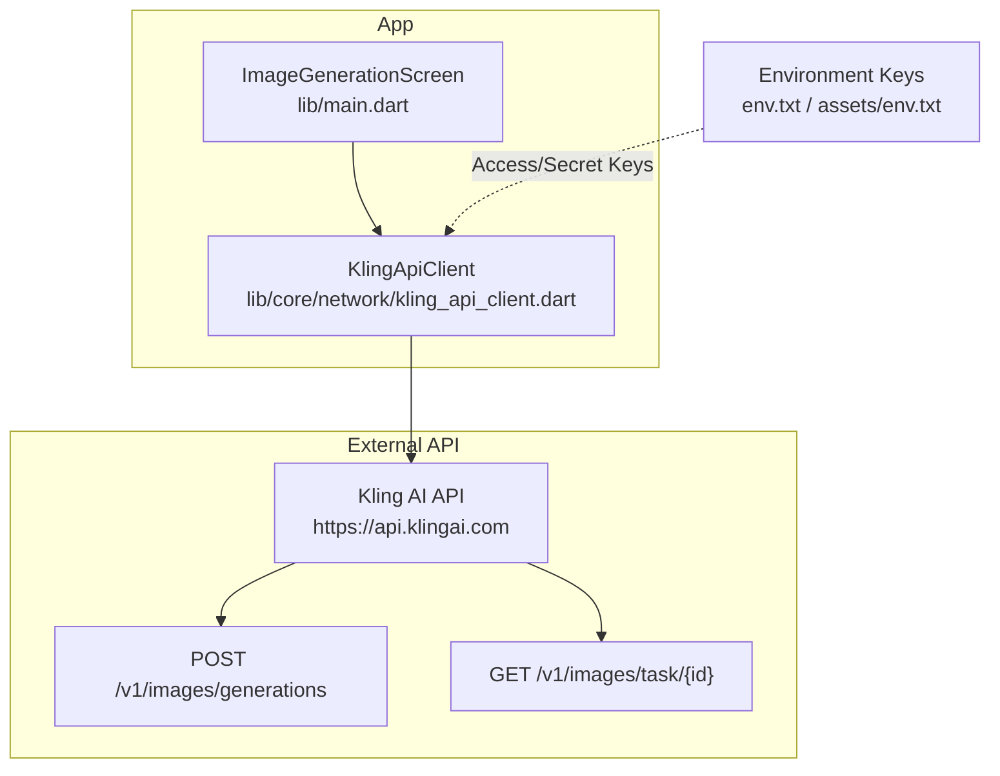
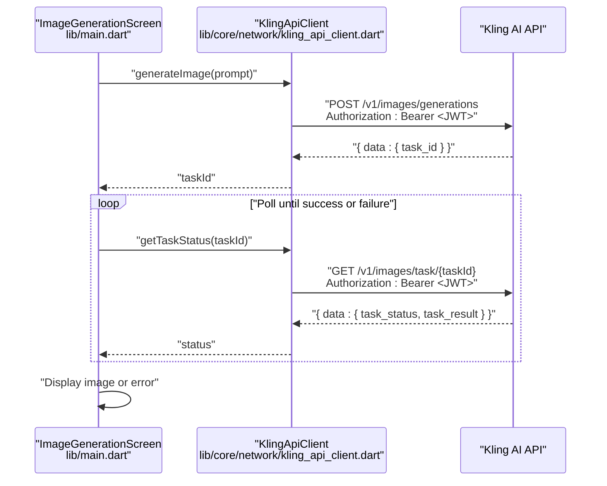
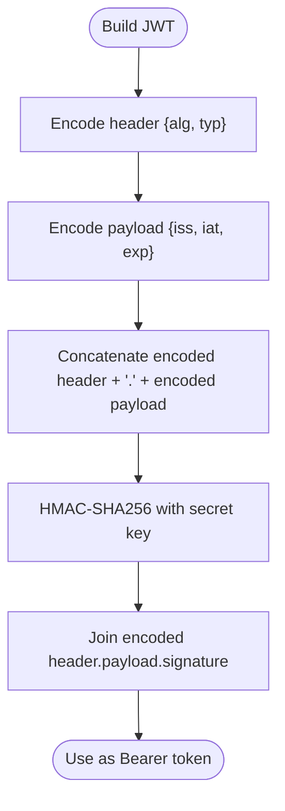
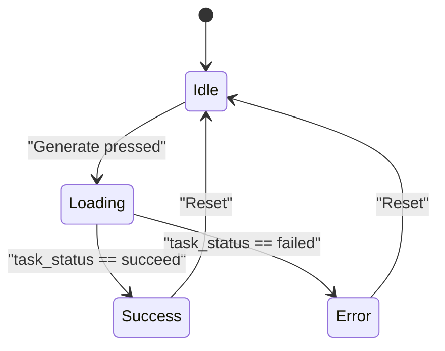
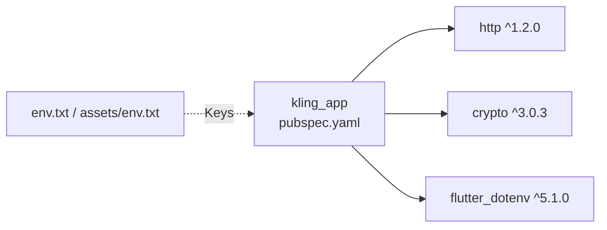

# API Integration

<cite>
**Referenced Files in This Document**
- [kling_api_client.dart](file://lib/core/network/kling_api_client.dart)
- [main.dart](file://lib/main.dart)
- [pubspec.yaml](file://pubspec.yaml)
- [env.txt](file://env.txt)
- [assets/env.txt](file://assets/env.txt)
</cite>

## Table of Contents
1. [Introduction](#introduction)
2. [Project Structure](#project-structure)
3. [Core Components](#core-components)
4. [Architecture Overview](#architecture-overview)
5. [Detailed Component Analysis](#detailed-component-analysis)
6. [Dependency Analysis](#dependency-analysis)
7. [Performance Considerations](#performance-considerations)
8. [Troubleshooting Guide](#troubleshooting-guide)
9. [Conclusion](#conclusion)
10. [Appendices](#appendices)

## Introduction
This document provides API integration documentation for the Kling AI service used by the Flutter application. It focuses on the RESTful API endpoints for asynchronous image generation, including the POST /v1/images/generations endpoint and the GET /v1/images/task/{id} endpoint used for polling task status. It also documents JWT-based authentication, request/response handling, error codes, rate limiting, and best practices for consuming the API.

## Project Structure
The API integration is encapsulated in a dedicated client class and consumed by the main UI screen. Supporting configuration is loaded from environment files.

**Diagram sources**
- [kling_api_client.dart:21-98](file://lib/core/network/kling_api_client.dart#L21-L98)
- [main.dart:30-90](file://lib/main.dart#L30-L90)
- [env.txt:1-3](file://env.txt#L1-L3)
- [assets/env.txt:1-3](file://assets/env.txt#L1-L3)

**Section sources**
- [kling_api_client.dart:21-98](file://lib/core/network/kling_api_client.dart#L21-L98)
- [main.dart:30-90](file://lib/main.dart#L30-L90)
- [pubspec.yaml:30-40](file://pubspec.yaml#L30-L40)
- [env.txt:1-3](file://env.txt#L1-L3)
- [assets/env.txt:1-3](file://assets/env.txt#L1-L3)

## Core Components
- Authentication: JWT bearer token generated using HS256 with access key and secret key.
- Request Layer: Shared HTTP client with timeouts and exponential backoff for transient errors and rate limits.
- Image Generation: Asynchronous workflow via task ID returned by the generation endpoint.
- Status Polling: Periodic GET requests to retrieve task status until completion or failure.

Key behaviors:
- POST /v1/images/generations returns a JSON object containing a task identifier.
- GET /v1/images/task/{id} returns a JSON object containing task status and results.
- On 429 or server error 5xx, the client retries up to three times with exponential backoff.
- Network and parsing errors are surfaced as typed exceptions.

**Section sources**
- [kling_api_client.dart:26-40](file://lib/core/network/kling_api_client.dart#L26-L40)
- [kling_api_client.dart:42-77](file://lib/core/network/kling_api_client.dart#L42-L77)
- [kling_api_client.dart:79-97](file://lib/core/network/kling_api_client.dart#L79-L97)
- [main.dart:50-90](file://lib/main.dart#L50-L90)

## Architecture Overview
The UI triggers image generation, which delegates to the client. The client posts the prompt and receives a task ID. The UI polls the task status periodically until success or failure, then displays the resulting image URL.

**Diagram sources**
- [main.dart:50-90](file://lib/main.dart#L50-L90)
- [kling_api_client.dart:79-97](file://lib/core/network/kling_api_client.dart#L79-L97)

## Detailed Component Analysis

### Authentication and JWT Token
- Algorithm: HS256
- Issuer: Access key
- Expiration: 1 hour from issuance
- Signature: HMAC-SHA256 over base64Url-encoded header.payload using the secret key
- Token included in Authorization header as Bearer

**Diagram sources**
- [kling_api_client.dart:26-40](file://lib/core/network/kling_api_client.dart#L26-L40)

**Section sources**
- [kling_api_client.dart:22-40](file://lib/core/network/kling_api_client.dart#L22-L40)
- [env.txt:1-3](file://env.txt#L1-L3)
- [assets/env.txt:1-3](file://assets/env.txt#L1-L3)

### Request Layer and Retry Logic
- HTTP client supports POST and GET with JSON content type and Authorization header.
- Timeout applied to all requests.
- Automatic retry on 429 or 5xx with exponential backoff (1s, 2s, 4s).
- Non-retryable failures raise typed exceptions.

**Diagram sources**
- [kling_api_client.dart:42-77](file://lib/core/network/kling_api_client.dart#L42-L77)

**Section sources**
- [kling_api_client.dart:42-77](file://lib/core/network/kling_api_client.dart#L42-L77)

### Image Generation Endpoint: POST /v1/images/generations
- Purpose: Submit a text prompt to start an image generation task.
- Request headers:
  - Content-Type: application/json
  - Authorization: Bearer <JWT>
- Request body schema:
  - prompt: string (required)
  - n: integer (optional, default 1)
  - size: string (optional, default "1024x1024")
- Response body schema:
  - data: object
    - task_id: string (required)
- Typical success flow:
  - Receive task_id immediately.
  - Poll task status via GET /v1/images/task/{id}.
- Error handling:
  - 429/5xx: automatic retry with exponential backoff.
  - Other non-2xx: exception thrown with status code.
  - Missing task_id: exception thrown.

Practical example (paths):
- Request: [kling_api_client.dart:79-84](file://lib/core/network/kling_api_client.dart#L79-L84)
- Response parsing: [kling_api_client.dart:86-91](file://lib/core/network/kling_api_client.dart#L86-L91)

**Section sources**
- [kling_api_client.dart:79-91](file://lib/core/network/kling_api_client.dart#L79-L91)

### Task Status Endpoint: GET /v1/images/task/{id}
- Purpose: Retrieve the current status and results of a generation task.
- Path parameter:
  - id: task identifier received from the generation endpoint
- Request headers:
  - Content-Type: application/json
  - Authorization: Bearer <JWT>
- Response body schema:
  - data: object
    - task_status: string (e.g., "succeed", "failed")
    - task_result: object (present when succeed)
      - images: array of objects
        - url: string (image download URL)
- Polling behavior:
  - UI polls periodically until task_status indicates completion or failure.
  - On "failed", the UI surfaces an error state.

Practical example (paths):
- Request: [kling_api_client.dart:94-96](file://lib/core/network/kling_api_client.dart#L94-L96)
- UI polling: [main.dart:64-78](file://lib/main.dart#L64-L78)

**Section sources**
- [kling_api_client.dart:94-97](file://lib/core/network/kling_api_client.dart#L94-L97)
- [main.dart:64-78](file://lib/main.dart#L64-L78)

### UI Integration and Workflow
- The UI captures user input, disables the button during generation, and shows loading indicators.
- On success, the first image URL is extracted and displayed.
- On failure, the UI shows an error message derived from caught exceptions.

**Diagram sources**
- [main.dart:28-90](file://lib/main.dart#L28-L90)

**Section sources**
- [main.dart:28-90](file://lib/main.dart#L28-L90)

## Dependency Analysis
- External libraries:
  - http: ^1.2.0
  - crypto: ^3.0.3
  - flutter_dotenv: ^5.1.0 (declared; environment loading not shown in main code)
- Environment keys:
  - KLING_ACCESS_KEY
  - KLING_SECRET_KEY
- Asset embedding:
  - assets/env.txt is configured for resource loading.

**Diagram sources**
- [pubspec.yaml:30-40](file://pubspec.yaml#L30-L40)
- [env.txt:1-3](file://env.txt#L1-L3)
- [assets/env.txt:1-3](file://assets/env.txt#L1-L3)

**Section sources**
- [pubspec.yaml:30-40](file://pubspec.yaml#L30-L40)
- [env.txt:1-3](file://env.txt#L1-L3)
- [assets/env.txt:1-3](file://assets/env.txt#L1-L3)

## Performance Considerations
- Timeouts: All requests are subject to a 30-second timeout to prevent hanging.
- Polling interval: The UI polls every 2 seconds; adjust based on expected generation latency and rate limits.
- Backoff: Automatic exponential backoff reduces load on the API during throttling or transient failures.
- Concurrency: Limit concurrent generation requests to avoid overwhelming the API and triggering rate limits.
- Caching: Store successful image URLs locally to avoid repeated downloads.

[No sources needed since this section provides general guidance]

## Troubleshooting Guide
Common issues and resolutions:
- Authentication failures:
  - Verify access and secret keys are correctly set and loaded.
  - Ensure the JWT is refreshed if expired (client generates per-request).
- Rate limiting (HTTP 429):
  - The client retries automatically up to three times with exponential backoff.
  - Consider reducing request frequency or batching tasks.
- Server errors (5xx):
  - The client retries automatically; if persistent, investigate upstream stability.
- Missing task_id:
  - Indicates malformed response; inspect request payload and retry.
- Network errors:
  - SocketException indicates connectivity issues; check device network and firewall.
- Parsing errors:
  - FormatException suggests unexpected response format; log raw response for inspection.

Debugging techniques:
- Log request URL, headers, and body before sending.
- Log response status, headers, and raw body for inspection.
- Instrument polling intervals and track total wait time.
- Capture exceptions and their stack traces for support.

Monitoring approaches:
- Track request latency and success rates per endpoint.
- Monitor retry counts and reasons (429 vs 5xx).
- Observe UI state transitions and error frequencies.

**Section sources**
- [kling_api_client.dart:42-77](file://lib/core/network/kling_api_client.dart#L42-L77)
- [main.dart:84-89](file://lib/main.dart#L84-L89)

## Conclusion
The application integrates with the Kling AI API using a robust client that handles JWT authentication, request retries, and asynchronous task polling. By following the documented endpoints, headers, and error handling patterns, developers can reliably consume the API and implement resilient UI flows for image generation.

[No sources needed since this section summarizes without analyzing specific files]

## Appendices

### API Reference Summary

- Base URL: https://api.klingai.com
- Authentication: Authorization: Bearer <JWT>
- Headers:
  - Content-Type: application/json
  - Authorization: Bearer <JWT>

Endpoints:
- POST /v1/images/generations
  - Body: { prompt: string, n?: integer, size?: string }
  - Response: { data: { task_id: string } }
- GET /v1/images/task/{id}
  - Response: { data: { task_status: string, task_result?: { images: [{ url: string }] } } }

Error Codes:
- 429 Too Many Requests: Automatic retry with exponential backoff
- 5xx Server Error: Automatic retry with exponential backoff
- Other non-2xx: Request failed with status code

Polling and Completion:
- Poll GET /v1/images/task/{id} until task_status is "succeed" or "failed".
- On success, extract the first image URL from task_result.images[0].url.

Timeout and Retries:
- Request timeout: 30 seconds
- Retry strategy: Up to 3 attempts with exponential backoff on 429/5xx

**Section sources**
- [kling_api_client.dart:49-52](file://lib/core/network/kling_api_client.dart#L49-L52)
- [kling_api_client.dart:79-97](file://lib/core/network/kling_api_client.dart#L79-L97)
- [main.dart:64-78](file://lib/main.dart#L64-L78)