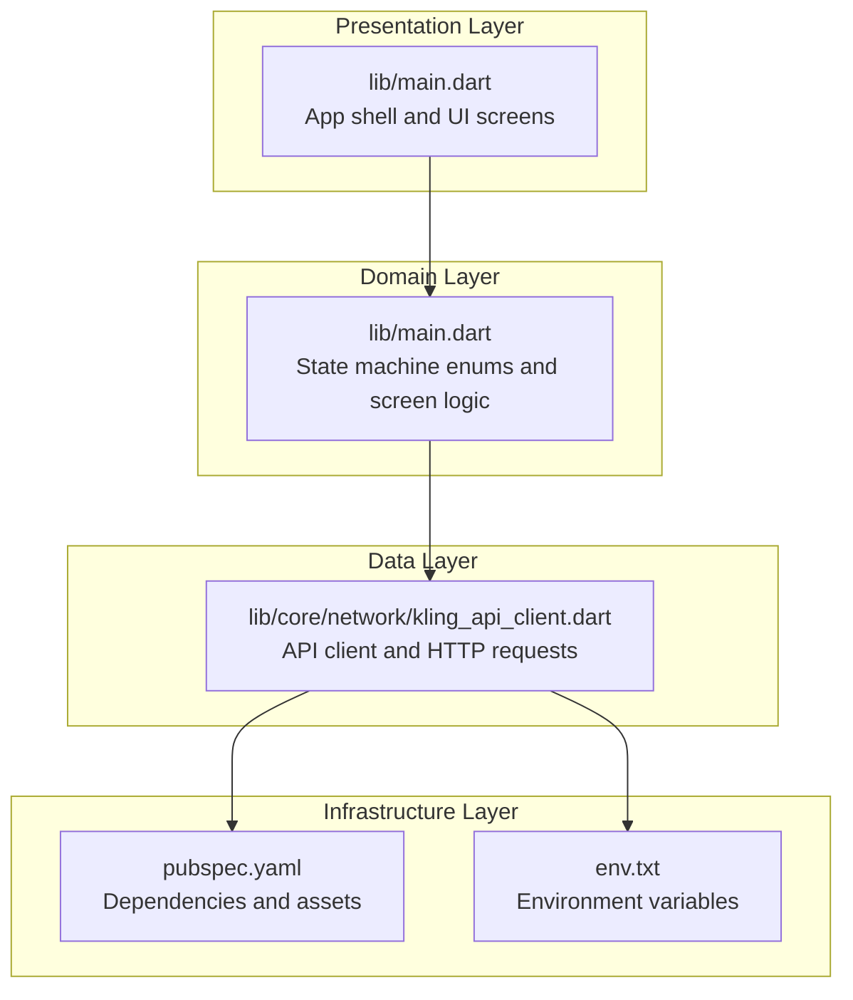
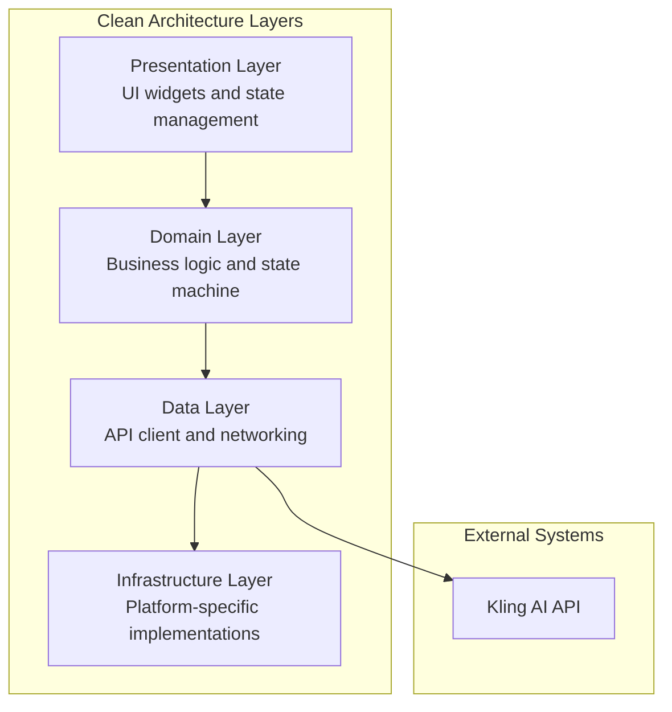
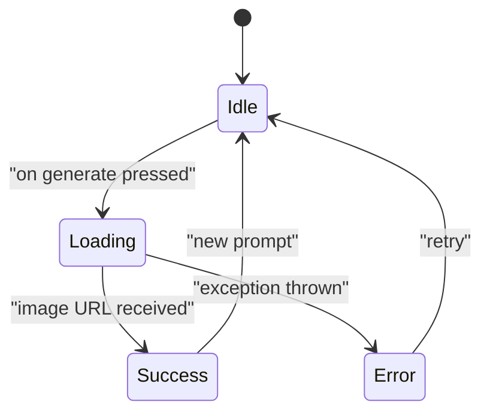
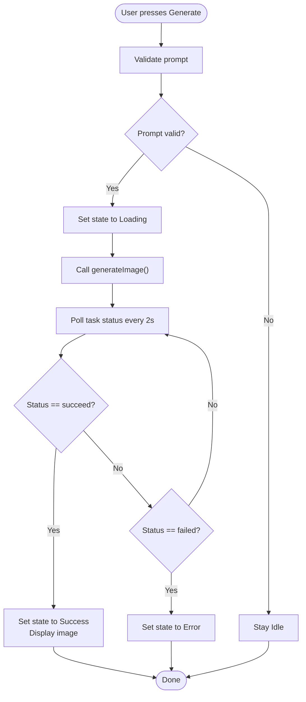
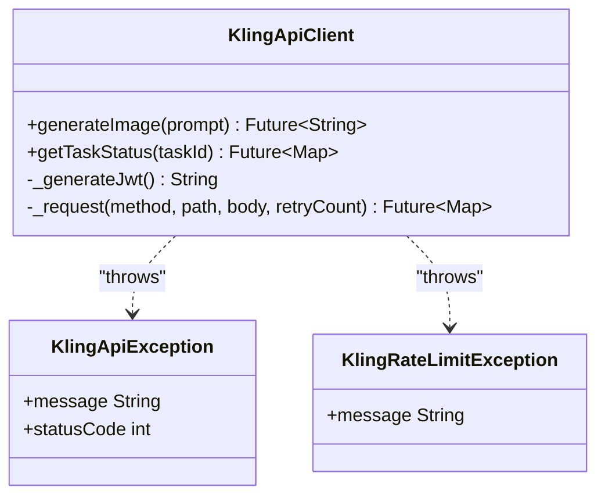
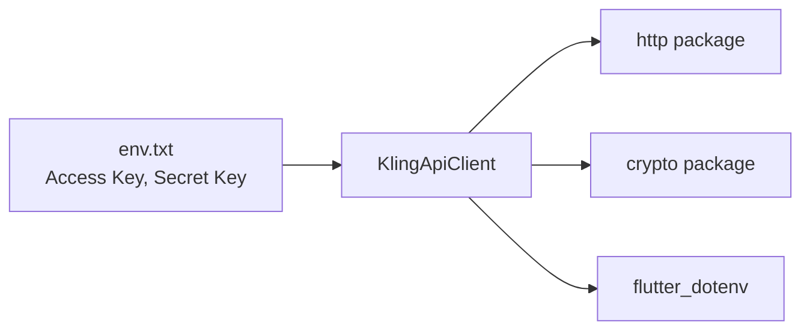
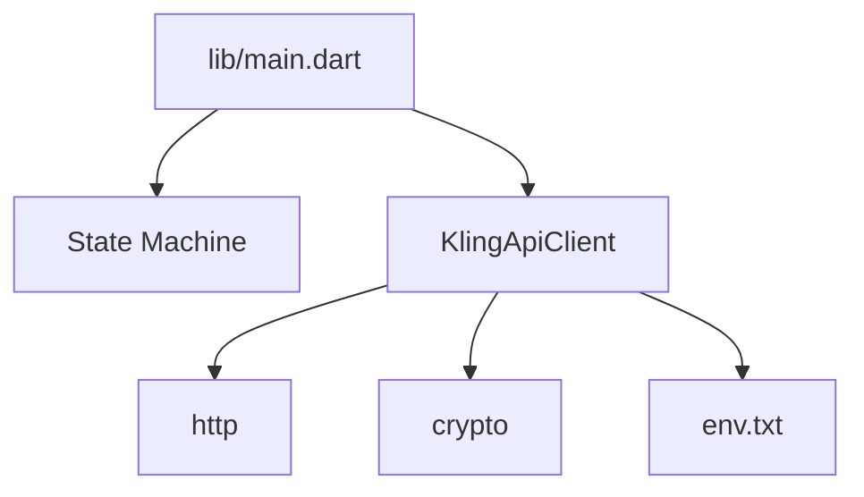

# Architecture Overview

<cite>
**Referenced Files in This Document**
- [main.dart](file://lib/main.dart)
- [kling_api_client.dart](file://lib/core/network/kling_api_client.dart)
- [pubspec.yaml](file://pubspec.yaml)
- [env.txt](file://env.txt)
- [DESIGN.md](file://DESIGN.md)
</cite>

## Table of Contents
1. [Introduction](#introduction)
2. [Project Structure](#project-structure)
3. [Core Components](#core-components)
4. [Architecture Overview](#architecture-overview)
5. [Detailed Component Analysis](#detailed-component-analysis)
6. [Dependency Analysis](#dependency-analysis)
7. [Performance Considerations](#performance-considerations)
8. [Troubleshooting Guide](#troubleshooting-guide)
9. [Conclusion](#conclusion)

## Introduction
This document describes the architectural design of the Kling AI Image Generation App following Clean Architecture principles. The app is a Flutter application that generates images via the Kling AI API. It emphasizes a clear separation of concerns across four layers:
- Presentation Layer: UI widgets and state management
- Domain Layer: Business logic and state machine
- Data Layer: API client and networking
- Infrastructure Layer: Platform-specific implementations and configuration

The system integrates with the Kling AI service using JWT authentication and implements a polling mechanism to track asynchronous image generation tasks. State transitions are managed via an enum-based state machine to ensure predictable UI behavior.

## Project Structure
The project follows a modular directory layout aligned with Clean Architecture:
- lib/main.dart: Application entry point and top-level UI composition
- lib/core/network/kling_api_client.dart: Networking and API client implementation
- lib/features/: Feature-focused modules (currently minimal)
- lib/shared/: Shared utilities (currently empty)
- lib/widgets/: Reusable UI components (currently empty)
- pubspec.yaml: Dependencies and assets configuration
- env.txt: Environment variables for API credentials
- DESIGN.md: Design system and UI state definitions

**Diagram sources**
- [main.dart:1-191](file://lib/main.dart#L1-L191)
- [kling_api_client.dart:1-99](file://lib/core/network/kling_api_client.dart#L1-L99)
- [pubspec.yaml:1-83](file://pubspec.yaml#L1-L83)
- [env.txt:1-3](file://env.txt#L1-L3)

**Section sources**
- [main.dart:1-191](file://lib/main.dart#L1-L191)
- [pubspec.yaml:1-83](file://pubspec.yaml#L1-L83)

## Core Components
- App entry and theme: The application initializes the app shell with a dark theme and sets the home screen to the image generation interface.
- ImageGenerationScreen: A stateful widget that manages user input, state transitions, and UI rendering. It uses an enum-based state machine to drive UI updates.
- KlingApiClient: A dedicated client responsible for JWT token generation, HTTP requests, error handling, and exponential backoff for rate limits and server errors.

Key responsibilities:
- Presentation Layer: Compose UI, manage user interactions, and render content based on state.
- Domain Layer: Define state transitions and orchestrate the generation flow.
- Data Layer: Encapsulate API communication, authentication, and retry logic.

**Section sources**
- [main.dart:8-26](file://lib/main.dart#L8-L26)
- [main.dart:28-35](file://lib/main.dart#L28-L35)
- [main.dart:30-190](file://lib/main.dart#L30-L190)
- [kling_api_client.dart:21-99](file://lib/core/network/kling_api_client.dart#L21-L99)

## Architecture Overview
The system adheres to Clean Architecture by isolating concerns:
- Presentation depends on Domain abstractions (state machine)
- Domain depends on Data abstractions (API client interface)
- Data depends on Infrastructure (HTTP client and environment)

**Diagram sources**
- [main.dart:30-190](file://lib/main.dart#L30-L190)
- [kling_api_client.dart:21-99](file://lib/core/network/kling_api_client.dart#L21-L99)

## Detailed Component Analysis

### Presentation Layer: ImageGenerationScreen
- Responsibilities:
  - Accept user prompts via a text field
  - Drive state transitions using the enum-based state machine
  - Render UI for idle, loading, success, and error states
  - Manage button enable/disable based on current state
- State Machine:
  - idle: Initial state with prompt input and generate button
  - loading: Progress indicator and disabled actions
  - success: Displays generated image
  - error: Displays error message and retains input
- UI Composition:
  - Theme applied via MaterialApp
  - Dark theme with primary and surface colors
  - Responsive layout using Column and Expanded

**Diagram sources**
- [main.dart:28-35](file://lib/main.dart#L28-L35)
- [main.dart:149-189](file://lib/main.dart#L149-L189)

**Section sources**
- [main.dart:30-190](file://lib/main.dart#L30-L190)
- [DESIGN.md:35-39](file://DESIGN.md#L35-L39)

### Domain Layer: State Management and Orchestration
- Enum-based state machine:
  - Defines discrete states and transitions
  - Ensures deterministic UI behavior
- Orchestration:
  - Validates prompt input
  - Initiates image generation
  - Polls task status until completion or failure
  - Updates state and displays results

**Diagram sources**
- [main.dart:50-90](file://lib/main.dart#L50-L90)
- [main.dart:28-35](file://lib/main.dart#L28-L35)

**Section sources**
- [main.dart:28-90](file://lib/main.dart#L28-L90)

### Data Layer: KlingApiClient
- Authentication:
  - Generates JWT tokens with issuer, expiration, and signing
  - Attaches Authorization header to requests
- Request Handling:
  - Supports POST for generation and GET for task status
  - Implements timeout and retry logic for transient failures
  - Handles rate limits and server errors with exponential backoff
- Error Handling:
  - Throws domain-specific exceptions for API and network errors
  - Propagates meaningful messages to the presentation layer

**Diagram sources**
- [kling_api_client.dart:6-19](file://lib/core/network/kling_api_client.dart#L6-L19)
- [kling_api_client.dart:21-99](file://lib/core/network/kling_api_client.dart#L21-L99)

**Section sources**
- [kling_api_client.dart:21-99](file://lib/core/network/kling_api_client.dart#L21-L99)

### Infrastructure Layer: Configuration and Environment
- Dependencies:
  - http for networking
  - crypto for JWT signing
  - flutter_dotenv for environment variable loading
- Environment:
  - Access key and secret key loaded from env.txt
  - Used by the API client to sign JWT tokens

**Diagram sources**
- [env.txt:1-3](file://env.txt#L1-L3)
- [kling_api_client.dart:22-24](file://lib/core/network/kling_api_client.dart#L22-L24)
- [pubspec.yaml:37-39](file://pubspec.yaml#L37-L39)

**Section sources**
- [env.txt:1-3](file://env.txt#L1-L3)
- [pubspec.yaml:37-39](file://pubspec.yaml#L37-L39)

## Dependency Analysis
- Presentation depends on Domain (state machine) and Data (API client)
- Domain depends on Data abstractions (API client interface)
- Data depends on Infrastructure (HTTP client, environment)
- External dependencies include http, crypto, and flutter_dotenv

**Diagram sources**
- [main.dart:1-2](file://lib/main.dart#L1-L2)
- [kling_api_client.dart:1-4](file://lib/core/network/kling_api_client.dart#L1-L4)
- [pubspec.yaml:37-39](file://pubspec.yaml#L37-L39)
- [env.txt:1-3](file://env.txt#L1-L3)

**Section sources**
- [pubspec.yaml:37-39](file://pubspec.yaml#L37-L39)

## Performance Considerations
- Network timeouts: Requests are subject to a 30-second timeout to prevent indefinite blocking.
- Retry strategy: Exponential backoff is applied for rate limits (429) and server errors (5xx) up to three attempts.
- Polling interval: Task status polling occurs every two seconds to balance responsiveness and API load.
- UI responsiveness: Heavy operations are offloaded to async tasks, keeping the UI thread responsive.

[No sources needed since this section provides general guidance]

## Troubleshooting Guide
Common issues and resolutions:
- Authentication failures:
  - Verify access key and secret key in env.txt
  - Ensure JWT generation succeeds and Authorization header is set
- Network errors:
  - Confirm internet connectivity and DNS resolution
  - Inspect SocketException handling and retry logic
- Rate limiting:
  - Respect 429 responses and observe exponential backoff
  - Reduce request frequency or increase retry delays
- Invalid responses:
  - Validate JSON parsing and presence of required fields (task_id, task_status, images)
  - Log raw responses for debugging

**Section sources**
- [kling_api_client.dart:54-77](file://lib/core/network/kling_api_client.dart#L54-L77)
- [kling_api_client.dart:79-97](file://lib/core/network/kling_api_client.dart#L79-L97)
- [main.dart:84-89](file://lib/main.dart#L84-L89)

## Conclusion
The Kling AI Image Generation App applies Clean Architecture to separate concerns across Presentation, Domain, Data, and Infrastructure layers. The enum-based state machine ensures predictable UI behavior, while the API client encapsulates authentication, retries, and error handling. The modular structure supports maintainability, testability, and future extensibility, including potential expansion of features under lib/features and shared utilities under lib/shared.