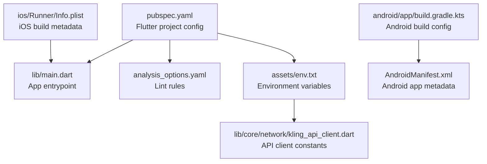
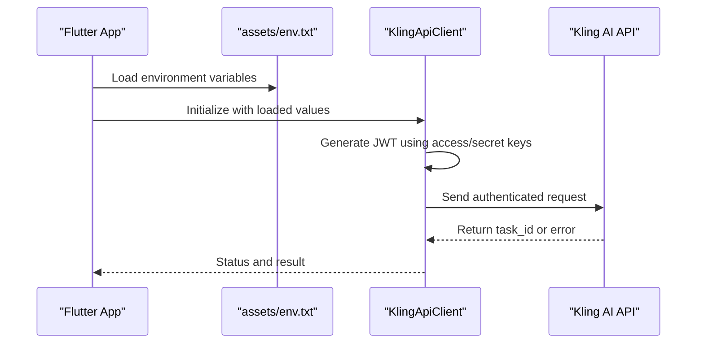
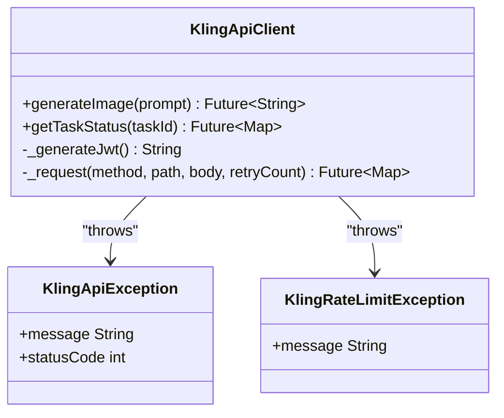
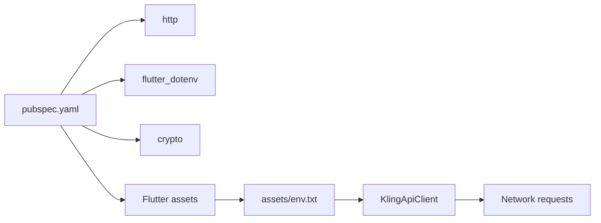

# Configuration Management

<cite>
**Referenced Files in This Document**
- [pubspec.yaml](file://pubspec.yaml)
- [analysis_options.yaml](file://analysis_options.yaml)
- [env.txt](file://env.txt)
- [assets/env.txt](file://assets/env.txt)
- [lib/main.dart](file://lib/main.dart)
- [lib/core/network/kling_api_client.dart](file://lib/core/network/kling_api_client.dart)
- [android/app/build.gradle.kts](file://android/app/build.gradle.kts)
- [android/app/src/main/AndroidManifest.xml](file://android/app/src/main/AndroidManifest.xml)
- [ios/Runner/Info.plist](file://ios/Runner/Info.plist)
</cite>

## Table of Contents
1. [Introduction](#introduction)
2. [Project Structure](#project-structure)
3. [Core Components](#core-components)
4. [Architecture Overview](#architecture-overview)
5. [Detailed Component Analysis](#detailed-component-analysis)
6. [Dependency Analysis](#dependency-analysis)
7. [Performance Considerations](#performance-considerations)
8. [Troubleshooting Guide](#troubleshooting-guide)
9. [Conclusion](#conclusion)

## Introduction
This document explains the configuration management system for the Kling AI Image Generation App. It covers Flutter project configuration via pubspec.yaml, environment variable handling using env.txt and assets/env.txt, code analysis configuration through analysis_options.yaml, and build configuration for Android and iOS. It also outlines best practices for managing sensitive configuration data, environment-specific overrides, and configuration validation approaches.

## Project Structure
The project follows a standard Flutter layout with platform-specific build configurations and a dedicated assets directory for environment files. Key configuration areas include:
- Flutter dependencies and assets declaration
- Linting and code quality configuration
- Environment variables packaged as app assets
- Android and iOS build settings

**Diagram sources**
- [pubspec.yaml:1-83](file://pubspec.yaml#L1-L83)
- [lib/main.dart:1-191](file://lib/main.dart#L1-L191)
- [analysis_options.yaml:1-29](file://analysis_options.yaml#L1-L29)
- [assets/env.txt:1-3](file://assets/env.txt#L1-L3)
- [lib/core/network/kling_api_client.dart:1-99](file://lib/core/network/kling_api_client.dart#L1-L99)
- [android/app/build.gradle.kts:1-45](file://android/app/build.gradle.kts#L1-L45)
- [android/app/src/main/AndroidManifest.xml:1-46](file://android/app/src/main/AndroidManifest.xml#L1-L46)
- [ios/Runner/Info.plist:1-50](file://ios/Runner/Info.plist#L1-L50)

**Section sources**
- [pubspec.yaml:1-83](file://pubspec.yaml#L1-L83)
- [analysis_options.yaml:1-29](file://analysis_options.yaml#L1-L29)
- [assets/env.txt:1-3](file://assets/env.txt#L1-L3)
- [lib/core/network/kling_api_client.dart:21-25](file://lib/core/network/kling_api_client.dart#L21-L25)

## Core Components
- Flutter project configuration (dependencies, assets, build settings)
- Environment variable system (env.txt and assets/env.txt)
- Code analysis configuration (analysis_options.yaml)
- Platform build configuration (Android and iOS)

**Section sources**
- [pubspec.yaml:30-52](file://pubspec.yaml#L30-L52)
- [analysis_options.yaml:8-29](file://analysis_options.yaml#L8-L29)
- [assets/env.txt:1-3](file://assets/env.txt#L1-L3)
- [android/app/build.gradle.kts:8-40](file://android/app/build.gradle.kts#L8-L40)
- [ios/Runner/Info.plist:19-24](file://ios/Runner/Info.plist#L19-L24)

## Architecture Overview
The configuration architecture integrates environment variables packaged as app assets with the Flutter app runtime. The API client reads these variables during initialization to configure authentication and endpoints. Build-time settings for Android and iOS are declared in their respective configuration files.

**Diagram sources**
- [assets/env.txt:1-3](file://assets/env.txt#L1-L3)
- [lib/core/network/kling_api_client.dart:21-25](file://lib/core/network/kling_api_client.dart#L21-L25)
- [lib/core/network/kling_api_client.dart:42-77](file://lib/core/network/kling_api_client.dart#L42-L77)

## Detailed Component Analysis

### Flutter Project Configuration (pubspec.yaml)
- Dependencies: Includes http, flutter_dotenv, and crypto for networking, environment loading, and JWT signing.
- Dev dependencies: Uses flutter_lints for standardized lint rules.
- Assets: Declares assets/env.txt for environment variables.
- Flutter SDK: Requires Flutter SDK version aligned with the environment block.

Best practices:
- Keep dependencies pinned to known compatible versions.
- Centralize environment variables in a single asset for portability.
- Use flutter_lints to enforce consistent code quality.

**Section sources**
- [pubspec.yaml:30-45](file://pubspec.yaml#L30-L45)
- [pubspec.yaml:47-52](file://pubspec.yaml#L47-L52)
- [pubspec.yaml:21-23](file://pubspec.yaml#L21-L23)

### Environment Variable System (env.txt and assets/env.txt)
- Two copies exist: project root env.txt and assets/env.txt. The Flutter assets section declares assets/env.txt, so ensure the correct file is used at runtime.
- Variables include API keys and secrets used by the API client.

Recommendations:
- Prefer assets/env.txt for runtime loading via flutter_dotenv.
- Avoid committing real secrets to version control; use CI/CD secret injection to populate env files during builds.
- Validate presence and format of required variables at startup.

**Section sources**
- [assets/env.txt:1-3](file://assets/env.txt#L1-L3)
- [pubspec.yaml:50-52](file://pubspec.yaml#L50-L52)

### Code Analysis Configuration (analysis_options.yaml)
- Includes the recommended Flutter lints set.
- Rules can be customized per project needs.
- Enables consistent style and quality gates across contributors.

**Section sources**
- [analysis_options.yaml:8-29](file://analysis_options.yaml#L8-L29)

### API Client Configuration (KlingApiClient)
- Contains hardcoded credentials and base URL.
- Generates JWT tokens using HMAC-SHA256 with the secret key.
- Implements retry logic for rate limits and server errors.

Security considerations:
- Hardcoded credentials are a security risk. Replace with runtime-loaded values from env files.
- Validate JWT generation and token expiration handling.
- Add input validation for prompts and response parsing.

**Diagram sources**
- [lib/core/network/kling_api_client.dart:6-19](file://lib/core/network/kling_api_client.dart#L6-L19)
- [lib/core/network/kling_api_client.dart:21-99](file://lib/core/network/kling_api_client.dart#L21-L99)

**Section sources**
- [lib/core/network/kling_api_client.dart:21-25](file://lib/core/network/kling_api_client.dart#L21-L25)
- [lib/core/network/kling_api_client.dart:26-40](file://lib/core/network/kling_api_client.dart#L26-L40)
- [lib/core/network/kling_api_client.dart:42-77](file://lib/core/network/kling_api_client.dart#L42-L77)

### Android Build Configuration
- Applies Android, Kotlin, and Flutter Gradle plugins.
- Sets compile/target SDK and JVM compatibility.
- Defines applicationId, minSdk, targetSdk, versionCode, and versionName from Flutter defaults.
- Release build uses debug signing by default.

Recommendations:
- Configure proper signing for release builds.
- Align minSdk and targetSdk with project requirements.
- Use flavorDimensions and product flavors for environment-specific builds.

**Section sources**
- [android/app/build.gradle.kts:1-6](file://android/app/build.gradle.kts#L1-L6)
- [android/app/build.gradle.kts:22-31](file://android/app/build.gradle.kts#L22-L31)
- [android/app/build.gradle.kts:33-39](file://android/app/build.gradle.kts#L33-L39)

### iOS Build Configuration
- Uses Info.plist for bundle identifiers, display names, and version strings.
- Version values are derived from Flutter build settings.

Recommendations:
- Keep bundle identifiers unique and secure.
- Manage version strings consistently across platforms.
- Use Xcode build configurations for environment-specific overrides.

**Section sources**
- [ios/Runner/Info.plist:19-24](file://ios/Runner/Info.plist#L19-L24)

## Dependency Analysis
The configuration system depends on:
- Flutter SDK and plugins for asset packaging and environment loading.
- Android/iOS build scripts for platform-specific settings.
- Network libraries for API communication and JWT signing.

**Diagram sources**
- [pubspec.yaml:30-45](file://pubspec.yaml#L30-L45)
- [pubspec.yaml:47-52](file://pubspec.yaml#L47-L52)
- [assets/env.txt:1-3](file://assets/env.txt#L1-L3)
- [lib/core/network/kling_api_client.dart:1-5](file://lib/core/network/kling_api_client.dart#L1-L5)

**Section sources**
- [pubspec.yaml:30-45](file://pubspec.yaml#L30-L45)
- [lib/core/network/kling_api_client.dart:1-5](file://lib/core/network/kling_api_client.dart#L1-L5)

## Performance Considerations
- Minimize asset size and count to reduce app bundle size.
- Cache environment variables after initial load to avoid repeated disk reads.
- Use platform-specific build optimizations for release builds.
- Avoid unnecessary retries and implement exponential backoff for robustness.

## Troubleshooting Guide
Common configuration issues and resolutions:
- Missing or empty environment variables:
  - Ensure assets/env.txt is present and contains required keys.
  - Verify the asset path matches the Flutter assets declaration.
- API authentication failures:
  - Confirm access and secret keys are correct and not expired.
  - Validate JWT generation logic and time synchronization.
- Build failures on Android:
  - Check signing configuration for release builds.
  - Ensure minSdk and targetSdk compatibility.
- iOS build issues:
  - Validate bundle identifiers and version strings in Info.plist.
  - Confirm Flutter build name and number are set correctly.

Validation steps:
- Add startup checks to verify environment variables presence.
- Log configuration values at app start for debugging.
- Implement graceful fallbacks for missing or invalid values.

**Section sources**
- [assets/env.txt:1-3](file://assets/env.txt#L1-L3)
- [lib/core/network/kling_api_client.dart:26-40](file://lib/core/network/kling_api_client.dart#L26-L40)
- [android/app/build.gradle.kts:33-39](file://android/app/build.gradle.kts#L33-L39)
- [ios/Runner/Info.plist:19-24](file://ios/Runner/Info.plist#L19-L24)

## Conclusion
The Kling AI Image Generation App’s configuration management relies on a combination of Flutter project settings, environment assets, and platform-specific build configurations. To improve security and maintainability:
- Move hardcoded credentials to runtime-loaded environment variables.
- Use CI/CD to inject secrets and manage environment-specific overrides.
- Enforce linting and code quality standards through analysis_options.yaml.
- Validate configuration at startup and implement robust error handling.