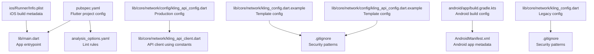
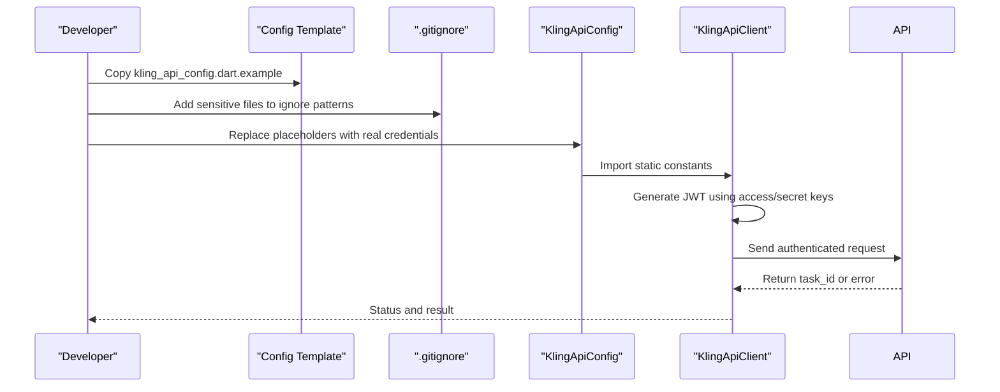
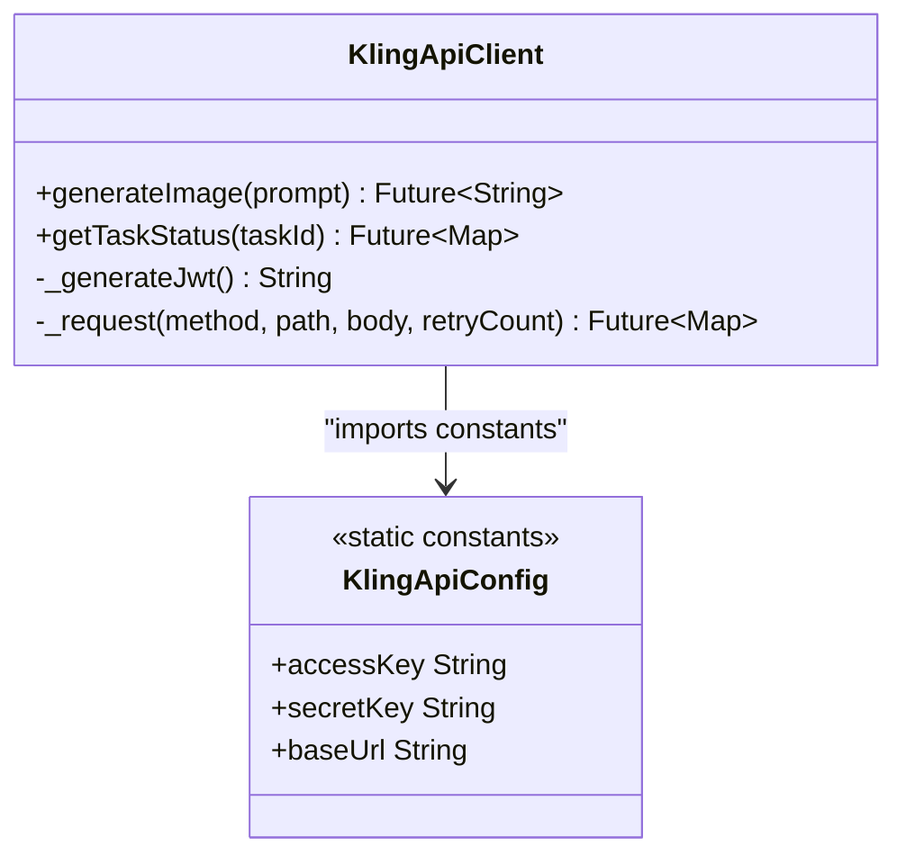
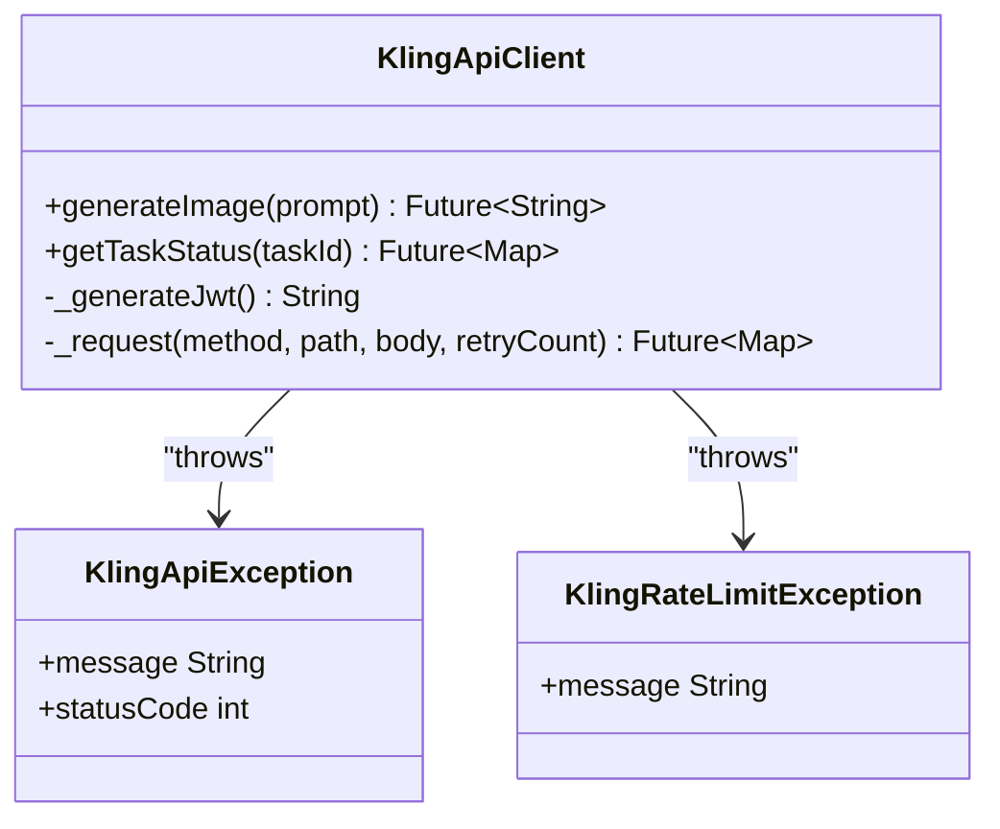
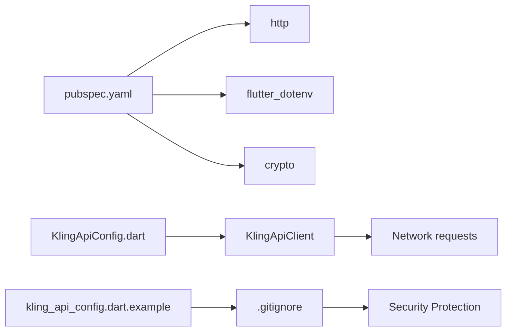

# Configuration Management

<cite>
**Referenced Files in This Document**
- [pubspec.yaml](file://pubspec.yaml)
- [analysis_options.yaml](file://analysis_options.yaml)
- [.gitignore](file://.gitignore)
- [lib/core/network/config/kling_api_config.dart](file://lib/core/network/config/kling_api_config.dart)
- [lib/core/network/config/kling_api_config.dart.example](file://lib/core/network/config/kling_api_config.dart.example)
- [lib/core/network/kling_config.dart](file://lib/core/network/kling_config.dart)
- [lib/core/network/kling_config.dart.example](file://lib/core/network/kling_config.dart.example)
- [lib/core/network/kling_api_client.dart](file://lib/core/network/kling_api_client.dart)
- [lib/main.dart](file://lib/main.dart)
- [android/app/build.gradle.kts](file://android/app/build.gradle.kts)
- [ios/Runner/Info.plist](file://ios/Runner/Info.plist)
</cite>

## Update Summary
**Changes Made**
- Added documentation for new kling_api_config.dart.example template for secure API configuration
- Enhanced security practices documentation with .gitignore patterns for sensitive configuration files
- Updated configuration templates to include both kling_api_config.dart and kling_config.dart examples
- Improved security guidelines for managing sensitive configuration data
- Added best practices for configuration validation and environment-specific overrides

## Table of Contents
1. [Introduction](#introduction)
2. [Project Structure](#project-structure)
3. [Core Components](#core-components)
4. [Architecture Overview](#architecture-overview)
5. [Detailed Component Analysis](#detailed-component-analysis)
6. [Security Practices](#security-practices)
7. [Dependency Analysis](#dependency-analysis)
8. [Performance Considerations](#performance-considerations)
9. [Troubleshooting Guide](#troubleshooting-guide)
10. [Conclusion](#conclusion)

## Introduction
This document explains the configuration management system for the Kling AI Image Generation App. The project uses a centralized configuration approach with Dart constants for API credentials and service endpoints. Recent enhancements include secure configuration templates and improved security practices to protect sensitive data from accidental exposure in version control systems.

## Project Structure
The project follows a standard Flutter layout with platform-specific build configurations and a centralized configuration system. Key configuration areas include:
- Flutter dependencies and assets declaration
- Centralized API configuration through Dart constants
- Secure configuration templates for development and deployment
- Code analysis configuration through analysis_options.yaml
- Platform build settings for Android and iOS

**Diagram sources**
- [pubspec.yaml:1-83](file://pubspec.yaml#L1-L83)
- [lib/main.dart:1-165](file://lib/main.dart#L1-L165)
- [analysis_options.yaml:1-29](file://analysis_options.yaml#L1-L29)
- [lib/core/network/config/kling_api_config.dart:1-6](file://lib/core/network/config/kling_api_config.dart#L1-L6)
- [lib/core/network/config/kling_api_config.dart.example:1-6](file://lib/core/network/config/kling_api_config.dart.example#L1-L6)
- [lib/core/network/kling_config.dart:1-6](file://lib/core/network/kling_config.dart#L1-L6)
- [lib/core/network/kling_config.dart.example:1-6](file://lib/core/network/kling_config.dart.example#L1-L6)
- [lib/core/network/kling_api_client.dart:1-118](file://lib/core/network/kling_api_client.dart#L1-L118)
- [android/app/build.gradle.kts:1-45](file://android/app/build.gradle.kts#L1-L45)
- [ios/Runner/Info.plist:1-50](file://ios/Runner/Info.plist#L1-L50)
- [.gitignore:55-58](file://.gitignore#L55-L58)

**Section sources**
- [pubspec.yaml:1-83](file://pubspec.yaml#L1-L83)
- [analysis_options.yaml:1-29](file://analysis_options.yaml#L1-L29)
- [lib/core/network/config/kling_api_config.dart:1-6](file://lib/core/network/config/kling_api_config.dart#L1-L6)
- [lib/core/network/kling_api_client.dart:1-118](file://lib/core/network/kling_api_client.dart#L1-L118)

## Core Components
- Flutter project configuration (dependencies, assets, build settings)
- Centralized API configuration system (Dart constants)
- Secure configuration templates (example files for development)
- Code analysis configuration (analysis_options.yaml)
- Platform build configuration (Android and iOS)
- Security practices for sensitive data protection

**Section sources**
- [pubspec.yaml:30-52](file://pubspec.yaml#L30-L52)
- [analysis_options.yaml:8-29](file://analysis_options.yaml#L8-L29)
- [lib/core/network/config/kling_api_config.dart:1-6](file://lib/core/network/config/kling_api_config.dart#L1-L6)
- [lib/core/network/config/kling_api_config.dart.example:1-6](file://lib/core/network/config/kling_api_config.dart.example#L1-L6)
- [android/app/build.gradle.kts:8-40](file://android/app/build.gradle.kts#L8-L40)
- [ios/Runner/Info.plist:19-24](file://ios/Runner/Info.plist#L19-L24)

## Architecture Overview
The configuration architecture now uses centralized Dart constants for API credentials and service endpoints. The system includes both production configuration files and secure templates for development. The API client imports these constants directly, eliminating the need for environment variable files. This approach provides compile-time safety and eliminates runtime configuration loading overhead while maintaining security through version control exclusion.

**Diagram sources**
- [lib/core/network/config/kling_api_config.dart.example:1-6](file://lib/core/network/config/kling_api_config.dart.example#L1-L6)
- [.gitignore:55-58](file://.gitignore#L55-L58)
- [lib/core/network/config/kling_api_config.dart:1-6](file://lib/core/network/config/kling_api_config.dart#L1-L6)
- [lib/core/network/kling_api_client.dart:23-118](file://lib/core/network/kling_api_client.dart#L23-L118)

## Detailed Component Analysis

### Flutter Project Configuration (pubspec.yaml)
- Dependencies: Includes http, flutter_dotenv, and crypto for networking, environment loading, and JWT signing.
- Dev dependencies: Uses flutter_lints for standardized lint rules.
- Assets: Declares assets/env.txt for environment variables (legacy support).
- Flutter SDK: Requires Flutter SDK version aligned with the environment block.

Best practices:
- Keep dependencies pinned to known compatible versions.
- Centralize environment variables in a single asset for portability.
- Use flutter_lints to enforce consistent code quality.

**Section sources**
- [pubspec.yaml:30-45](file://pubspec.yaml#L30-L45)
- [pubspec.yaml:47-52](file://pubspec.yaml#L47-L52)
- [pubspec.yaml:21-23](file://pubspec.yaml#L21-L23)

### Centralized API Configuration (kling_api_config.dart)
The project now uses a centralized configuration approach with Dart constants instead of distributed environment files.

- Static constants for accessKey, secretKey, and baseUrl
- Compile-time constant values eliminate runtime configuration overhead
- Direct import in API client eliminates environment variable loading complexity
- Enhanced type safety and IntelliSense support

Security considerations:
- Production credentials are hardcoded in source code, which is a security risk
- Consider migrating to platform-specific secure storage or CI/CD secret injection
- Validate that constants are not exposed in production builds

**Diagram sources**
- [lib/core/network/config/kling_api_config.dart:1-6](file://lib/core/network/config/kling_api_config.dart#L1-L6)
- [lib/core/network/kling_api_client.dart:23-118](file://lib/core/network/kling_api_client.dart#L23-L118)

**Section sources**
- [lib/core/network/config/kling_api_config.dart:1-6](file://lib/core/network/config/kling_api_config.dart#L1-L6)

### Secure Configuration Templates (kling_api_config.dart.example)
**Updated** The project now includes secure configuration templates to guide developers in setting up their own API credentials safely.

- Template file with placeholder values for accessKey, secretKey, and baseUrl
- Provides clear guidance for replacing placeholders with actual credentials
- Should never be committed to version control due to sensitive nature
- Used as a reference for local development configuration

Security best practices:
- Never commit template files with placeholder values to version control
- Use different credentials for development, staging, and production environments
- Regularly rotate API credentials and update configuration files
- Store actual credentials in secure platform-specific storage solutions

**Section sources**
- [lib/core/network/config/kling_api_config.dart.example:1-6](file://lib/core/network/config/kling_api_config.dart.example#L1-L6)

### Legacy Configuration Files (kling_config.dart)
**Updated** Legacy configuration files are maintained for backward compatibility but are excluded from version control.

- Contains the same structure as the main configuration class
- Used for legacy system support and migration purposes
- Excluded from version control through .gitignore patterns
- Should be replaced with the new centralized configuration approach

**Section sources**
- [lib/core/network/kling_config.dart:1-6](file://lib/core/network/kling_config.dart#L1-L6)
- [lib/core/network/kling_config.dart.example:1-6](file://lib/core/network/kling_config.dart.example#L1-L6)

### Code Analysis Configuration (analysis_options.yaml)
- Includes the recommended Flutter lints set.
- Rules can be customized per project needs.
- Enables consistent style and quality gates across contributors.

**Section sources**
- [analysis_options.yaml:8-29](file://analysis_options.yaml#L8-L29)

### API Client Configuration (KlingApiClient)
Now imports centralized configuration constants instead of loading from environment files.

- Imports KlingApiConfig for accessKey, secretKey, and baseUrl
- Generates JWT tokens using HMAC-SHA256 with the secret key
- Implements retry logic for rate limits and server errors
- Maintains the same API interface while improving configuration management

Security considerations:
- Still uses hardcoded credentials - consider migrating to secure storage
- Validate JWT generation and token expiration handling
- Add input validation for prompts and response parsing

**Diagram sources**
- [lib/core/network/kling_api_client.dart:8-21](file://lib/core/network/kling_api_client.dart#L8-L21)
- [lib/core/network/kling_api_client.dart:23-118](file://lib/core/network/kling_api_client.dart#L23-L118)

**Section sources**
- [lib/core/network/kling_api_client.dart:23-118](file://lib/core/network/kling_api_client.dart#L23-L118)

### Android Build Configuration
- Applies Android, Kotlin, and Flutter Gradle plugins.
- Sets compile/target SDK and JVM compatibility.
- Defines applicationId, minSdk, targetSdk, versionCode, and versionName from Flutter defaults.
- Release build uses debug signing by default.

Recommendations:
- Configure proper signing for release builds.
- Align minSdk and targetSdk with project requirements.
- Use flavorDimensions and product flavors for environment-specific builds.

**Section sources**
- [android/app/build.gradle.kts:1-6](file://android/app/build.gradle.kts#L1-L6)
- [android/app/build.gradle.kts:22-31](file://android/app/build.gradle.kts#L22-L31)
- [android/app/build.gradle.kts:33-39](file://android/app/build.gradle.kts#L33-L39)

### iOS Build Configuration
- Uses Info.plist for bundle identifiers, display names, and version strings.
- Version values are derived from Flutter build settings.

Recommendations:
- Keep bundle identifiers unique and secure.
- Manage version strings consistently across platforms.
- Use Xcode build configurations for environment-specific overrides.

**Section sources**
- [ios/Runner/Info.plist:19-24](file://ios/Runner/Info.plist#L19-L24)

## Security Practices
**Updated** Enhanced security practices have been implemented to protect sensitive configuration data.

### Sensitive File Protection
The project includes comprehensive ignore patterns in .gitignore to prevent accidental exposure of sensitive configuration files:

- `.env` - Environment variable files
- `assets/env.txt` - Environment variable assets
- `lib/core/network/kling_config.dart` - Legacy configuration files
- `lib/core/network/config/kling_api_config.dart` - Main configuration files

### Configuration Security Guidelines
- **Never commit actual API credentials** to version control
- Use separate credential sets for different environments (development, staging, production)
- Implement CI/CD secret injection for automated deployments
- Regularly audit configuration files for sensitive data exposure
- Use platform-specific secure storage solutions (Keychain on iOS, Keystore on Android)

### Development Workflow Security
- Use template files (`.example`) for local development configuration
- Replace placeholders with environment-specific credentials
- Implement configuration validation at application startup
- Monitor for unauthorized configuration file modifications

**Section sources**
- [.gitignore:55-58](file://.gitignore#L55-L58)
- [lib/core/network/config/kling_api_config.dart.example:1-6](file://lib/core/network/config/kling_api_config.dart.example#L1-L6)

## Dependency Analysis
The configuration system now depends on:
- Flutter SDK and plugins for asset packaging and environment loading.
- Centralized Dart constants for API configuration.
- Secure template files for development configuration.
- Android/iOS build scripts for platform-specific settings.
- Network libraries for API communication and JWT signing.

**Diagram sources**
- [pubspec.yaml:30-45](file://pubspec.yaml#L30-L45)
- [lib/core/network/config/kling_api_config.dart:1-6](file://lib/core/network/config/kling_api_config.dart#L1-L6)
- [lib/core/network/config/kling_api_config.dart.example:1-6](file://lib/core/network/config/kling_api_config.dart.example#L1-L6)
- [lib/core/network/kling_api_client.dart:1-6](file://lib/core/network/kling_api_client.dart#L1-L6)
- [.gitignore:55-58](file://.gitignore#L55-L58)

**Section sources**
- [pubspec.yaml:30-45](file://pubspec.yaml#L30-L45)
- [lib/core/network/config/kling_api_config.dart:1-6](file://lib/core/network/config/kling_api_config.dart#L1-L6)
- [lib/core/network/config/kling_api_config.dart.example:1-6](file://lib/core/network/config/kling_api_config.dart.example#L1-L6)
- [lib/core/network/kling_api_client.dart:1-6](file://lib/core/network/kling_api_client.dart#L1-L6)

## Performance Considerations
- Centralized configuration eliminates runtime environment variable loading overhead.
- Static constants are resolved at compile-time, improving performance.
- Reduced asset size and count compared to legacy environment files.
- Cache configuration values after initial load to avoid repeated disk reads.
- Use platform-specific build optimizations for release builds.
- Avoid unnecessary retries and implement exponential backoff for robustness.

## Troubleshooting Guide
Common configuration issues and resolutions:
- Missing or empty environment variables:
  - Legacy env.txt files are deprecated - use centralized configuration instead.
  - Ensure kling_api_config.dart contains valid API credentials.
  - Verify the asset path matches the Flutter assets declaration.
- API authentication failures:
  - Confirm access and secret keys are correct and not expired.
  - Validate JWT generation logic and time synchronization.
  - Check that centralized configuration constants are properly imported.
- Configuration template issues:
  - Ensure kling_api_config.dart.example is copied and configured correctly.
  - Verify that actual configuration files are not committed to version control.
  - Check that .gitignore patterns are properly protecting sensitive files.
- Build failures on Android:
  - Check signing configuration for release builds.
  - Ensure minSdk and targetSdk compatibility.
- iOS build issues:
  - Validate bundle identifiers and version strings in Info.plist.
  - Confirm Flutter build name and number are set correctly.

Validation steps:
- Add startup checks to verify configuration constants presence.
- Log configuration values at app start for debugging.
- Implement graceful fallbacks for missing or invalid values.
- Monitor for deprecated environment variable file usage.
- Verify that sensitive configuration files are properly ignored by version control.

**Section sources**
- [lib/core/network/config/kling_api_config.dart:1-6](file://lib/core/network/config/kling_api_config.dart#L1-L6)
- [lib/core/network/config/kling_api_config.dart.example:1-6](file://lib/core/network/config/kling_api_config.dart.example#L1-L6)
- [lib/core/network/kling_api_client.dart:23-118](file://lib/core/network/kling_api_client.dart#L23-L118)
- [android/app/build.gradle.kts:33-39](file://android/app/build.gradle.kts#L33-L39)
- [ios/Runner/Info.plist:19-24](file://ios/Runner/Info.plist#L19-L24)

## Conclusion
The Kling AI Image Generation App's configuration management has evolved from a distributed environment variable system to a centralized configuration approach with enhanced security practices. The addition of secure template files and comprehensive ignore patterns in .gitignore significantly improves the security posture while maintaining the same functionality for API credentials and service endpoints.

The migration to kling_api_config.dart with Dart constants provides compile-time safety and eliminates runtime configuration loading overhead, while the inclusion of .example templates ensures developers have clear guidance for setting up their own configurations without compromising security.

To further enhance the configuration system:
- Consider migrating to platform-specific secure storage for API credentials.
- Implement CI/CD secret injection for environment-specific overrides.
- Enforce linting and code quality standards through analysis_options.yaml.
- Validate configuration at startup and implement robust error handling.
- Regularly audit configuration files and security practices.
- Plan for future migration away from hardcoded credentials to truly secure configuration management.