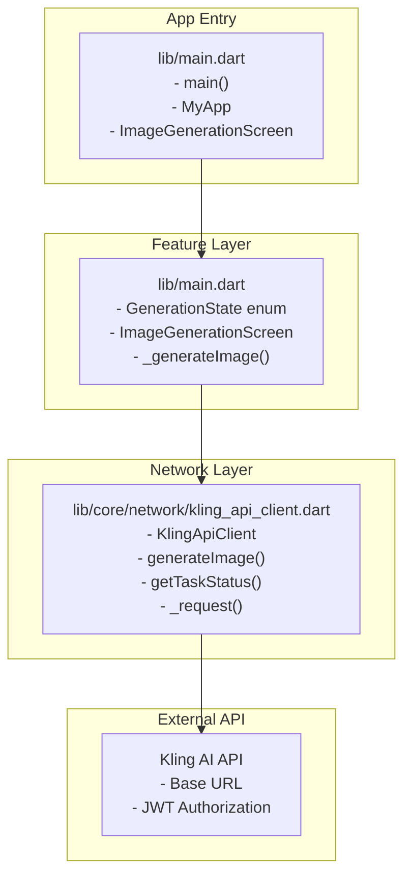
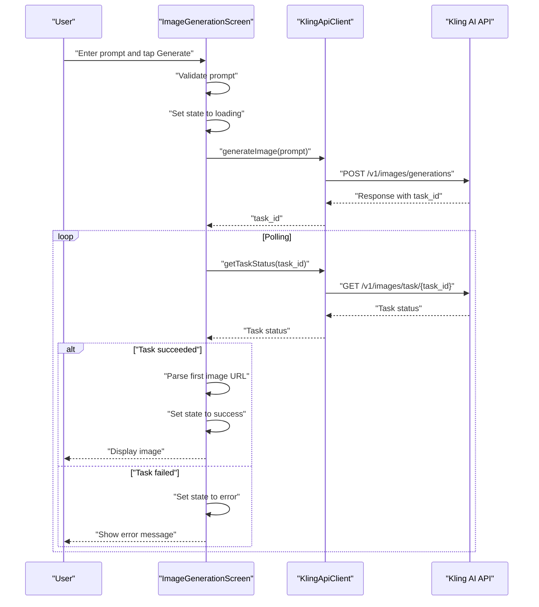
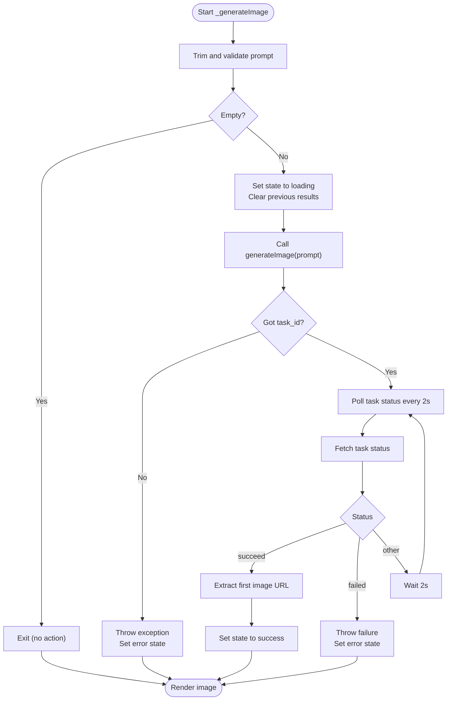
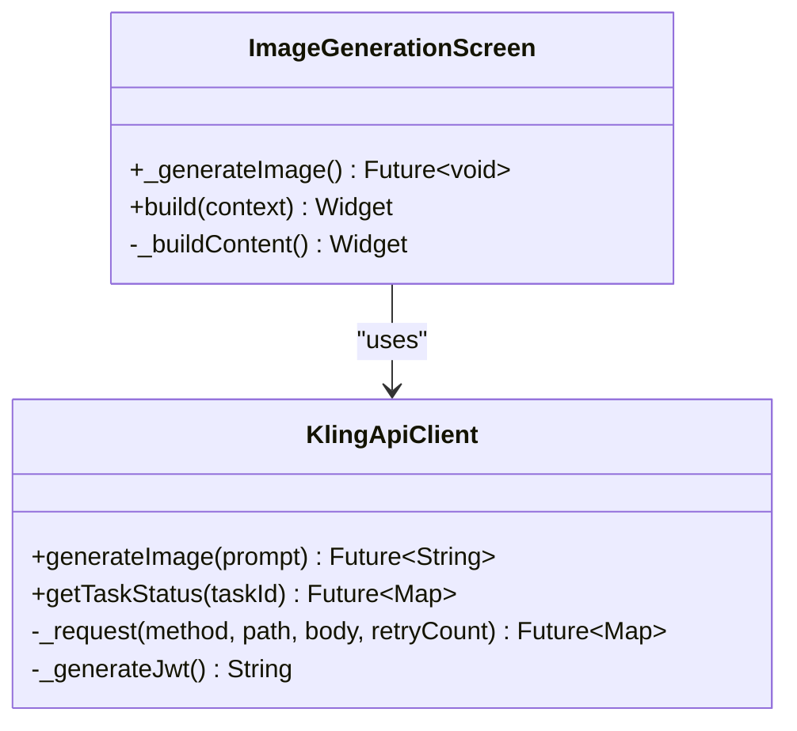
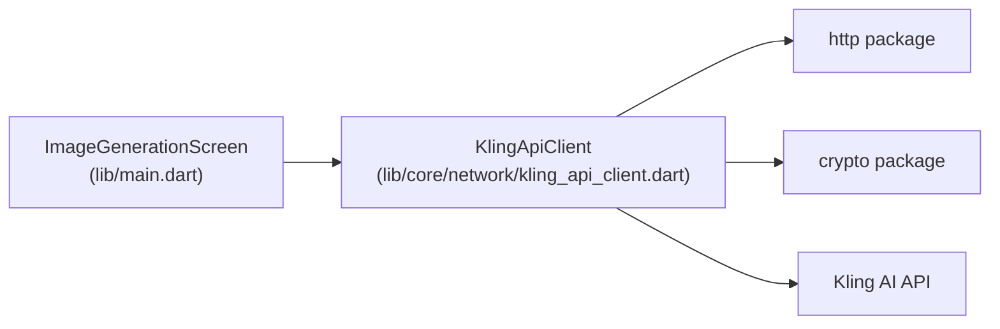

# AI Image Generation

<cite>
**Referenced Files in This Document**
- [main.dart](file://lib/main.dart)
- [kling_api_client.dart](file://lib/core/network/kling_api_client.dart)
- [env.txt](file://env.txt)
- [DESIGN.md](file://DESIGN.md)
</cite>

## Table of Contents
1. [Introduction](#introduction)
2. [Project Structure](#project-structure)
3. [Core Components](#core-components)
4. [Architecture Overview](#architecture-overview)
5. [Detailed Component Analysis](#detailed-component-analysis)
6. [Dependency Analysis](#dependency-analysis)
7. [Performance Considerations](#performance-considerations)
8. [Troubleshooting Guide](#troubleshooting-guide)
9. [Conclusion](#conclusion)

## Introduction
This document explains the AI image generation feature end-to-end, from text prompt input to image display. It covers the prompt validation, API request processing, asynchronous task polling, result handling, and state management using the GenerationState enum. It also documents the integration with the Kling AI API, request formatting, and response parsing for image URLs. Practical examples are provided via code snippet paths to guide implementation and troubleshooting.

## Project Structure
The AI image generation feature is implemented in a single screen widget backed by a dedicated API client. The application entry point initializes the UI theme and sets the home screen to the image generation interface. Environment variables for API credentials are stored separately for secure configuration.

**Diagram sources**
- [main.dart:1-191](file://lib/main.dart#L1-L191)
- [kling_api_client.dart:1-99](file://lib/core/network/kling_api_client.dart#L1-L99)

**Section sources**
- [main.dart:1-191](file://lib/main.dart#L1-L191)
- [kling_api_client.dart:1-99](file://lib/core/network/kling_api_client.dart#L1-L99)
- [env.txt:1-2](file://env.txt#L1-L2)

## Core Components
- GenerationState enum: Controls UI rendering states (idle, loading, success, error).
- ImageGenerationScreen: Manages user input, triggers generation, polls task status, and renders results.
- KlingApiClient: Handles JWT token generation, HTTP requests, rate limiting, and response parsing.

Key responsibilities:
- Prompt validation occurs before initiating generation.
- Asynchronous polling checks task status until completion or failure.
- UI updates are driven by state transitions and re-rendering logic.

**Section sources**
- [main.dart:28-90](file://lib/main.dart#L28-L90)
- [kling_api_client.dart:21-98](file://lib/core/network/kling_api_client.dart#L21-L98)

## Architecture Overview
The workflow follows a request-response pattern with asynchronous task polling:
1. User enters a prompt and taps Generate.
2. The screen validates the prompt and transitions to loading state.
3. The API client posts the prompt to the Kling AI API and receives a task ID.
4. The screen polls the task status periodically until success or failure.
5. On success, the first image URL is extracted and displayed; on failure, an error state is shown.

**Diagram sources**
- [main.dart:50-90](file://lib/main.dart#L50-L90)
- [kling_api_client.dart:79-97](file://lib/core/network/kling_api_client.dart#L79-L97)

## Detailed Component Analysis

### State Management with GenerationState
The GenerationState enum drives UI rendering:
- idle: Prompts the user to enter a prompt.
- loading: Shows a progress indicator and prevents duplicate submissions.
- success: Displays the generated image.
- error: Shows an error message with details.

Rendering logic is implemented in the screen’s build method using a switch over the current state. The _generateImage method orchestrates state transitions and error handling.

**Section sources**
- [main.dart:28-190](file://lib/main.dart#L28-L190)

### Prompt Validation and Input Handling
- The prompt is read from a text controller and trimmed.
- Empty prompts are rejected before any API calls.
- During loading, the Generate button is disabled to prevent concurrent requests.

Practical example paths:
- Prompt retrieval and validation: [lib/main.dart:50-58](file://lib/main.dart#L50-L58)
- Button state logic: [lib/main.dart:118-138](file://lib/main.dart#L118-L138)

**Section sources**
- [main.dart:50-58](file://lib/main.dart#L50-L58)
- [main.dart:118-138](file://lib/main.dart#L118-L138)

### Asynchronous Task Processing and Polling
The _generateImage method implements the polling loop:
- Initiates generation and sets loading state.
- Retrieves a task ID from the initial response.
- Polls the task status every two seconds until success or failure.
- Extracts the first image URL upon success and switches to success state.
- Catches exceptions and switches to error state.

**Diagram sources**
- [main.dart:50-90](file://lib/main.dart#L50-L90)

**Section sources**
- [main.dart:50-90](file://lib/main.dart#L50-L90)

### API Integration with Kling AI
KlingApiClient encapsulates:
- JWT token generation using HS256 signing with configured keys.
- HTTP request abstraction with timeout and retry logic for rate limits and server errors.
- Image generation endpoint invocation returning a task ID.
- Task status polling endpoint returning structured JSON.

Request/response handling:
- Request formatting: POST to /v1/images/generations with prompt, count, and size.
- Response parsing: Extract task_id from data, then poll /v1/images/task/{task_id} for completion.
- Result parsing: Extract the first image URL from task_result.images.

**Diagram sources**
- [kling_api_client.dart:21-98](file://lib/core/network/kling_api_client.dart#L21-L98)
- [main.dart:30-190](file://lib/main.dart#L30-L190)

**Section sources**
- [kling_api_client.dart:21-98](file://lib/core/network/kling_api_client.dart#L21-L98)
- [main.dart:50-90](file://lib/main.dart#L50-L90)

### Error Handling Strategies
- Network and parsing errors are captured and wrapped in custom exceptions.
- Rate limiting and server errors trigger exponential backoff with retries.
- Task failures are surfaced as errors with state transitions.
- UI displays error messages and remains interactive for retries.

Practical example paths:
- Request error handling and retries: [lib/core/network/kling_api_client.dart:42-77](file://lib/core/network/kling_api_client.dart#L42-L77)
- Task failure handling: [lib/main.dart:75-77](file://lib/main.dart#L75-L77)
- UI error rendering: [lib/main.dart:180-188](file://lib/main.dart#L180-L188)

**Section sources**
- [kling_api_client.dart:42-77](file://lib/core/network/kling_api_client.dart#L42-L77)
- [main.dart:75-77](file://lib/main.dart#L75-L77)
- [main.dart:180-188](file://lib/main.dart#L180-L188)

### User Interaction Patterns
- Input field with multiline support and placeholder guidance.
- Generate button disabled during loading to prevent duplicate submissions.
- Loading indicator replaces button text while generating.
- Success displays the image with a bordered container; error shows a centered message.

Practical example paths:
- Input field and button: [lib/main.dart:104-138](file://lib/main.dart#L104-L138)
- Content rendering per state: [lib/main.dart:149-189](file://lib/main.dart#L149-L189)
- Design guidelines for UI behavior: [DESIGN.md:31-44](file://DESIGN.md#L31-L44)

**Section sources**
- [main.dart:104-138](file://lib/main.dart#L104-L138)
- [main.dart:149-189](file://lib/main.dart#L149-L189)
- [DESIGN.md:31-44](file://DESIGN.md#L31-L44)

## Dependency Analysis
The feature exhibits clean separation of concerns:
- UI layer depends on state management and the API client.
- API client encapsulates HTTP logic and error handling.
- External dependency is the Kling AI service with JWT-based authentication.

**Diagram sources**
- [main.dart:30-90](file://lib/main.dart#L30-L90)
- [kling_api_client.dart:1-99](file://lib/core/network/kling_api_client.dart#L1-L99)

**Section sources**
- [main.dart:30-90](file://lib/main.dart#L30-L90)
- [kling_api_client.dart:1-99](file://lib/core/network/kling_api_client.dart#L1-L99)

## Performance Considerations
- Polling interval: Two seconds between status checks balances responsiveness with API load.
- Retries: Exponential backoff reduces retry pressure on the API.
- Timeout: Requests enforce a 30-second timeout to avoid hanging connections.
- Image loading: Using a network image widget defers decoding and memory usage until rendered.

Recommendations:
- Consider configurable polling intervals and maximum retry attempts.
- Add cancellation support to stop ongoing tasks.
- Implement caching for recently generated images to reduce network usage.

[No sources needed since this section provides general guidance]

## Troubleshooting Guide
Common issues and resolutions:
- No task_id returned: Verify prompt formatting and API availability; inspect thrown exception details.
- Task fails immediately: Check prompt validity and external API status; review error state message.
- Network errors: Confirm connectivity and retry behavior; ensure timeouts are not exceeded.
- Rate limit exceeded: Implement backoff and consider reducing polling frequency or number of concurrent requests.

Practical example paths:
- Exception types and messages: [lib/core/network/kling_api_client.dart:6-19](file://lib/core/network/kling_api_client.dart#L6-L19)
- Retry logic and exponential backoff: [lib/core/network/kling_api_client.dart:59-65](file://lib/core/network/kling_api_client.dart#L59-L65)
- Error state rendering: [lib/main.dart:180-188](file://lib/main.dart#L180-L188)

**Section sources**
- [kling_api_client.dart:6-19](file://lib/core/network/kling_api_client.dart#L6-L19)
- [kling_api_client.dart:59-65](file://lib/core/network/kling_api_client.dart#L59-L65)
- [main.dart:180-188](file://lib/main.dart#L180-L188)

## Conclusion
The AI image generation feature integrates a straightforward prompt-to-image workflow with robust state management and asynchronous polling. The GenerationState enum cleanly maps to UI states, while the KlingApiClient centralizes API communication, error handling, and retries. The design aligns with the project’s dark theme and minimal UI principles, ensuring a smooth user experience from input to image display.

[No sources needed since this section summarizes without analyzing specific files]