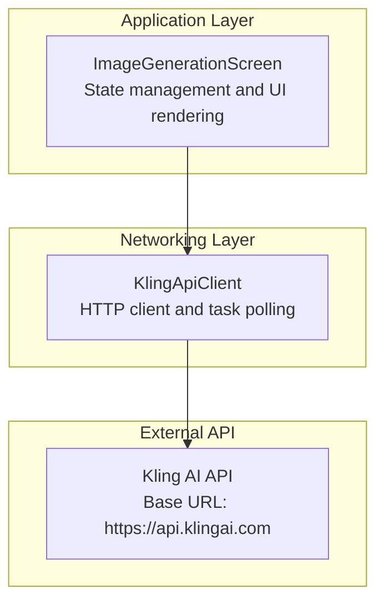
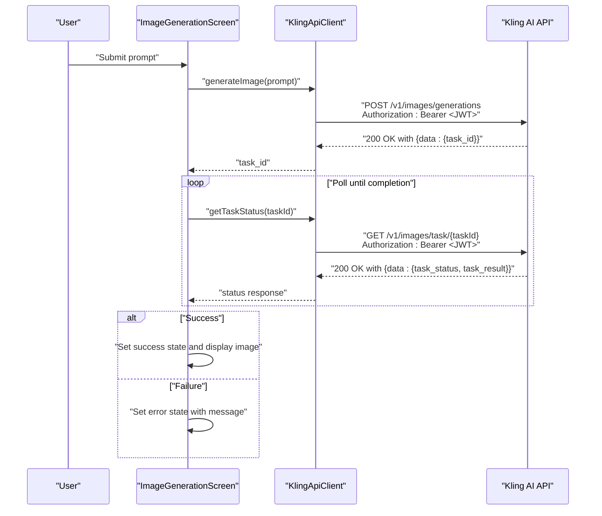
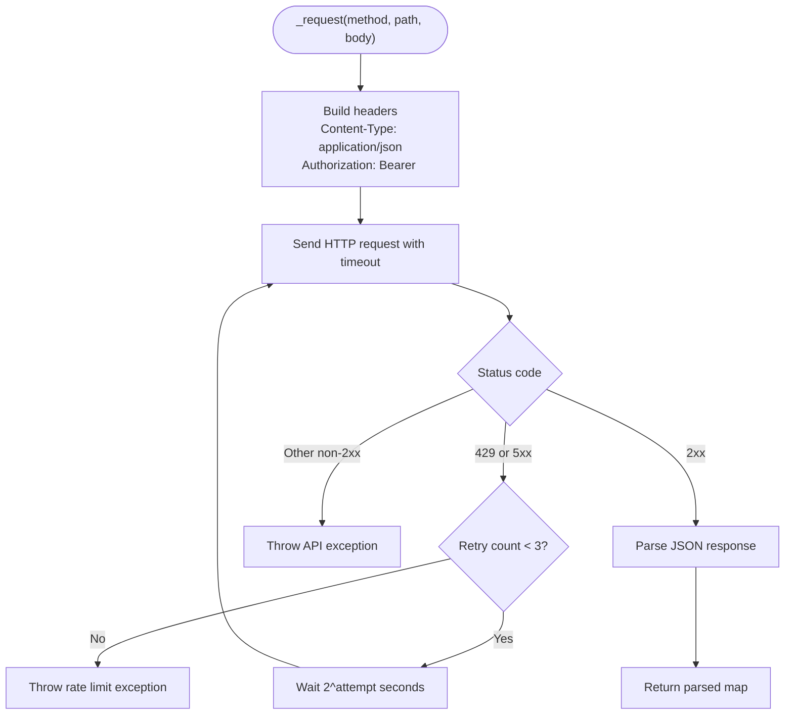
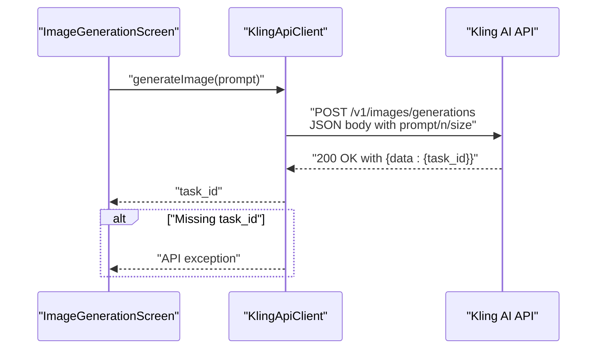
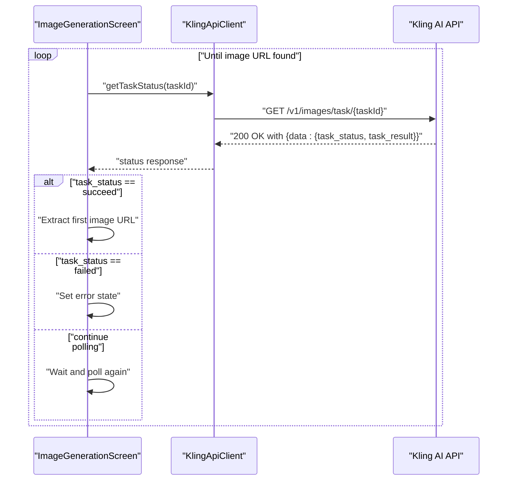
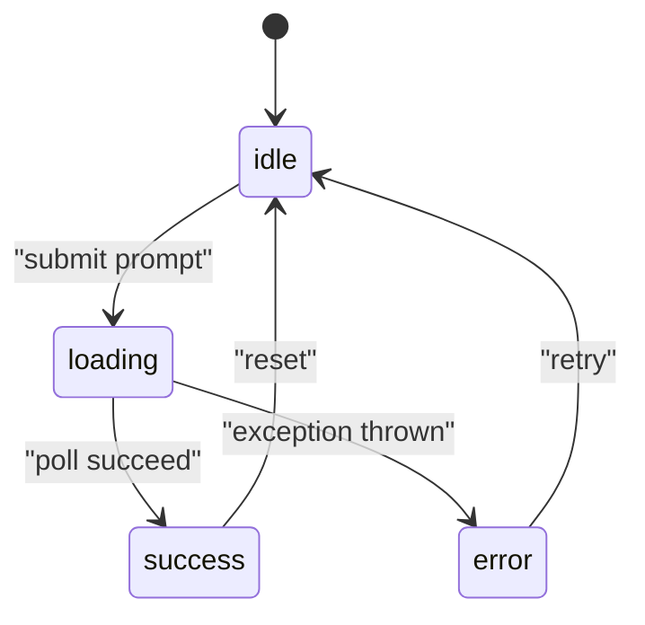
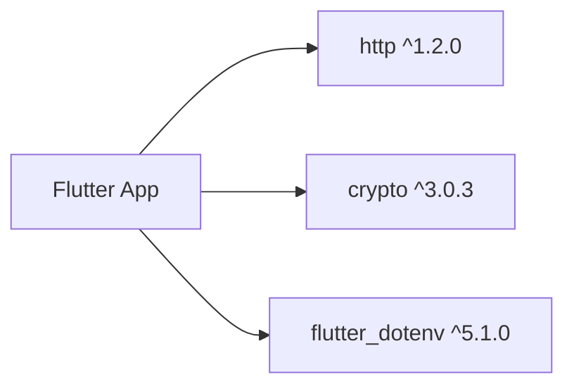

# API Integration

<cite>
**Referenced Files in This Document**
- [kling_api_client.dart](file://lib/core/network/kling_api_client.dart)
- [main.dart](file://lib/main.dart)
- [pubspec.yaml](file://pubspec.yaml)
- [env.txt](file://env.txt)
</cite>

## Table of Contents
1. [Introduction](#introduction)
2. [Project Structure](#project-structure)
3. [Core Components](#core-components)
4. [Architecture Overview](#architecture-overview)
5. [Detailed Component Analysis](#detailed-component-analysis)
6. [Dependency Analysis](#dependency-analysis)
7. [Performance Considerations](#performance-considerations)
8. [Troubleshooting Guide](#troubleshooting-guide)
9. [Conclusion](#conclusion)

## Introduction
This document provides comprehensive API documentation for the Kling AI integration within the Flutter application. It focuses on the HTTP client implementation, request and response handling, error management, and the asynchronous workflow for generating images via the Kling API. It also explains how the API responses drive UI state transitions in the main application screen.

## Project Structure
The API integration spans two primary areas:
- Core networking layer: Implements JWT-based authentication, HTTP requests, retry logic, and task polling.
- Application UI: Orchestrates user prompts, invokes the API client, polls task status, and updates the UI state accordingly.

**Diagram sources**
- [main.dart:30-90](file://lib/main.dart#L30-L90)
- [kling_api_client.dart:21-98](file://lib/core/network/kling_api_client.dart#L21-L98)

**Section sources**
- [main.dart:1-191](file://lib/main.dart#L1-L191)
- [kling_api_client.dart:1-99](file://lib/core/network/kling_api_client.dart#L1-L99)
- [pubspec.yaml:30-40](file://pubspec.yaml#L30-L40)

## Core Components
- Authentication and Authorization
  - JWT generation with HMAC SHA-256 signing, issued by the configured access key, with current timestamp and expiration.
  - Authorization header uses Bearer token format.
- HTTP Client
  - Centralized request method supporting GET and POST with JSON bodies.
  - Built-in timeout per request.
  - Retry logic for rate limiting and server errors with exponential backoff.
- Task Management
  - Image generation initiates a task and returns a task identifier.
  - Task status polling retrieves progress and result metadata.
- UI Integration
  - State machine drives UI feedback during idle, loading, success, and error conditions.
  - Polling loop checks task status until completion or failure.

**Section sources**
- [kling_api_client.dart:21-98](file://lib/core/network/kling_api_client.dart#L21-L98)
- [main.dart:28-90](file://lib/main.dart#L28-L90)

## Architecture Overview
The application follows a clean separation of concerns:
- UI layer triggers image generation and renders outcomes.
- Networking layer encapsulates API communication, authentication, and error handling.
- External API is accessed via HTTPS with JWT-based authentication.

**Diagram sources**
- [main.dart:50-90](file://lib/main.dart#L50-L90)
- [kling_api_client.dart:79-97](file://lib/core/network/kling_api_client.dart#L79-L97)

## Detailed Component Analysis

### HTTP Client Implementation
- Responsibilities
  - Generate JWT tokens with issuer, expiration, and issued-at claims.
  - Perform HTTP requests with JSON content type and Authorization header.
  - Apply timeouts and handle transient failures with exponential backoff.
  - Parse successful responses and raise typed exceptions for errors.
- Authentication
  - Uses HMAC SHA-256 to sign a compact JWT with base64-encoded header and payload, and a URL-safe signature.
  - Injects the token into the Authorization header as a Bearer token.
- Request Handling
  - Supports POST for generation and GET for status retrieval.
  - Applies a 30-second timeout to all requests.
  - Throws a rate-limit exception when repeated 429 or 5xx responses exceed retry threshold.
  - Throws a generic API exception for non-2xx responses.
  - Catches network and parsing errors and wraps them in a unified exception type.
- Exponential Backoff
  - Retries up to three times for rate limits and server errors.
  - Wait duration doubles each attempt (1s, 2s, 4s).

**Diagram sources**
- [kling_api_client.dart:42-77](file://lib/core/network/kling_api_client.dart#L42-L77)

**Section sources**
- [kling_api_client.dart:21-77](file://lib/core/network/kling_api_client.dart#L21-L77)

### Image Generation Workflow
- Endpoint
  - POST /v1/images/generations
- Request Body
  - prompt: string
  - n: integer (number of images)
  - size: string (resolution)
- Response
  - data.task_id: string (required)
- Error Handling
  - Missing task_id results in an API exception.
  - Non-2xx responses trigger an API exception.
  - Network or parsing errors are captured and rethrown as API exceptions.

**Diagram sources**
- [kling_api_client.dart:79-92](file://lib/core/network/kling_api_client.dart#L79-L92)

**Section sources**
- [kling_api_client.dart:79-92](file://lib/core/network/kling_api_client.dart#L79-L92)

### Task Status Polling
- Endpoint
  - GET /v1/images/task/{taskId}
- Response Fields of Interest
  - data.task_status: string (expected values include succeed, failed)
  - data.task_result.images: array of objects containing url
- Polling Behavior
  - The UI polls at fixed intervals until success or failure.
  - On success, the first image URL is extracted and displayed.
  - On failure, an error state is set.

**Diagram sources**
- [kling_api_client.dart:94-97](file://lib/core/network/kling_api_client.dart#L94-L97)
- [main.dart:64-78](file://lib/main.dart#L64-L78)

**Section sources**
- [kling_api_client.dart:94-97](file://lib/core/network/kling_api_client.dart#L94-L97)
- [main.dart:64-78](file://lib/main.dart#L64-L78)

### UI Integration and State Transitions
- States
  - idle: initial state with prompt input.
  - loading: request sent; spinner shown.
  - success: image displayed.
  - error: error message shown.
- Actions
  - Submitting a prompt triggers generation and switches to loading.
  - Successful polling sets success and displays the image.
  - Exceptions during generation or polling set error state.

**Diagram sources**
- [main.dart:28-90](file://lib/main.dart#L28-L90)

**Section sources**
- [main.dart:28-90](file://lib/main.dart#L28-L90)

## Dependency Analysis
- External Libraries
  - http: ^1.2.0 for HTTP requests.
  - crypto: ^3.0.3 for HMAC signing and hashing.
  - flutter_dotenv: ^5.1.0 for environment variable loading (declared but not used in the referenced files).
- Environment Configuration
  - Access and secret keys are embedded in the client constants.
  - Environment file is present but not loaded in the referenced code.

**Diagram sources**
- [pubspec.yaml:30-40](file://pubspec.yaml#L30-L40)

**Section sources**
- [pubspec.yaml:30-40](file://pubspec.yaml#L30-L40)
- [env.txt:1-3](file://env.txt#L1-L3)

## Performance Considerations
- Timeout
  - All requests are subject to a 30-second timeout to prevent indefinite blocking.
- Retry Strategy
  - Up to three retries with exponential backoff (1s, 2s, 4s) for rate limits and server errors.
- Polling Interval
  - The UI polls every 2 seconds. Adjusting this interval can reduce load on the API and improve responsiveness.
- Concurrency
  - The UI disables the generate button during loading to avoid overlapping requests.

[No sources needed since this section provides general guidance]

## Troubleshooting Guide
- Common Exceptions
  - API exception: raised for non-2xx responses and invalid responses.
  - Rate limit exception: raised after retries are exhausted under 429 or 5xx conditions.
  - Network errors: socket exceptions are captured and reported as API exceptions.
- Error Scenarios
  - Missing task_id in generation response leads to an API exception.
  - Task failure status triggers an error state in the UI.
- Recommendations
  - Validate prompt length and content before sending.
  - Monitor network connectivity and retry logic behavior.
  - Consider increasing the polling interval for long-running tasks.

**Section sources**
- [kling_api_client.dart:6-19](file://lib/core/network/kling_api_client.dart#L6-L19)
- [kling_api_client.dart:54-77](file://lib/core/network/kling_api_client.dart#L54-L77)
- [main.dart:84-89](file://lib/main.dart#L84-L89)

## Conclusion
The Kling AI integration is implemented with a focused HTTP client that handles JWT authentication, robust error management, and exponential backoff. The UI integrates seamlessly with the client to orchestrate asynchronous image generation, polling, and state-driven rendering. Extending the client to support environment-based configuration and configurable polling intervals would further improve maintainability and flexibility.