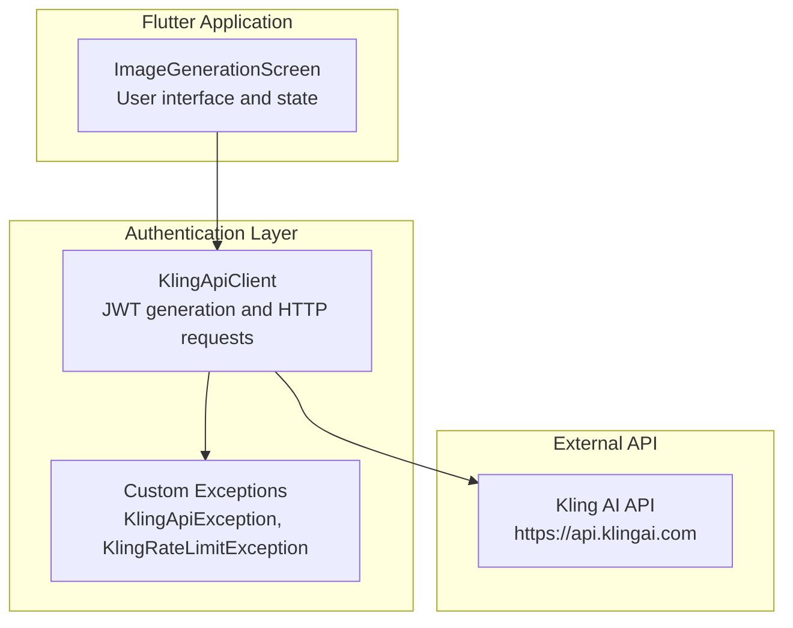
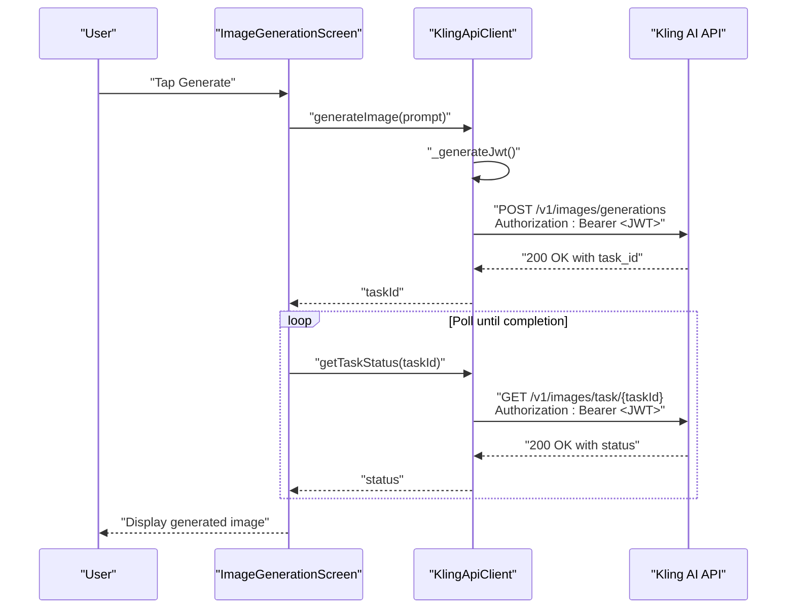
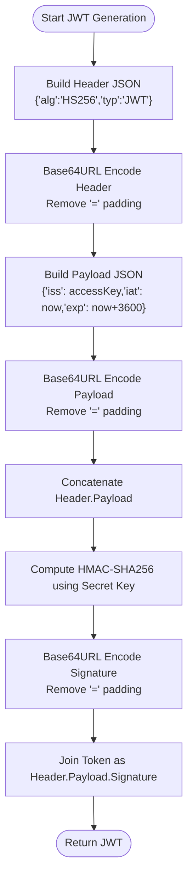
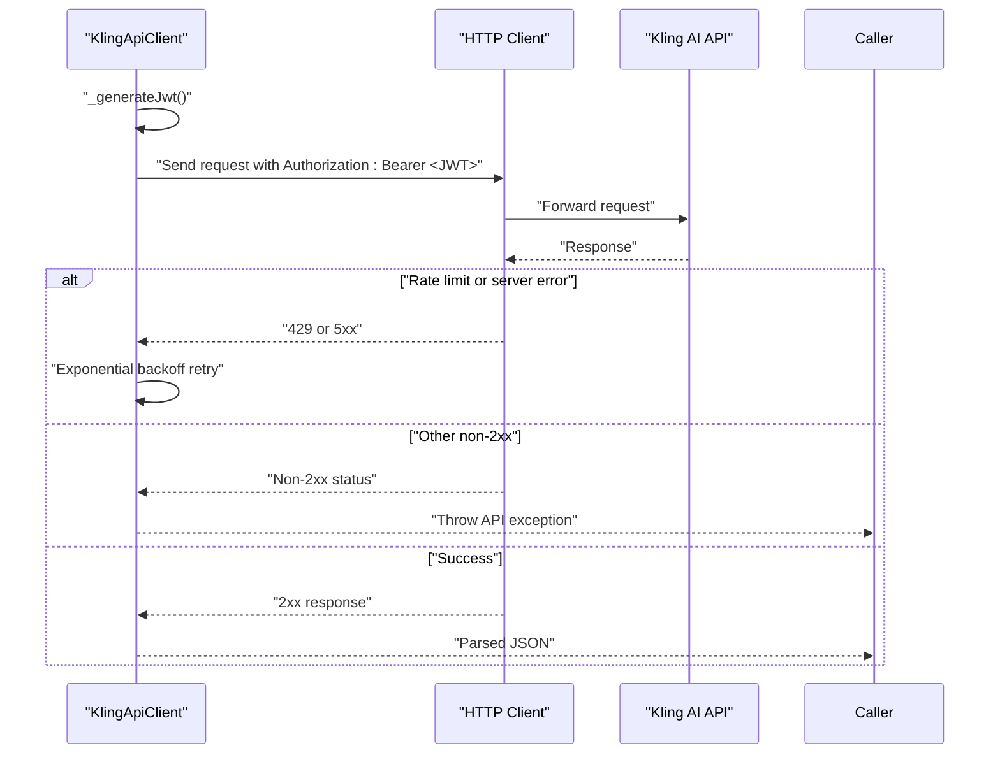
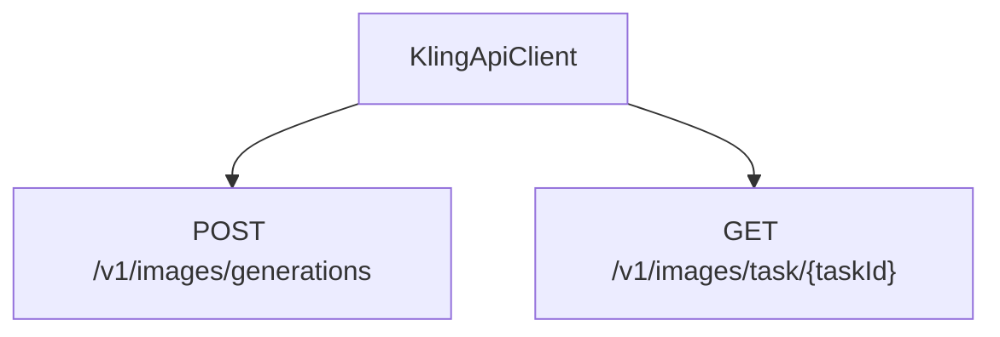
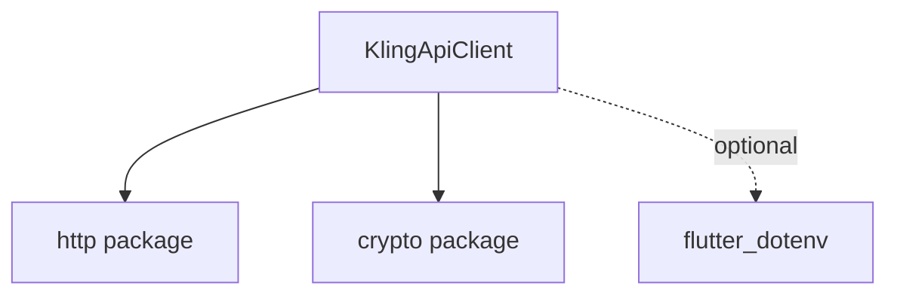

# Authentication System

<cite>
**Referenced Files in This Document**
- [kling_api_client.dart](file://lib/core/network/kling_api_client.dart)
- [main.dart](file://lib/main.dart)
- [pubspec.yaml](file://pubspec.yaml)
- [env.txt](file://env.txt)
</cite>

## Table of Contents
1. [Introduction](#introduction)
2. [Project Structure](#project-structure)
3. [Core Components](#core-components)
4. [Architecture Overview](#architecture-overview)
5. [Detailed Component Analysis](#detailed-component-analysis)
6. [Dependency Analysis](#dependency-analysis)
7. [Performance Considerations](#performance-considerations)
8. [Troubleshooting Guide](#troubleshooting-guide)
9. [Conclusion](#conclusion)

## Introduction
This document explains the authentication system used to access the Kling AI API with JSON Web Tokens (JWT) using the HS256 algorithm. It covers token generation, header and payload structure, signature creation via HMAC-SHA256, integration with the API client, and security considerations. Practical examples show how tokens are constructed, encoded, and attached to requests as Authorization headers. The document also addresses token expiration handling, retry mechanisms for rate limits, and error scenarios during authentication.

## Project Structure
The authentication logic is encapsulated in a dedicated API client class responsible for generating JWTs and making authenticated requests to the Kling AI API. The Flutter application integrates this client to trigger image generation workflows.

**Diagram sources**
- [main.dart:30-90](file://lib/main.dart#L30-L90)
- [kling_api_client.dart:21-99](file://lib/core/network/kling_api_client.dart#L21-L99)

**Section sources**
- [main.dart:1-191](file://lib/main.dart#L1-L191)
- [kling_api_client.dart:1-99](file://lib/core/network/kling_api_client.dart#L1-L99)

## Core Components
- JWT Generator: Creates a signed JWT with HS256 using a fixed access key as issuer and a short-lived validity window.
- HTTP Client: Sends authenticated requests to the Kling AI API with Authorization headers containing the generated JWT.
- Exception Handling: Distinguishes between API errors, rate limits, and network/format errors.

Key responsibilities:
- Construct JWT header with algorithm and token type.
- Build payload with issuer, issued-at, and expiration timestamps.
- Compute HMAC-SHA256 signature using the secret key.
- Attach the resulting JWT to every request as a Bearer token.
- Retry transient failures and handle rate-limit conditions.

**Section sources**
- [kling_api_client.dart:26-40](file://lib/core/network/kling_api_client.dart#L26-L40)
- [kling_api_client.dart:42-77](file://lib/core/network/kling_api_client.dart#L42-L77)

## Architecture Overview
The authentication flow integrates the UI, API client, and external service. The UI triggers image generation, the API client generates a JWT per request, and the API validates the token before processing the request.

**Diagram sources**
- [main.dart:50-90](file://lib/main.dart#L50-L90)
- [kling_api_client.dart:79-97](file://lib/core/network/kling_api_client.dart#L79-L97)

## Detailed Component Analysis

### JWT Token Generation
The JWT comprises three parts separated by dots:
- Header: Contains algorithm and token type.
- Payload: Contains issuer, issued-at, and expiration.
- Signature: HMAC-SHA256 of the concatenated header and payload, signed with the secret key.

Token structure and generation steps:
- Header: JSON object encoded using URL-safe base64 and stripped of padding.
- Payload: JSON object encoded using URL-safe base64 and stripped of padding.
- Signature input: Concatenation of header and payload with a dot separator.
- Signature: HMAC-SHA256 computed over the signature input using the secret key, encoded with URL-safe base64 and stripped of padding.
- Final token: Concatenation of header, payload, and signature with dots.

**Diagram sources**
- [kling_api_client.dart:26-40](file://lib/core/network/kling_api_client.dart#L26-L40)

**Section sources**
- [kling_api_client.dart:26-40](file://lib/core/network/kling_api_client.dart#L26-L40)

### Request Execution and Authorization
Each request attaches the JWT in the Authorization header as a Bearer token. The client supports POST and GET operations and includes robust error handling for network, format, and API errors. It also implements exponential backoff for rate-limit and server errors.

**Diagram sources**
- [kling_api_client.dart:42-77](file://lib/core/network/kling_api_client.dart#L42-L77)

**Section sources**
- [kling_api_client.dart:42-77](file://lib/core/network/kling_api_client.dart#L42-L77)

### Credential Management
Current implementation embeds credentials directly in the client class. While functional, this approach exposes secrets in the compiled application binary, increasing risk exposure.

Recommended improvements:
- Load credentials from environment variables or secure storage.
- Use platform-specific secure storage APIs for sensitive keys.
- Avoid hardcoding secrets in source files.

**Section sources**
- [kling_api_client.dart:22-24](file://lib/core/network/kling_api_client.dart#L22-L24)
- [pubspec.yaml:38-39](file://pubspec.yaml#L38-L39)

### Token Storage Strategies
The current implementation does not persist tokens. Each request generates a fresh JWT. This reduces token reuse but increases computational overhead per request.

Considerations:
- Short-lived tokens eliminate long-term storage needs.
- If persistence becomes necessary, store encrypted tokens in secure storage and invalidate on logout.

**Section sources**
- [kling_api_client.dart:26-40](file://lib/core/network/kling_api_client.dart#L26-L40)

### Integration with Kling AI API
The client targets the Kling AI API base URL and uses the Authorization header pattern required by the service. It performs two primary operations:
- Image generation: POST to the generations endpoint with prompt, count, and size parameters.
- Task polling: GET task status using the returned task ID.

**Diagram sources**
- [kling_api_client.dart:79-97](file://lib/core/network/kling_api_client.dart#L79-L97)

**Section sources**
- [kling_api_client.dart:79-97](file://lib/core/network/kling_api_client.dart#L79-L97)

## Dependency Analysis
The authentication system relies on the following dependencies:
- HTTP client for network requests.
- Crypto library for HMAC-SHA256 computation.
- DotEnv for environment variable loading (declared in pubspec).

**Diagram sources**
- [pubspec.yaml:37-39](file://pubspec.yaml#L37-L39)

**Section sources**
- [pubspec.yaml:30-40](file://pubspec.yaml#L30-L40)

## Performance Considerations
- Token generation cost: Each request computes HMAC-SHA256, which is lightweight but repeated frequently. Consider caching tokens only if acceptable for your security model.
- Network timeouts: Requests timeout after 30 seconds to prevent hanging operations.
- Retry strategy: Exponential backoff mitigates transient failures from rate limits and server errors.

Recommendations:
- Batch requests where possible to reduce redundant token computations.
- Monitor API latency and adjust timeouts accordingly.
- Implement connection pooling if extending to higher concurrency.

**Section sources**
- [kling_api_client.dart:57-65](file://lib/core/network/kling_api_client.dart#L57-L65)

## Troubleshooting Guide
Common error scenarios and handling:
- Rate limit exceeded: The client retries up to three times with exponential backoff and throws a dedicated rate-limit exception when exhausted.
- Non-2xx responses: Throws a generic API exception with the status code for diagnosis.
- Network errors: Catches socket exceptions and surfaces them as API exceptions.
- Response format errors: Catches format exceptions and reports invalid response format.

Resolution steps:
- Inspect status codes and messages from thrown exceptions.
- Verify network connectivity and API availability.
- Confirm credentials and token validity windows.
- Adjust retry logic and timeouts based on observed failure patterns.

**Section sources**
- [kling_api_client.dart:6-19](file://lib/core/network/kling_api_client.dart#L6-L19)
- [kling_api_client.dart:54-76](file://lib/core/network/kling_api_client.dart#L54-L76)

## Conclusion
The authentication system uses HS256-signed JWTs to authorize requests to the Kling AI API. It generates tokens per request, attaches them via Bearer headers, and handles errors gracefully with retries and clear exception types. For production, strengthen credential management by moving secrets out of source code and into secure storage. Consider token caching only after evaluating risk and implementing appropriate safeguards. The current design balances simplicity and reliability for the provided use case.