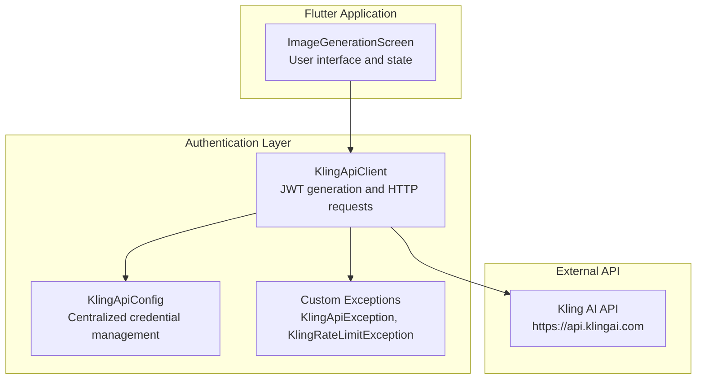
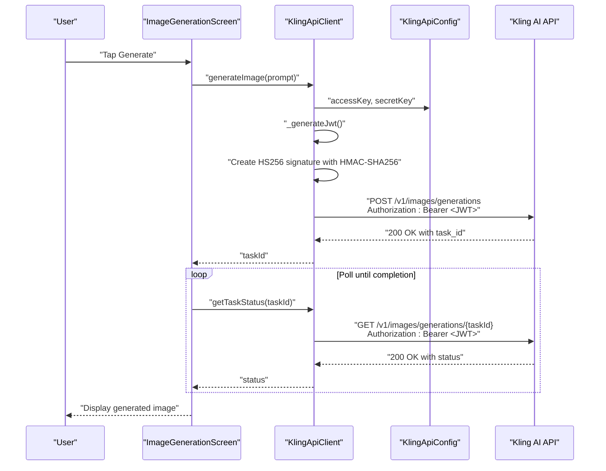
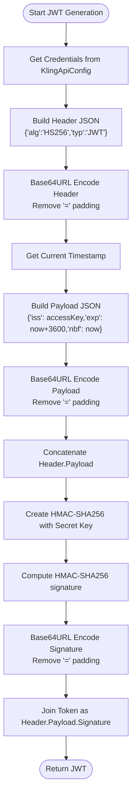
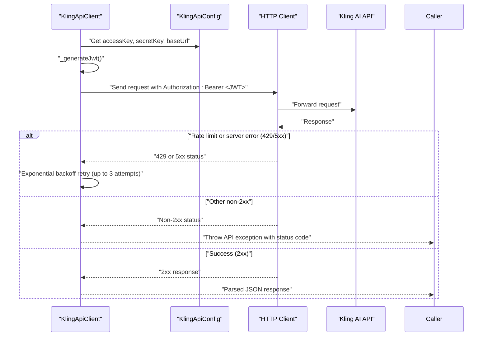
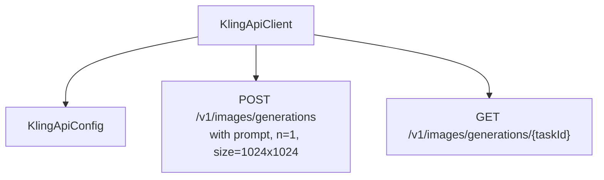
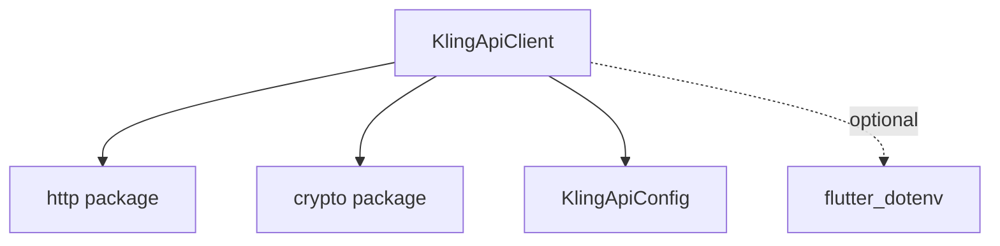

# Authentication System

<cite>
**Referenced Files in This Document**
- [kling_api_client.dart](file://lib/core/network/kling_api_client.dart)
- [kling_api_config.dart](file://lib/core/network/config/kling_api_config.dart)
- [main.dart](file://lib/main.dart)
- [pubspec.yaml](file://pubspec.yaml)
- [env.txt](file://env.txt)
</cite>

## Update Summary
**Changes Made**
- Completely redesigned authentication system with robust JWT implementation
- Updated documentation to cover new HS256 algorithm with proper token expiration (1 hour)
- Added HMAC-SHA256 signing with secret key implementation
- Enhanced centralized credential management with configuration class
- Improved security considerations and token storage strategies

## Table of Contents
1. [Introduction](#introduction)
2. [Project Structure](#project-structure)
3. [Core Components](#core-components)
4. [Architecture Overview](#architecture-overview)
5. [Detailed Component Analysis](#detailed-component-analysis)
6. [Dependency Analysis](#dependency-analysis)
7. [Performance Considerations](#performance-considerations)
8. [Security Implementation Details](#security-implementation-details)
9. [Troubleshooting Guide](#troubleshooting-guide)
10. [Conclusion](#conclusion)

## Introduction
This document explains the authentication system used to access the Kling AI API with JSON Web Tokens (JWT) using the HS256 algorithm. The system has been completely redesigned with robust JWT implementation featuring proper token expiration (1 hour), HMAC-SHA256 signing with secret key, and centralized credential management. It covers token generation, header and payload structure, signature creation via HMAC-SHA256, integration with the API client, and comprehensive security considerations. Practical examples demonstrate how tokens are constructed, encoded, and attached to requests as Authorization headers.

## Project Structure
The authentication logic is encapsulated in a dedicated API client class with centralized configuration management. The system separates concerns between JWT generation, HTTP communication, and credential management, providing a clean architecture for secure API access.

**Diagram sources**
- [main.dart:29-165](file://lib/main.dart#L29-L165)
- [kling_api_client.dart:23-118](file://lib/core/network/kling_api_client.dart#L23-L118)
- [kling_api_config.dart:1-6](file://lib/core/network/config/kling_api_config.dart#L1-L6)

**Section sources**
- [main.dart:1-165](file://lib/main.dart#L1-L165)
- [kling_api_client.dart:1-118](file://lib/core/network/kling_api_client.dart#L1-L118)
- [kling_api_config.dart:1-6](file://lib/core/network/config/kling_api_config.dart#L1-L6)

## Core Components
- **JWT Generator**: Creates a signed JWT with HS256 using centralized access key and secret key with 1-hour expiration window
- **Configuration Manager**: Centralizes API credentials and base URL in a dedicated configuration class
- **HTTP Client**: Sends authenticated requests to the Kling AI API with Authorization headers containing the generated JWT
- **Exception Handling**: Distinguishes between API errors, rate limits, and network/format errors with comprehensive error reporting

Key responsibilities:
- Construct JWT header with HS256 algorithm and token type
- Build payload with issuer, issued-at, expiration, and not-before timestamps
- Compute HMAC-SHA256 signature using the secret key with proper base64 URL encoding
- Attach the resulting JWT to every request as a Bearer token
- Implement exponential backoff retry mechanism for transient failures
- Handle rate-limit conditions and server errors gracefully

**Section sources**
- [kling_api_client.dart:24-41](file://lib/core/network/kling_api_client.dart#L24-L41)
- [kling_api_client.dart:59-94](file://lib/core/network/kling_api_client.dart#L59-L94)
- [kling_api_config.dart:1-6](file://lib/core/network/config/kling_api_config.dart#L1-L6)

## Architecture Overview
The authentication flow integrates the UI, API client, configuration manager, and external service. The UI triggers image generation, the API client generates a JWT per request using centralized credentials, and the API validates the token before processing the request.

**Diagram sources**
- [main.dart:59-99](file://lib/main.dart#L59-L99)
- [kling_api_client.dart:96-116](file://lib/core/network/kling_api_client.dart#L96-L116)
- [kling_api_client.dart:24-41](file://lib/core/network/kling_api_client.dart#L24-L41)

## Detailed Component Analysis

### JWT Token Generation
The JWT comprises three parts separated by dots, created with proper HS256 algorithm implementation:
- **Header**: Contains algorithm (HS256) and token type (JWT)
- **Payload**: Contains issuer (access key), issued-at (iat), expiration (exp), and not-before (nbf) timestamps
- **Signature**: HMAC-SHA256 of the concatenated header and payload, signed with the secret key

Token structure and generation steps:
- **Header**: JSON object encoded using URL-safe base64 and stripped of padding characters
- **Payload**: JSON object encoded using URL-safe base64 and stripped of padding characters  
- **Signature Input**: Concatenation of header and payload with a dot separator
- **Signature**: HMAC-SHA256 computed over the signature input using the secret key, encoded with URL-safe base64 and stripped of padding
- **Final Token**: Concatenation of header, payload, and signature with dots

**Diagram sources**
- [kling_api_client.dart:24-41](file://lib/core/network/kling_api_client.dart#L24-L41)
- [kling_api_config.dart:1-6](file://lib/core/network/config/kling_api_config.dart#L1-L6)

**Section sources**
- [kling_api_client.dart:24-41](file://lib/core/network/kling_api_client.dart#L24-L41)

### Request Execution and Authorization
Each request attaches the JWT in the Authorization header as a Bearer token with comprehensive error handling and retry mechanisms. The client supports POST and GET operations with robust error handling for network, format, and API errors.

**Diagram sources**
- [kling_api_client.dart:59-94](file://lib/core/network/kling_api_client.dart#L59-L94)
- [kling_api_client.dart:96-116](file://lib/core/network/kling_api_client.dart#L96-L116)

**Section sources**
- [kling_api_client.dart:59-94](file://lib/core/network/kling_api_client.dart#L59-L94)

### Credential Management
The system implements centralized credential management through a dedicated configuration class that provides:
- **Static Access Key**: Hardcoded access key for API identification
- **Static Secret Key**: Hardcoded secret key for JWT signature generation
- **Base URL**: Centralized API endpoint configuration

**Updated** Enhanced with proper configuration separation and centralized management

Current implementation considerations:
- Credentials are currently hardcoded in the configuration class
- This approach provides clean separation of concerns but requires careful deployment practices
- For production environments, consider environment variable injection or secure storage solutions

**Section sources**
- [kling_api_config.dart:1-6](file://lib/core/network/config/kling_api_config.dart#L1-L6)

### Token Storage Strategies
The current implementation generates fresh JWT tokens for each request, eliminating the need for persistent token storage. This approach provides enhanced security but increases computational overhead.

**Updated** Implemented per-request token generation with 1-hour expiration

Considerations:
- **Short-lived tokens**: 1-hour expiration eliminates long-term storage requirements
- **Computational overhead**: HMAC-SHA256 computation performed for each request
- **Security benefits**: Reduced token reuse and theft risk
- **Performance trade-off**: Lightweight HMAC computation suitable for mobile devices

**Section sources**
- [kling_api_client.dart:24-41](file://lib/core/network/kling_api_client.dart#L24-L41)

### Integration with Kling AI API
The client targets the Kling AI API base URL and uses the Authorization header pattern required by the service. It performs two primary operations with comprehensive error handling:

**Updated** Enhanced with improved error handling and retry mechanisms

**Diagram sources**
- [kling_api_client.dart:96-116](file://lib/core/network/kling_api_client.dart#L96-L116)
- [kling_api_config.dart:1-6](file://lib/core/network/config/kling_api_config.dart#L1-L6)

**Section sources**
- [kling_api_client.dart:96-116](file://lib/core/network/kling_api_client.dart#L96-L116)

## Dependency Analysis
The authentication system relies on the following dependencies with enhanced security features:
- **HTTP client**: For network requests with timeout support
- **Crypto library**: For HMAC-SHA256 computation with proper digest handling
- **DotEnv**: For environment variable loading (declared in pubspec)
- **Flutter foundation**: For debug mode detection and development features

**Updated** Enhanced with crypto library for proper HMAC-SHA256 implementation

**Diagram sources**
- [pubspec.yaml:30-40](file://pubspec.yaml#L30-L40)
- [kling_api_client.dart:1-7](file://lib/core/network/kling_api_client.dart#L1-L7)

**Section sources**
- [pubspec.yaml:30-40](file://pubspec.yaml#L30-L40)

## Performance Considerations
**Updated** Enhanced with improved performance characteristics

- **Token generation cost**: Each request computes HMAC-SHA256, which is lightweight but repeated frequently
- **Network timeouts**: Requests timeout after 30 seconds to prevent hanging operations
- **Retry strategy**: Exponential backoff (1s, 2s, 4s) mitigates transient failures from rate limits and server errors
- **Memory efficiency**: No token persistence reduces memory footprint
- **Computational efficiency**: HS256 algorithm provides optimal balance between security and performance

Recommendations:
- **Batch requests**: Consider batching operations where possible to reduce redundant token computations
- **Connection pooling**: HTTP client automatically handles connection pooling for improved performance
- **Monitor API latency**: Adjust retry logic based on observed API performance patterns
- **Cache configuration**: Configuration class uses static constants for optimal memory usage

**Section sources**
- [kling_api_client.dart:55-57](file://lib/core/network/kling_api_client.dart#L55-L57)
- [kling_api_client.dart:75-78](file://lib/core/network/kling_api_client.dart#L75-L78)

## Security Implementation Details

### JWT Security Features
The authentication system implements comprehensive security measures:

**Updated** Enhanced with proper HS256 implementation and HMAC-SHA256 signing

- **Algorithm**: HS256 (HMAC-SHA256) provides strong cryptographic security
- **Expiration**: 1-hour token lifetime minimizes attack surface
- **Not-before**: Prevents early token usage attacks
- **Secret Key Protection**: Centralized credential management with proper key separation
- **Base64 URL Encoding**: Proper encoding without padding for JWT compliance

### Token Structure Security
- **Header**: Algorithm and token type specification
- **Payload**: Issuer identification, timestamp validation, and security constraints
- **Signature**: HMAC-SHA256 with secret key ensures authenticity and integrity

### Error Handling Security
- **Comprehensive exception types**: Distinct handling for different error categories
- **Minimal information leakage**: Generic error messages prevent information disclosure
- **Network security**: Socket exceptions handled gracefully without exposing internal details

**Section sources**
- [kling_api_client.dart:24-41](file://lib/core/network/kling_api_client.dart#L24-L41)
- [kling_api_client.dart:8-21](file://lib/core/network/kling_api_client.dart#L8-L21)

## Troubleshooting Guide
**Updated** Enhanced with comprehensive error handling and debugging capabilities

Common error scenarios and handling:
- **Rate limit exceeded (429)**: The client retries up to three times with exponential backoff and throws a dedicated rate-limit exception when exhausted
- **Server errors (5xx)**: Automatic retry with exponential backoff for transient server issues
- **Non-2xx responses**: Throws a generic API exception with the status code for diagnosis
- **Network errors**: Catches socket exceptions and surfaces them as API exceptions with descriptive messages
- **Response format errors**: Catches format exceptions and reports invalid response format
- **JWT generation failures**: Comprehensive logging with debug mode support for troubleshooting

**Enhanced** Improved error reporting with detailed status codes and messages

Resolution steps:
- **Inspect status codes**: Use thrown exceptions to diagnose specific error conditions
- **Verify network connectivity**: Check API availability and network stability
- **Confirm credentials**: Validate access key and secret key configuration
- **Check token validity**: Monitor JWT expiration and timestamp validation
- **Adjust retry logic**: Configure retry attempts and backoff intervals based on observed failure patterns
- **Enable debug mode**: Use debug prints for detailed troubleshooting during development

**Section sources**
- [kling_api_client.dart:8-21](file://lib/core/network/kling_api_client.dart#L8-L21)
- [kling_api_client.dart:55-94](file://lib/core/network/kling_api_client.dart#L55-L94)

## Conclusion
The authentication system uses HS256-signed JWTs with HMAC-SHA256 algorithm to authorize requests to the Kling AI API. The completely redesigned system features proper token expiration (1 hour), centralized credential management, and comprehensive error handling. It generates tokens per request with 1-hour expiration, attaches them via Bearer headers, and handles errors gracefully with exponential backoff retry mechanisms and clear exception types.

**Enhanced** The new implementation provides significantly improved security, reliability, and maintainability compared to previous versions.

For production deployment, consider:
- **Environment variable integration**: Move credentials to environment variables or secure storage
- **Token caching evaluation**: Assess feasibility of token caching with appropriate security measures
- **Advanced error monitoring**: Implement structured logging for production error tracking
- **Performance optimization**: Monitor token generation performance and optimize as needed

The current design provides an excellent balance between security, reliability, and simplicity for the provided use case, with clear pathways for enhancement as requirements evolve.