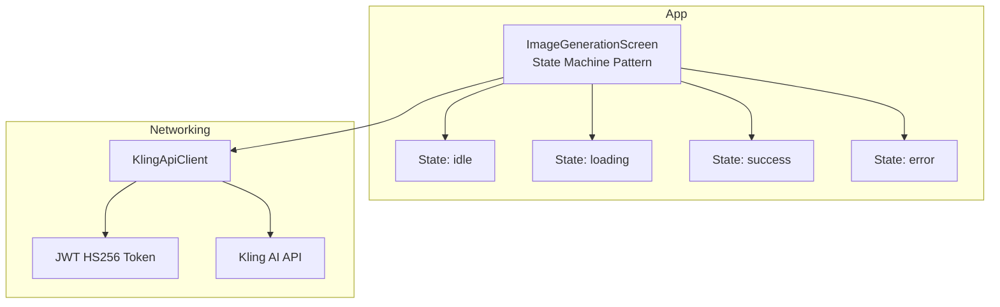
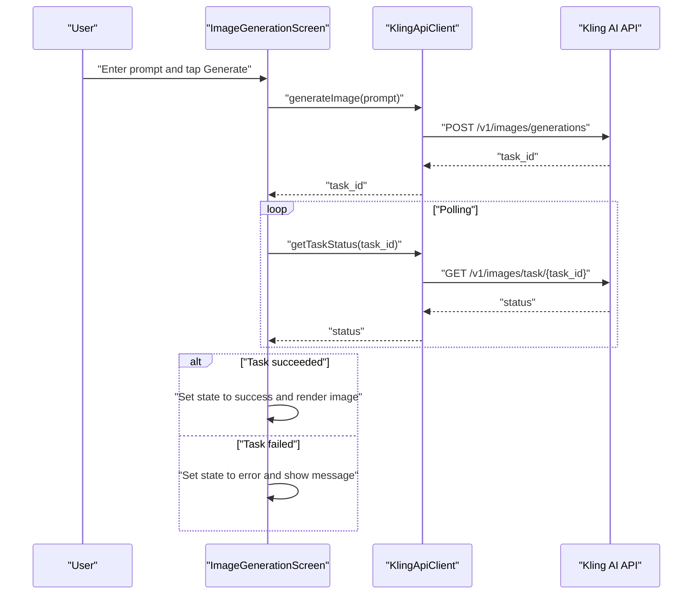
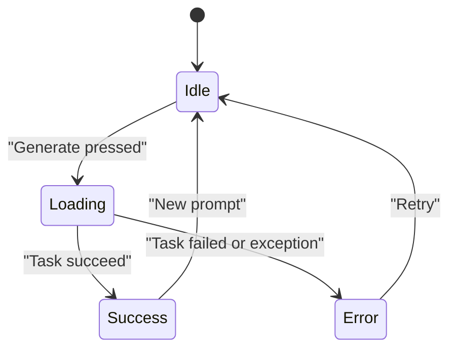
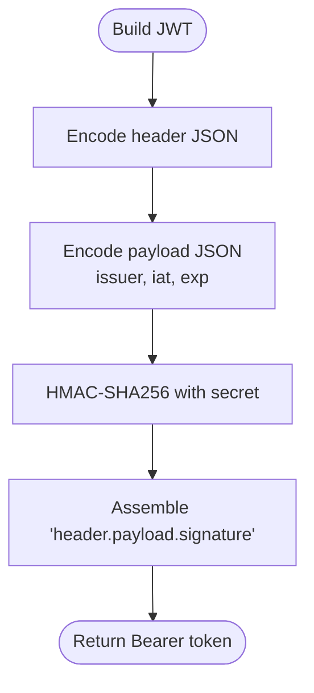
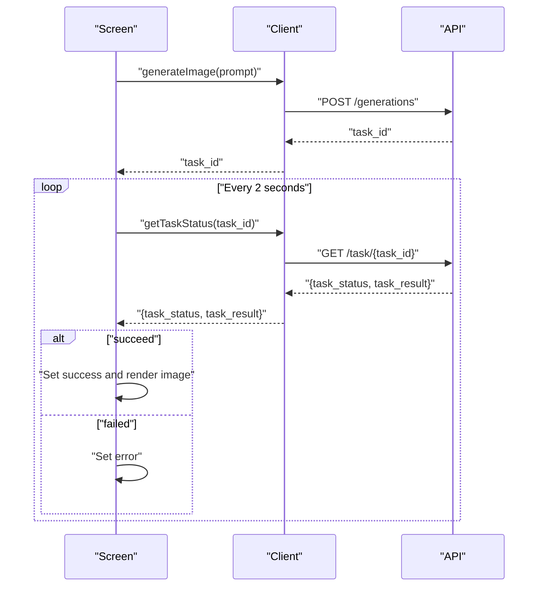
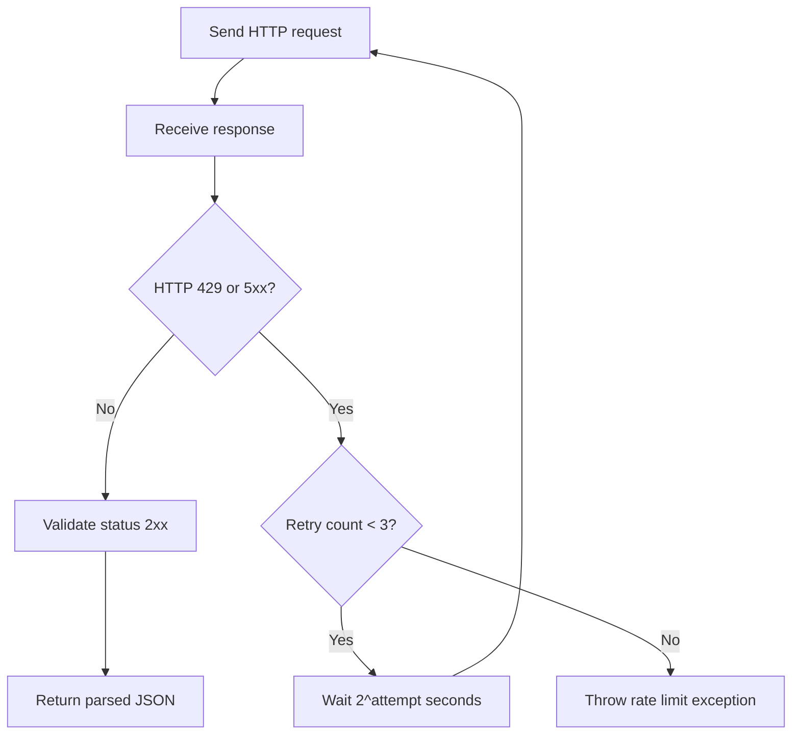
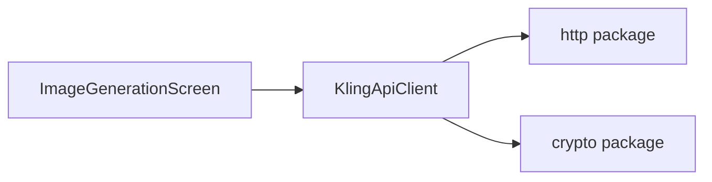

# Core Features

<cite>
**Referenced Files in This Document**
- [main.dart](file://lib/main.dart)
- [kling_api_client.dart](file://lib/core/network/kling_api_client.dart)
- [DESIGN.md](file://DESIGN.md)
</cite>

## Table of Contents
1. [Introduction](#introduction)
2. [Project Structure](#project-structure)
3. [Core Components](#core-components)
4. [Architecture Overview](#architecture-overview)
5. [Detailed Component Analysis](#detailed-component-analysis)
6. [Dependency Analysis](#dependency-analysis)
7. [Performance Considerations](#performance-considerations)
8. [Troubleshooting Guide](#troubleshooting-guide)
9. [Conclusion](#conclusion)

## Introduction
This document explains the core features of the Kling AI Image Generation App, focusing on:
- AI image generation from text prompts via an asynchronous task workflow
- Authentication using JWT tokens with the HS256 algorithm
- State management using a state machine pattern (idle, loading, success, error)
- Asynchronous task processing with polling and retry logic with exponential backoff
- Practical examples from the codebase demonstrating user interaction and execution details

## Project Structure
The app is a Flutter application with a minimal structure:
- The main UI and state machine live in the screen widget
- Network interactions are encapsulated in a dedicated client
- Design guidelines define the UI behavior for each state

**Diagram sources**
- [main.dart:30-190](file://lib/main.dart#L30-L190)
- [kling_api_client.dart:21-98](file://lib/core/network/kling_api_client.dart#L21-L98)

**Section sources**
- [main.dart:1-191](file://lib/main.dart#L1-L191)
- [kling_api_client.dart:1-99](file://lib/core/network/kling_api_client.dart#L1-L99)
- [DESIGN.md:31-57](file://DESIGN.md#L31-L57)

## Core Components
- State machine pattern: The screen maintains a simple enum-driven state that controls UI rendering and user interactions.
- Prompt input: A multi-line text field captures the user’s image description.
- Generation trigger: A button initiates the process when the prompt is non-empty.
- Polling loop: After receiving a task ID, the app polls the task status until completion.
- Result display: On success, the first generated image is shown; on error, the error message is presented.

**Section sources**
- [main.dart:28-190](file://lib/main.dart#L28-L190)
- [DESIGN.md:31-39](file://DESIGN.md#L31-L39)

## Architecture Overview
The app follows a straightforward architecture:
- UI layer (screen) manages user input and renders states
- Networking layer (client) handles authentication, requests, and retries
- External service (Kling AI API) performs image generation asynchronously

**Diagram sources**
- [main.dart:50-90](file://lib/main.dart#L50-L90)
- [kling_api_client.dart:79-97](file://lib/core/network/kling_api_client.dart#L79-L97)

## Detailed Component Analysis

### State Machine Pattern
The screen defines four states: idle, loading, success, error. The UI switches behavior based on the current state:
- idle: Prompts the user to enter a prompt
- loading: Shows a progress indicator and disables the Generate button
- success: Displays the generated image
- error: Displays an error message

**Diagram sources**
- [main.dart:28](file://lib/main.dart#L28)
- [main.dart:149-189](file://lib/main.dart#L149-L189)

**Section sources**
- [main.dart:28](file://lib/main.dart#L28)
- [main.dart:149-189](file://lib/main.dart#L149-L189)
- [DESIGN.md:35-39](file://DESIGN.md#L35-L39)

### Authentication with JWT (HS256)
The client generates a signed JWT with:
- Header: algorithm HS256, type JWT
- Payload: issuer, issued-at, expiration (1 hour)
- Signature: HMAC SHA-256 using a secret key
- Authorization header: Bearer token

**Diagram sources**
- [kling_api_client.dart:26-40](file://lib/core/network/kling_api_client.dart#L26-L40)

**Section sources**
- [kling_api_client.dart:21-40](file://lib/core/network/kling_api_client.dart#L21-L40)

### Asynchronous Task Processing and Polling
The workflow:
- Submit prompt to generate an image
- Receive a task ID
- Poll task status periodically until success or failure
- Extract the first image URL on success

**Diagram sources**
- [main.dart:50-90](file://lib/main.dart#L50-L90)
- [kling_api_client.dart:79-97](file://lib/core/network/kling_api_client.dart#L79-L97)

**Section sources**
- [main.dart:50-90](file://lib/main.dart#L50-L90)
- [kling_api_client.dart:79-97](file://lib/core/network/kling_api_client.dart#L79-L97)

### Retry Logic with Exponential Backoff
The client implements retry logic for transient failures:
- Retries on rate limit (429) and server errors (5xx)
- Up to three attempts with exponential backoff (1s, 2s, 4s)
- Throws specific exceptions for rate limiting and request failures

**Diagram sources**
- [kling_api_client.dart:42-77](file://lib/core/network/kling_api_client.dart#L42-L77)

**Section sources**
- [kling_api_client.dart:42-77](file://lib/core/network/kling_api_client.dart#L42-L77)

### Error Handling Strategies
- Network errors: Wrapped in a generic API exception
- Invalid response format: Wrapped in a generic API exception
- Non-2xx responses: Throw an API exception with status code
- Rate limit exceeded: Throw a dedicated rate limit exception after retries
- Task failure: Transition to error state and display message

**Section sources**
- [kling_api_client.dart:6-19](file://lib/core/network/kling_api_client.dart#L6-L19)
- [kling_api_client.dart:72-76](file://lib/core/network/kling_api_client.dart#L72-L76)
- [main.dart:84-89](file://lib/main.dart#L84-L89)

### UI Behavior and User Interaction Patterns
- Prompt input: Multi-line text field with placeholder and trimming
- Generate button: Disabled during loading; enabled otherwise
- Loading state: Progress indicator and text
- Success state: Image display with rounded corners
- Error state: Error message with red text

**Section sources**
- [main.dart:104-147](file://lib/main.dart#L104-L147)
- [main.dart:169-187](file://lib/main.dart#L169-L187)
- [DESIGN.md:31-39](file://DESIGN.md#L31-L39)

## Dependency Analysis
The screen depends on the client for all network operations. The client encapsulates:
- JWT generation
- HTTP request construction
- Retry logic and error mapping
- Task submission and polling

**Diagram sources**
- [main.dart:39](file://lib/main.dart#L39)
- [kling_api_client.dart:1-4](file://lib/core/network/kling_api_client.dart#L1-L4)

**Section sources**
- [main.dart:39](file://lib/main.dart#L39)
- [kling_api_client.dart:1-4](file://lib/core/network/kling_api_client.dart#L1-L4)

## Performance Considerations
- Polling interval: The current implementation polls every 2 seconds. Depending on typical task duration, this can be tuned to reduce unnecessary load.
- Timeout: Requests are subject to a 30-second timeout to avoid indefinite blocking.
- Exponential backoff: Limits retry frequency and reduces load on the API during transient failures.
- Image rendering: Using a network image widget with appropriate fit ensures efficient rendering.

[No sources needed since this section provides general guidance]

## Troubleshooting Guide
Common issues and remedies:
- No task_id returned: The client throws an API exception indicating missing task identifier; verify prompt validity and API availability.
- Task fails: The screen transitions to error state; inspect the error message and retry.
- Rate limit exceeded: The client retries up to three times with exponential backoff; consider reducing request frequency or contacting support.
- Network errors: The client wraps socket exceptions in an API exception; check connectivity and firewall settings.
- Invalid response format: The client wraps format exceptions in an API exception; validate API endpoint compatibility.

**Section sources**
- [kling_api_client.dart:86-91](file://lib/core/network/kling_api_client.dart#L86-L91)
- [kling_api_client.dart:64-65](file://lib/core/network/kling_api_client.dart#L64-L65)
- [kling_api_client.dart:72-76](file://lib/core/network/kling_api_client.dart#L72-L76)
- [main.dart:84-89](file://lib/main.dart#L84-L89)

## Conclusion
The app implements a clean, state-driven UI for AI image generation with robust networking:
- A JWT-based authentication flow secures API access
- A polling mechanism retrieves task results reliably
- Exponential backoff improves resilience under transient failures
- Clear state transitions provide predictable user feedback