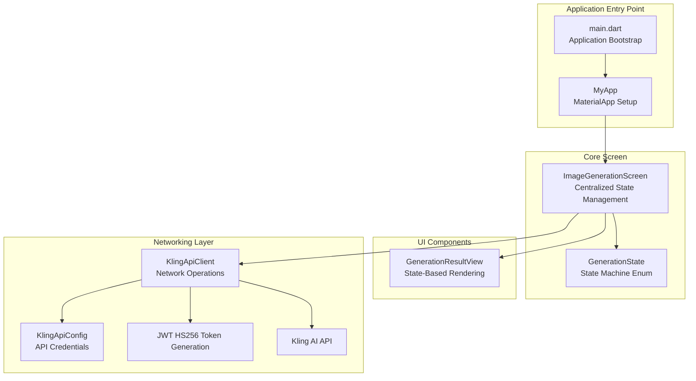
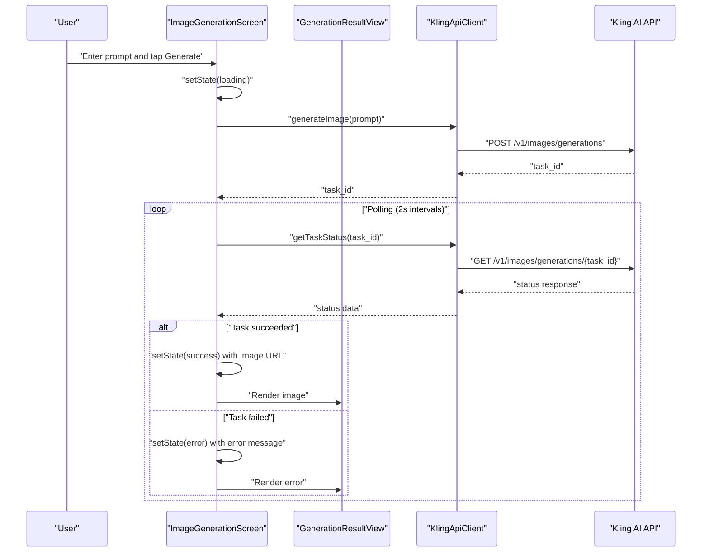
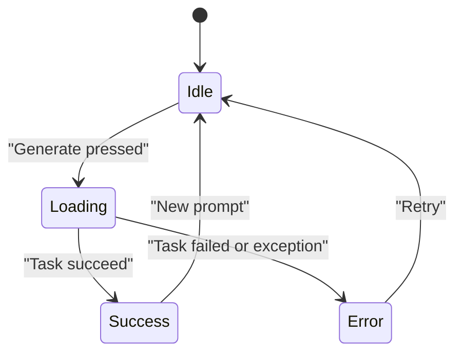
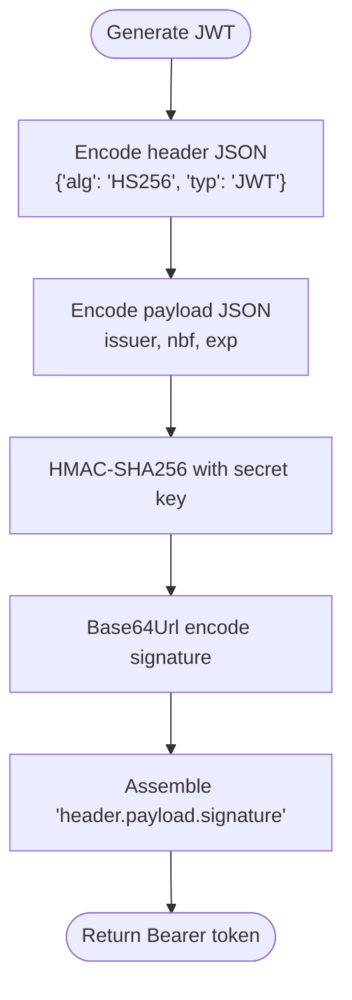
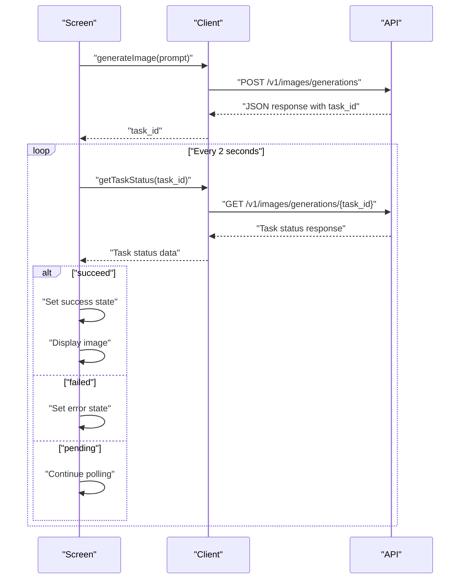
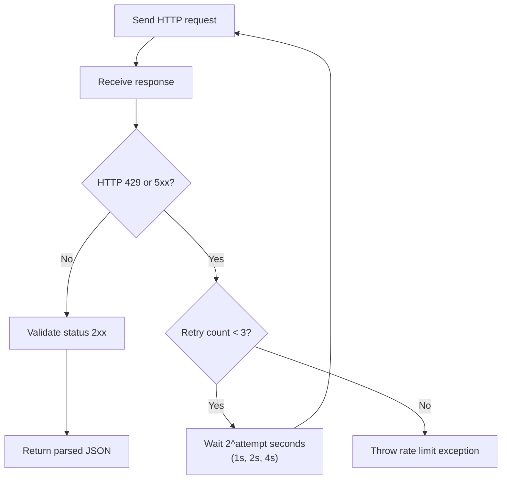
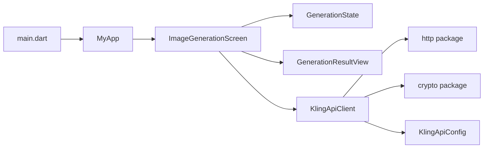

# Core Features

<cite>
**Referenced Files in This Document**
- [main.dart](file://lib/main.dart)
- [generation_state.dart](file://lib/core/enums/generation_state.dart)
- [kling_api_client.dart](file://lib/core/network/kling_api_client.dart)
- [kling_api_config.dart](file://lib/core/network/config/kling_api_config.dart)
- [generation_result.dart](file://lib/ui/widgets/generation_result.dart)
- [DESIGN.md](file://DESIGN.md)
</cite>

## Update Summary
**Changes Made**
- Updated main application entry point to focus on core image generation functionality
- Streamlined ImageGenerationScreen architecture with centralized state management
- Improved error handling patterns with dedicated exception classes
- Enhanced separation of concerns with dedicated UI widgets

## Table of Contents
1. [Introduction](#introduction)
2. [Project Structure](#project-structure)
3. [Core Components](#core-components)
4. [Architecture Overview](#architecture-overview)
5. [Detailed Component Analysis](#detailed-component-analysis)
6. [Dependency Analysis](#dependency-analysis)
7. [Performance Considerations](#performance-considerations)
8. [Troubleshooting Guide](#troubleshooting-guide)
9. [Conclusion](#conclusion)

## Introduction
This document explains the core features of the Kling AI Image Generation App, focusing on:
- AI image generation from text prompts via an asynchronous task workflow
- Authentication using JWT tokens with the HS256 algorithm
- Centralized state management using a state machine pattern (idle, loading, success, error)
- Asynchronous task processing with polling and retry logic with exponential backoff
- Practical examples from the codebase demonstrating user interaction and execution details

## Project Structure
The app is a Flutter application with a streamlined architecture:
- Main entry point focuses on core image generation functionality
- Screen widget centralizes state management and UI logic
- Dedicated client handles all network operations and authentication
- Separate widget for result display with clear state-based rendering
- Configuration constants for API endpoints and credentials

**Diagram sources**
- [main.dart:6-27](file://lib/main.dart#L6-L27)
- [main.dart:29-34](file://lib/main.dart#L29-L34)
- [generation_state.dart:1](file://lib/core/enums/generation_state.dart#L1)
- [generation_result.dart:4](file://lib/ui/widgets/generation_result.dart#L4)
- [kling_api_client.dart:23](file://lib/core/network/kling_api_client.dart#L23)
- [kling_api_config.dart:1](file://lib/core/network/config/kling_api_config.dart#L1)

**Section sources**
- [main.dart:1-165](file://lib/main.dart#L1-L165)
- [generation_state.dart:1](file://lib/core/enums/generation_state.dart#L1)
- [kling_api_client.dart:1-118](file://lib/core/network/kling_api_client.dart#L1-L118)
- [kling_api_config.dart:1-6](file://lib/core/network/config/kling_api_config.dart#L1-L6)
- [generation_result.dart:1-59](file://lib/ui/widgets/generation_result.dart#L1-L59)
- [DESIGN.md:1-59](file://DESIGN.md#L1-L59)

## Core Components
- **Centralized State Management**: The screen maintains a single state machine with four states (idle, loading, success, error) controlling all UI behavior
- **Prompt Input**: A multi-line TextField with focus management and auto-focus on startup
- **Generation Trigger**: ElevatedButton that activates when prompt is non-empty, disabled during loading
- **Polling Mechanism**: Continuous polling with 2-second intervals until task completion
- **Result Display**: Dedicated GenerationResultView widget handling all state-based rendering
- **Authentication**: JWT HS256 token generation with proper encoding and signing
- **Error Handling**: Dedicated exception classes for different error scenarios

**Section sources**
- [main.dart:36-57](file://lib/main.dart#L36-L57)
- [main.dart:59-99](file://lib/main.dart#L59-L99)
- [main.dart:102-163](file://lib/main.dart#L102-L163)
- [generation_state.dart:1](file://lib/core/enums/generation_state.dart#L1)
- [generation_result.dart:16-57](file://lib/ui/widgets/generation_result.dart#L16-L57)

## Architecture Overview
The app follows a clean, layered architecture with clear separation of concerns:
- **Entry Point**: Minimal main.dart focusing on application bootstrap
- **Presentation Layer**: ImageGenerationScreen with centralized state management
- **UI Components**: GenerationResultView for state-based rendering
- **Business Logic**: KlingApiClient handling all network operations and authentication
- **Configuration**: Static configuration for API credentials and endpoints

**Diagram sources**
- [main.dart:59-99](file://lib/main.dart#L59-L99)
- [kling_api_client.dart:96-116](file://lib/core/network/kling_api_client.dart#L96-L116)
- [generation_result.dart:16-57](file://lib/ui/widgets/generation_result.dart#L16-L57)

## Detailed Component Analysis

### Centralized State Management Pattern
The screen implements a comprehensive state machine pattern with centralized state management:
- **State Enumeration**: Simple enum defining four distinct states
- **Single Source of Truth**: All UI behavior controlled by the `_state` variable
- **Consistent State Transitions**: Clear transitions between states based on operation outcomes
- **UI Reactivity**: Automatic UI updates through setState calls

**Diagram sources**
- [generation_state.dart:1](file://lib/core/enums/generation_state.dart#L1)
- [main.dart:36-57](file://lib/main.dart#L36-L57)

**Section sources**
- [generation_state.dart:1](file://lib/core/enums/generation_state.dart#L1)
- [main.dart:36-57](file://lib/main.dart#L36-L57)
- [main.dart:102-163](file://lib/main.dart#L102-L163)

### Authentication with JWT (HS256)
The client implements robust JWT authentication with proper encoding and signing:
- **Header Encoding**: Base64Url encoding of JSON header with HS256 algorithm
- **Payload Generation**: Issuer, timestamp, and expiration handling
- **Signature Creation**: HMAC-SHA256 with secret key using signature input
- **Token Assembly**: Proper concatenation of header, payload, and signature
- **Authorization Header**: Bearer token format for API requests

**Diagram sources**
- [kling_api_client.dart:24-41](file://lib/core/network/kling_api_client.dart#L24-L41)

**Section sources**
- [kling_api_client.dart:24-41](file://lib/core/network/kling_api_client.dart#L24-L41)
- [kling_api_config.dart:1-6](file://lib/core/network/config/kling_api_config.dart#L1-L6)

### Asynchronous Task Processing and Polling
The workflow implements a reliable asynchronous processing pattern:
- **Task Submission**: POST request to generate image with prompt, count, and size parameters
- **Task ID Retrieval**: Extract task_id from response data
- **Continuous Polling**: 2-second intervals until task completion or failure
- **Result Extraction**: Parse task_result for image URLs on success
- **State Management**: Automatic state transitions based on task outcomes

**Diagram sources**
- [main.dart:59-99](file://lib/main.dart#L59-L99)
- [kling_api_client.dart:96-116](file://lib/core/network/kling_api_client.dart#L96-L116)

**Section sources**
- [main.dart:59-99](file://lib/main.dart#L59-L99)
- [kling_api_client.dart:96-116](file://lib/core/network/kling_api_client.dart#L96-L116)

### Retry Logic with Exponential Backoff
The client implements sophisticated retry logic for resilient network operations:
- **Failure Detection**: Automatic retry for HTTP 429 (rate limit) and 5xx server errors
- **Exponential Backoff**: 1s, 2s, 4s delays between retry attempts
- **Retry Limit**: Maximum 3 attempts to prevent infinite retry loops
- **Exception Handling**: Dedicated exceptions for different failure scenarios
- **Timeout Protection**: 30-second timeout for all requests

**Diagram sources**
- [kling_api_client.dart:55-94](file://lib/core/network/kling_api_client.dart#L55-L94)

**Section sources**
- [kling_api_client.dart:55-94](file://lib/core/network/kling_api_client.dart#L55-L94)

### Error Handling Strategies
The app implements comprehensive error handling with dedicated exception types:
- **Network Errors**: SocketException wrapped in KlingApiException with descriptive messages
- **Format Errors**: FormatException wrapped in KlingApiException for invalid responses
- **HTTP Errors**: Non-2xx responses throw KlingApiException with status codes
- **Rate Limiting**: Dedicated KlingRateLimitException after 3 retry attempts
- **Missing Data**: KlingApiException for missing task_id or other critical data
- **State Management**: Automatic error state transitions with user-friendly messages

**Section sources**
- [kling_api_client.dart:8-21](file://lib/core/network/kling_api_client.dart#L8-L21)
- [kling_api_client.dart:89-93](file://lib/core/network/kling_api_client.dart#L89-L93)
- [kling_api_client.dart:83-86](file://lib/core/network/kling_api_client.dart#L83-L86)
- [main.dart:93-98](file://lib/main.dart#L93-L98)

### UI Behavior and User Interaction Patterns
The UI implements a clean, responsive interface with clear state-based behavior:
- **Prompt Input**: Auto-focus TextField with placeholder text and multi-line support
- **Generate Button**: Conditional enabling/disabling based on loading state
- **Loading State**: CircularProgressIndicator with centered text during generation
- **Success State**: Image display with proper scaling and rounded corners
- **Error State**: Red error text with centered alignment and clear messaging
- **Focus Management**: Automatic focus on startup for improved UX

**Section sources**
- [main.dart:113-128](file://lib/main.dart#L113-L128)
- [main.dart:130-149](file://lib/main.dart#L130-L149)
- [main.dart:152-158](file://lib/main.dart#L152-L158)
- [generation_result.dart:16-57](file://lib/ui/widgets/generation_result.dart#L16-L57)

## Dependency Analysis
The application demonstrates excellent separation of concerns with clear dependency relationships:
- **Entry Point Dependencies**: Minimal Flutter imports for basic app setup
- **Screen Dependencies**: State management, controllers, and client integration
- **Client Dependencies**: HTTP, crypto, and configuration management
- **UI Dependencies**: Stateless widgets with clear prop interfaces
- **Configuration Dependencies**: Static constants for API credentials

**Diagram sources**
- [main.dart:1-8](file://lib/main.dart#L1-L8)
- [main.dart:29-34](file://lib/main.dart#L29-L34)
- [generation_state.dart:1](file://lib/core/enums/generation_state.dart#L1)
- [generation_result.dart:1-3](file://lib/ui/widgets/generation_result.dart#L1-L3)
- [kling_api_client.dart:1-6](file://lib/core/network/kling_api_client.dart#L1-L6)

**Section sources**
- [main.dart:1-8](file://lib/main.dart#L1-L8)
- [main.dart:29-34](file://lib/main.dart#L29-L34)
- [kling_api_client.dart:1-6](file://lib/core/network/kling_api_client.dart#L1-L6)

## Performance Considerations
The application implements several performance optimizations:
- **Polling Interval**: 2-second intervals balance responsiveness with API load
- **Timeout Protection**: 30-second timeouts prevent hanging requests
- **Exponential Backoff**: Reduces API load during transient failures
- **Image Loading**: Efficient network image loading with proper scaling
- **Memory Management**: Proper disposal of controllers and focus nodes
- **State Optimization**: Single state variable controls all UI behavior

## Troubleshooting Guide
Common issues and their solutions:
- **No Task ID Returned**: Client throws KlingApiException for missing task_id; verify prompt validity and API availability
- **Task Failure**: Screen transitions to error state with descriptive message; check API logs and retry
- **Rate Limit Exceeded**: Client retries 3 times with exponential backoff; consider reducing request frequency
- **Network Errors**: SocketException wrapped in KlingApiException; verify connectivity and firewall settings
- **Invalid Response Format**: FormatException wrapped in KlingApiException; validate API endpoint compatibility
- **Authentication Issues**: JWT generation failures indicate incorrect API credentials in config

**Section sources**
- [kling_api_client.dart:105-108](file://lib/core/network/kling_api_client.dart#L105-L108)
- [kling_api_client.dart:89-93](file://lib/core/network/kling_api_client.dart#L89-L93)
- [kling_api_client.dart:80](file://lib/core/network/kling_api_client.dart#L80)
- [main.dart:93-98](file://lib/main.dart#L93-L98)

## Conclusion
The app implements a clean, state-driven architecture for AI image generation with robust networking:
- **Streamlined Entry Point**: Minimal main.dart focuses on application bootstrap
- **Centralized State Management**: Single source of truth for all UI behavior
- **Robust Authentication**: Secure JWT HS256 token generation and management
- **Reliable Task Processing**: Polling mechanism with exponential backoff for resilience
- **Clear Error Handling**: Dedicated exception classes for different failure scenarios
- **Separation of Concerns**: Well-structured layers with clear responsibilities

The architecture demonstrates best practices in Flutter development with proper state management, error handling, and user experience considerations.