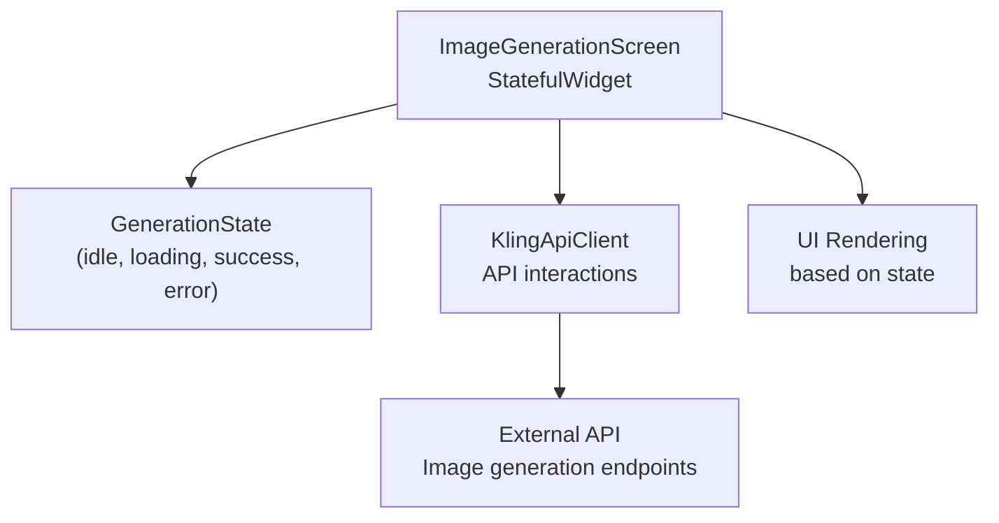
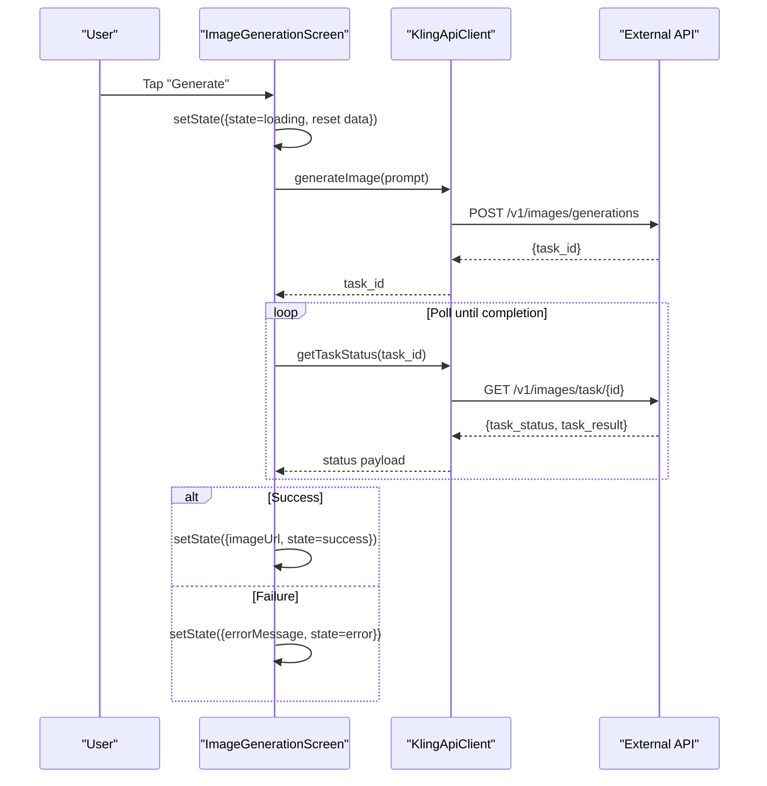
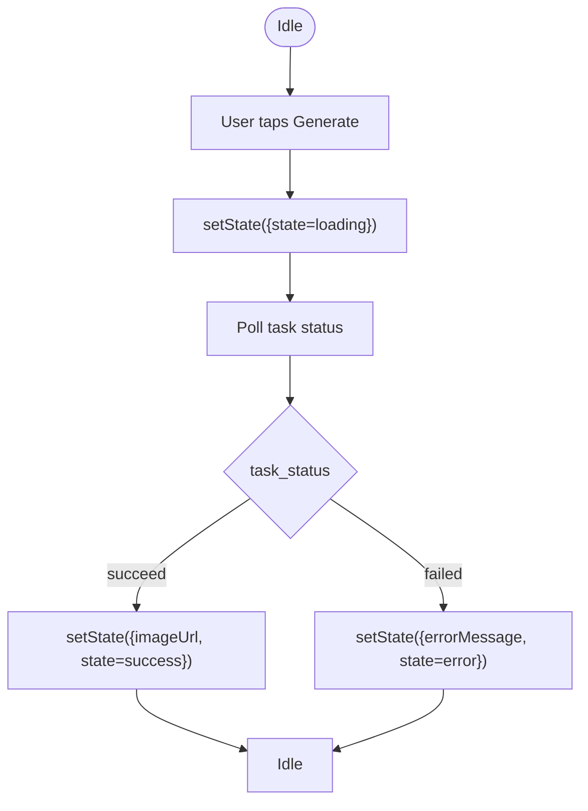
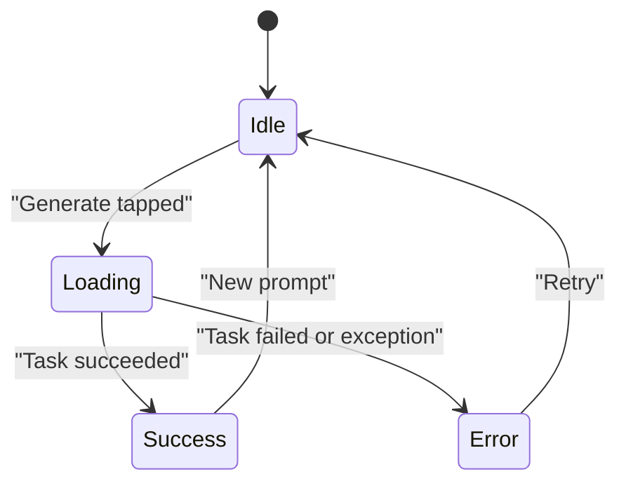
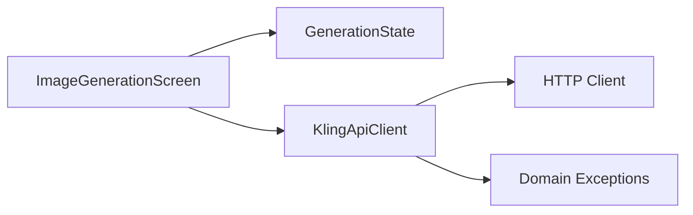

# State Management

<cite>
**Referenced Files in This Document**
- [main.dart](file://lib/main.dart)
- [kling_api_client.dart](file://lib/core/network/kling_api_client.dart)
- [DESIGN.md](file://DESIGN.md)
</cite>

## Table of Contents
1. [Introduction](#introduction)
2. [Project Structure](#project-structure)
3. [Core Components](#core-components)
4. [Architecture Overview](#architecture-overview)
5. [Detailed Component Analysis](#detailed-component-analysis)
6. [Dependency Analysis](#dependency-analysis)
7. [Performance Considerations](#performance-considerations)
8. [Troubleshooting Guide](#troubleshooting-guide)
9. [Conclusion](#conclusion)

## Introduction
This document explains the state management implementation using the state machine pattern in the image generation feature. It focuses on the GenerationState enum and its four states (idle, loading, success, error), how each state drives UI rendering and user interactions, and how setState() triggers widget rebuilds. Practical examples from the codebase illustrate state updates during image generation, error handling, and UI feedback mechanisms. Benefits of enum-based state management for predictable UI behavior and debugging are also highlighted.

## Project Structure
The state machine pattern is implemented in a single screen widget with a small supporting network client:
- lib/main.dart defines the GenerationState enum and the ImageGenerationScreen stateful widget that manages UI state and renders content based on the current state.
- lib/core/network/kling_api_client.dart encapsulates API interactions and exceptions, returning task identifiers and polling for completion.
- DESIGN.md describes intended UI states and behaviors for the image generation screen.

**Diagram sources**
- [main.dart:28](file://lib/main.dart#L28)
- [main.dart:30-190](file://lib/main.dart#L30-L190)
- [kling_api_client.dart:21-99](file://lib/core/network/kling_api_client.dart#L21-L99)

**Section sources**
- [main.dart:28](file://lib/main.dart#L28)
- [main.dart:30-190](file://lib/main.dart#L30-L190)
- [kling_api_client.dart:21-99](file://lib/core/network/kling_api_client.dart#L21-L99)
- [DESIGN.md:31-59](file://DESIGN.md#L31-L59)

## Core Components
- GenerationState enum: Defines the discrete states of the UI lifecycle for image generation.
- ImageGenerationScreen: A StatefulWidget that holds the current state, UI data, and error messages. It renders different UI depending on the current state and controls user interactions accordingly.
- setState(): Used to update internal state fields and trigger a rebuild of the widget subtree.
- KlingApiClient: Provides asynchronous methods to initiate image generation and poll for task completion, throwing domain-specific exceptions.

Key responsibilities:
- GenerationState drives UI rendering via a switch statement inside the screen’s build method.
- setState() ensures Flutter re-renders the UI whenever the state or associated data changes.
- API client encapsulates network concerns and exceptions, surfacing errors to the screen for state transitions.

**Section sources**
- [main.dart:28](file://lib/main.dart#L28)
- [main.dart:30-190](file://lib/main.dart#L30-L190)
- [kling_api_client.dart:21-99](file://lib/core/network/kling_api_client.dart#L21-L99)

## Architecture Overview
The state machine orchestrates user actions and API responses into deterministic UI outcomes. The sequence below maps the actual code paths for initiating and completing an image generation request.

**Diagram sources**
- [main.dart:50-90](file://lib/main.dart#L50-L90)
- [kling_api_client.dart:79-97](file://lib/core/network/kling_api_client.dart#L79-L97)

## Detailed Component Analysis

### GenerationState enum and UI rendering
The enum defines four states:
- idle: Initial state with empty data and no active operation.
- loading: Indicates an ongoing generation process.
- success: Indicates successful completion with an image URL.
- error: Indicates failure with an error message.

Rendering behavior per state:
- idle: Displays a placeholder message prompting the user to enter a prompt.
- loading: Shows a progress indicator and a status message; the Generate button is disabled.
- success: Displays the generated image if available; otherwise a fallback message.
- error: Displays an error message derived from the caught exception.

User interaction constraints:
- During loading, the Generate button is disabled to prevent concurrent requests.
- The prompt field remains enabled to allow edits or retries.

These behaviors are implemented by:
- A switch statement in the screen’s content builder that selects the appropriate UI subtree.
- Conditional enable/disable logic for the Generate button based on the current state.

**Section sources**
- [main.dart:28](file://lib/main.dart#L28)
- [main.dart:149-190](file://lib/main.dart#L149-L190)
- [main.dart:118-138](file://lib/main.dart#L118-L138)

### setState() usage patterns
setState() is used to:
- Transition from idle to loading when the user initiates generation.
- Clear previous data and errors before starting a new request.
- Transition to success upon receiving a valid image URL.
- Transition to error when an exception occurs.

Each setState() invocation updates one or more internal fields and triggers a rebuild of the widget tree, ensuring the UI reflects the latest state.

Practical examples:
- Transition to loading: [lib/main.dart:54-58](file://lib/main.dart#L54-L58)
- Transition to success: [lib/main.dart:80-83](file://lib/main.dart#L80-L83)
- Transition to error: [lib/main.dart:85-88](file://lib/main.dart#L85-L88)

**Section sources**
- [main.dart:50-90](file://lib/main.dart#L50-L90)

### State transitions triggered by user actions and API responses
Transitions are driven by:
- User action: Tapping Generate sets the state to loading and starts polling.
- API polling: Repeatedly checking task status; on success, set image URL and state to success; on failure, set error message and state to error.

**Diagram sources**
- [main.dart:50-90](file://lib/main.dart#L50-L90)
- [kling_api_client.dart:94-97](file://lib/core/network/kling_api_client.dart#L94-L97)

**Section sources**
- [main.dart:50-90](file://lib/main.dart#L50-L90)

### Relationship between state changes and widget rebuilds
- setState() marks the widget as needing a rebuild.
- Flutter traverses the widget tree and re-invokes build() for the affected subtree.
- The switch-based renderer selects the correct UI subtree for the current state, reflecting immediate visual changes.

Benefits:
- Predictable UI updates synchronized with state changes.
- Easy-to-follow control flow for debugging and testing.

**Section sources**
- [main.dart:149-190](file://lib/main.dart#L149-L190)

### Practical examples from the codebase
- Initiating generation and transitioning to loading: [lib/main.dart:50-58](file://lib/main.dart#L50-L58)
- Polling and transitioning to success: [lib/main.dart:60-83](file://lib/main.dart#L60-L83)
- Handling errors and transitioning to error: [lib/main.dart:84-89](file://lib/main.dart#L84-L89)
- Rendering UI per state: [lib/main.dart:149-190](file://lib/main.dart#L149-L190)
- Network client exceptions and retries: [lib/core/network/kling_api_client.dart:42-77](file://lib/core/network/kling_api_client.dart#L42-L77)

**Section sources**
- [main.dart:50-90](file://lib/main.dart#L50-L90)
- [main.dart:149-190](file://lib/main.dart#L149-L190)
- [kling_api_client.dart:42-77](file://lib/core/network/kling_api_client.dart#L42-L77)

### Conceptual Overview
The state machine pattern enforces a finite set of states with explicit transitions, simplifying reasoning about UI behavior. The enum-based approach improves readability and reduces the risk of invalid state combinations.

[No sources needed since this diagram shows conceptual workflow, not actual code structure]

## Dependency Analysis
The screen depends on the network client for external API interactions. The client encapsulates HTTP logic and domain-specific exceptions, allowing the screen to focus on state transitions and UI rendering.

**Diagram sources**
- [main.dart:30-190](file://lib/main.dart#L30-L190)
- [kling_api_client.dart:21-99](file://lib/core/network/kling_api_client.dart#L21-L99)

**Section sources**
- [main.dart:30-190](file://lib/main.dart#L30-L190)
- [kling_api_client.dart:21-99](file://lib/core/network/kling_api_client.dart#L21-L99)

## Performance Considerations
- Polling interval: The current implementation polls at fixed intervals. Consider exponential backoff or jitter to reduce unnecessary load and improve responsiveness under varying server conditions.
- Debouncing user input: Validate and debounce prompts before triggering generation to avoid redundant requests.
- Image loading: Using network image widgets is efficient, but ensure proper caching and error handling for failed loads.
- UI rebuilds: Keep setState() scopes minimal to reduce unnecessary rebuilds; group related state updates within a single setState() call.

[No sources needed since this section provides general guidance]

## Troubleshooting Guide
Common issues and resolutions:
- No task_id returned: The network client throws a domain exception when task_id is missing; handle and present a user-friendly message.
- Rate limiting or server errors: The client retries transient failures and raises rate limit exceptions; surface a retry mechanism or backoff UI.
- Network exceptions: Socket and format exceptions are caught and rethrown as API exceptions; display a connectivity message and allow retry.
- UI not updating: Ensure setState() is called on the screen’s stateful widget and not in a descendant widget that does not trigger rebuilds.

**Section sources**
- [kling_api_client.dart:79-97](file://lib/core/network/kling_api_client.dart#L79-L97)
- [kling_api_client.dart:42-77](file://lib/core/network/kling_api_client.dart#L42-L77)
- [main.dart:84-89](file://lib/main.dart#L84-L89)

## Conclusion
The state machine pattern implemented via GenerationState delivers a clear, predictable UI for image generation. The enum-based approach, combined with targeted setState() usage and a dedicated network client, ensures that state transitions are explicit, easy to debug, and resilient to API errors. Extending the design with improved polling strategies and enhanced error messaging would further strengthen the user experience.