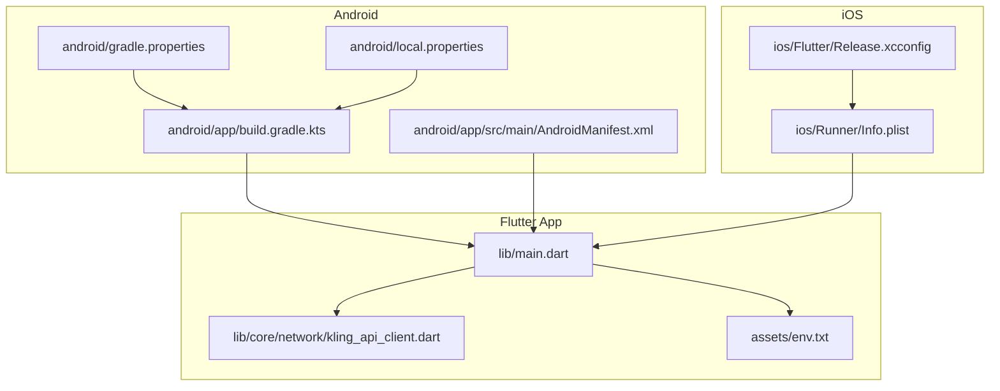
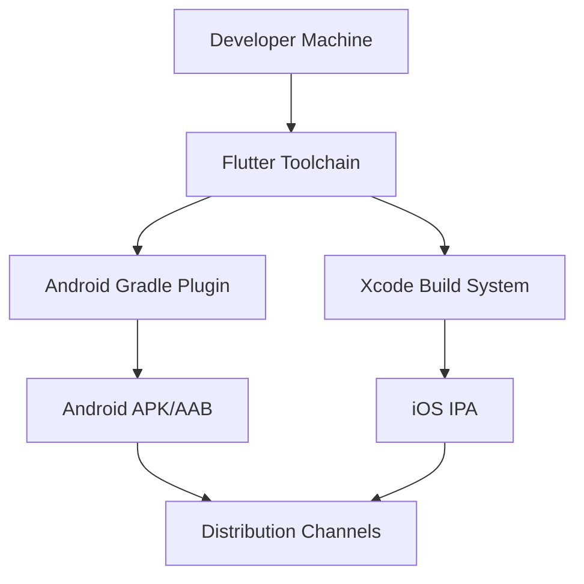
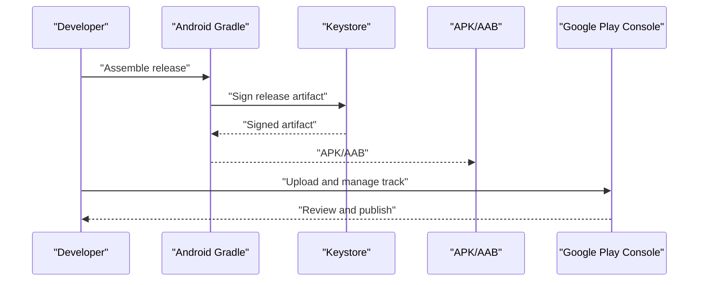
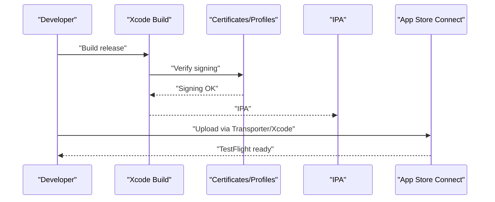
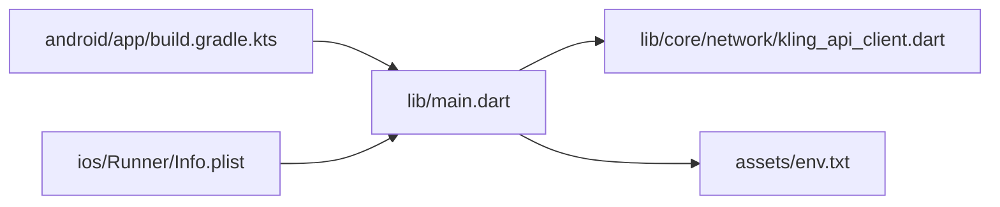

# Deployment & Distribution

<cite>
**Referenced Files in This Document**
- [pubspec.yaml](file://pubspec.yaml)
- [android/app/build.gradle.kts](file://android/app/build.gradle.kts)
- [android/app/src/main/AndroidManifest.xml](file://android/app/src/main/AndroidManifest.xml)
- [android/gradle.properties](file://android/gradle.properties)
- [android/local.properties](file://android/local.properties)
- [ios/Runner/Info.plist](file://ios/Runner/Info.plist)
- [ios/Flutter/Release.xcconfig](file://ios/Flutter/Release.xcconfig)
- [lib/main.dart](file://lib/main.dart)
- [lib/core/network/kling_api_client.dart](file://lib/core/network/kling_api_client.dart)
- [assets/env.txt](file://assets/env.txt)
</cite>

## Table of Contents
1. [Introduction](#introduction)
2. [Project Structure](#project-structure)
3. [Core Components](#core-components)
4. [Architecture Overview](#architecture-overview)
5. [Detailed Component Analysis](#detailed-component-analysis)
6. [Dependency Analysis](#dependency-analysis)
7. [Performance Considerations](#performance-considerations)
8. [Troubleshooting Guide](#troubleshooting-guide)
9. [Conclusion](#conclusion)
10. [Appendices](#appendices)

## Introduction
This section documents the deployment and distribution process for the Kling AI Image Generation App built with Flutter. It covers Flutter build configuration for release mode, Android APK generation and signing, iOS IPA generation and App Store Connect/TestFlight workflows, version management and release coordination, and operational post-deployment practices such as monitoring and crash reporting. The goal is to provide a clear, actionable guide for shipping and maintaining the app across platforms.

## Project Structure
The repository follows a standard Flutter layout with platform-specific folders for Android and iOS, a Dart application entry point, and shared assets. The build and packaging configuration is primarily defined in Flutter and platform Gradle/Xcode configuration files.

**Diagram sources**
- [lib/main.dart](file://lib/main.dart)
- [lib/core/network/kling_api_client.dart](file://lib/core/network/kling_api_client.dart)
- [assets/env.txt](file://assets/env.txt)
- [android/app/build.gradle.kts](file://android/app/build.gradle.kts)
- [android/app/src/main/AndroidManifest.xml](file://android/app/src/main/AndroidManifest.xml)
- [android/gradle.properties](file://android/gradle.properties)
- [android/local.properties](file://android/local.properties)
- [ios/Runner/Info.plist](file://ios/Runner/Info.plist)
- [ios/Flutter/Release.xcconfig](file://ios/Flutter/Release.xcconfig)

**Section sources**
- [lib/main.dart](file://lib/main.dart)
- [lib/core/network/kling_api_client.dart](file://lib/core/network/kling_api_client.dart)
- [assets/env.txt](file://assets/env.txt)
- [android/app/build.gradle.kts](file://android/app/build.gradle.kts)
- [android/app/src/main/AndroidManifest.xml](file://android/app/src/main/AndroidManifest.xml)
- [android/gradle.properties](file://android/gradle.properties)
- [android/local.properties](file://android/local.properties)
- [ios/Runner/Info.plist](file://ios/Runner/Info.plist)
- [ios/Flutter/Release.xcconfig](file://ios/Flutter/Release.xcconfig)

## Core Components
- Version and build metadata: Defined in the Flutter manifest and consumed by platform build systems.
- Asset bundling: Environment configuration is bundled via Flutter assets.
- Network client: Implements JWT-based authentication and request retry logic for the Kling AI API.
- Platform manifests: Android and iOS define app identifiers, versions, and capabilities.

Key deployment-relevant elements:
- Versioning: Flutter version string and code map to Android versionName/versionCode and iOS CFBundleShortVersionString/CFBundleVersion.
- Asset bundling: env.txt is included as a Flutter asset and can be loaded at runtime.
- Build configuration: Android Gradle plugin and Kotlin plugin are applied; iOS Release.xcconfig includes generated configuration.

**Section sources**
- [pubspec.yaml](file://pubspec.yaml)
- [lib/core/network/kling_api_client.dart](file://lib/core/network/kling_api_client.dart)
- [assets/env.txt](file://assets/env.txt)
- [android/app/build.gradle.kts](file://android/app/build.gradle.kts)
- [ios/Runner/Info.plist](file://ios/Runner/Info.plist)

## Architecture Overview
The deployment pipeline integrates Flutter’s build system with platform-native toolchains. The Flutter toolchain generates platform-specific artifacts (APK/AAB for Android, IPA for iOS) using Gradle and Xcode configurations. Runtime behavior depends on the bundled environment configuration and network client logic.

[No sources needed since this diagram shows conceptual workflow, not actual code structure]

## Detailed Component Analysis

### Flutter Build Process and Release Builds
- Build modes: The project sets a debug build mode in local properties; production releases should use release builds.
- Versioning: The Flutter manifest defines the version string and build number; platform build systems consume these values.
- Asset bundling: env.txt is declared as a Flutter asset and will be packaged with the app.

Recommended steps for release builds:
- Use Flutter release mode to produce optimized binaries.
- Configure signing credentials for Android and iOS prior to release builds.
- Verify versionName/versionCode on Android and CFBundleShortVersionString/CFBundleVersion on iOS.

**Section sources**
- [pubspec.yaml](file://pubspec.yaml)
- [android/local.properties](file://android/local.properties)
- [lib/core/network/kling_api_client.dart](file://lib/core/network/kling_api_client.dart)
- [assets/env.txt](file://assets/env.txt)

### Android Deployment Workflow
- APK generation: Use Gradle tasks to assemble a release variant. The current Gradle configuration references a debug signing config for release; this must be updated with a proper keystore before publishing.
- Signing: Replace the placeholder debug signing configuration with a release keystore and configure signing properties.
- Google Play Store submission: Prepare internal testing, closed testing, or open tracks with release artifacts. Ensure privacy policy, developer console listings, and compliance requirements are met.

**Diagram sources**
- [android/app/build.gradle.kts](file://android/app/build.gradle.kts)
- [android/app/src/main/AndroidManifest.xml](file://android/app/src/main/AndroidManifest.xml)

**Section sources**
- [android/app/build.gradle.kts](file://android/app/build.gradle.kts)
- [android/app/src/main/AndroidManifest.xml](file://android/app/src/main/AndroidManifest.xml)
- [android/gradle.properties](file://android/gradle.properties)
- [android/local.properties](file://android/local.properties)

### iOS Deployment Process
- IPA generation: Build the release scheme in Xcode or via command-line tools. Ensure the Release.xcconfig is properly included.
- App Store Connect setup: Create an app record, configure app information, and upload metrics. Set up provisioning profiles and certificates.
- TestFlight distribution: Submit builds to TestFlight for internal and external testing. Manage build approval and distribution groups.

**Diagram sources**
- [ios/Runner/Info.plist](file://ios/Runner/Info.plist)
- [ios/Flutter/Release.xcconfig](file://ios/Flutter/Release.xcconfig)

**Section sources**
- [ios/Runner/Info.plist](file://ios/Runner/Info.plist)
- [ios/Flutter/Release.xcconfig](file://ios/Flutter/Release.xcconfig)

### Continuous Integration and Automated Deployment Pipelines
- Version management: Centralize version and build number in the Flutter manifest; propagate to platform build systems.
- Release coordination: Tag releases in version control; gate deployments with smoke tests and manual approvals.
- Pipeline stages: Build (Flutter assemble), sign (Android keystore/iOS certificates), package (APK/AAB/IPA), and distribute (internal testing, stores).
- Post-deployment: Monitor crash reports and analytics; prepare hotfixes and subsequent releases.

[No sources needed since this section provides general guidance]

### Monitoring Setup and Crash Reporting
- Crash reporting: Integrate a crash reporting SDK appropriate for each platform (e.g., Firebase Crashlytics, Apple Diagnostics) and initialize it early in the app lifecycle.
- Analytics: Track key events such as image generation attempts, success/failure rates, and performance metrics.
- Post-deployment maintenance: Establish alerts for crash spikes, monitor backend API health, and coordinate updates to the network client and environment configuration.

[No sources needed since this section provides general guidance]

## Dependency Analysis
The app’s runtime depends on the network client and environment configuration. The build system depends on Flutter, Android Gradle, and iOS Xcode configurations.

**Diagram sources**
- [lib/main.dart](file://lib/main.dart)
- [lib/core/network/kling_api_client.dart](file://lib/core/network/kling_api_client.dart)
- [assets/env.txt](file://assets/env.txt)
- [android/app/build.gradle.kts](file://android/app/build.gradle.kts)
- [ios/Runner/Info.plist](file://ios/Runner/Info.plist)

**Section sources**
- [lib/main.dart](file://lib/main.dart)
- [lib/core/network/kling_api_client.dart](file://lib/core/network/kling_api_client.dart)
- [assets/env.txt](file://assets/env.txt)
- [android/app/build.gradle.kts](file://android/app/build.gradle.kts)
- [ios/Runner/Info.plist](file://ios/Runner/Info.plist)

## Performance Considerations
- Optimize release builds: Enable tree shaking, minification, and resource shrinking for Android; enable bitcode and appropriate arch slices for iOS.
- Network reliability: The client implements exponential backoff for rate limits and server errors; ensure timeouts and retry policies align with user expectations.
- Asset bundling: Keep asset sizes reasonable; consider remote configuration for non-critical settings to reduce binary size.

[No sources needed since this section provides general guidance]

## Troubleshooting Guide
Common issues and resolutions:
- Android release signing: If the release build fails due to missing signing configuration, configure a keystore and update the signing block in the Gradle file.
- iOS code signing: If Xcode reports signing issues, verify provisioning profiles and certificates; ensure the bundle identifier matches the App Store Connect record.
- Version mismatches: Confirm that Flutter versionName/versionCode match Android version fields and CFBundleShortVersionString/CFBundleVersion on iOS.
- Network failures: Inspect network exceptions and retry logic; verify API endpoint availability and credentials.

**Section sources**
- [android/app/build.gradle.kts](file://android/app/build.gradle.kts)
- [ios/Runner/Info.plist](file://ios/Runner/Info.plist)
- [lib/core/network/kling_api_client.dart](file://lib/core/network/kling_api_client.dart)

## Conclusion
The Kling AI Image Generation App can be reliably deployed to both Android and iOS using Flutter’s cross-platform toolchain. Focus on configuring secure release signing, aligning version metadata across platforms, and establishing robust CI/CD pipelines. Post-deployment, integrate monitoring and crash reporting to maintain app quality and user satisfaction.

[No sources needed since this section summarizes without analyzing specific files]

## Appendices

### Appendix A: Version and Build Metadata Reference
- Flutter version and build number: consumed by platform build systems to set Android versionName/versionCode and iOS CFBundleShortVersionString/CFBundleVersion.
- Android Gradle configuration: applies the Flutter-sourced version fields and Java/Kotlin compatibility settings.
- iOS Info.plist: consumes FLUTTER_BUILD_NAME and FLUTTER_BUILD_NUMBER to populate bundle version fields.

**Section sources**
- [pubspec.yaml](file://pubspec.yaml)
- [android/app/build.gradle.kts](file://android/app/build.gradle.kts)
- [ios/Runner/Info.plist](file://ios/Runner/Info.plist)