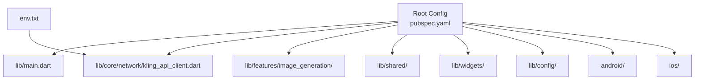
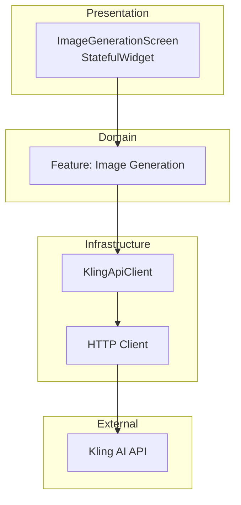
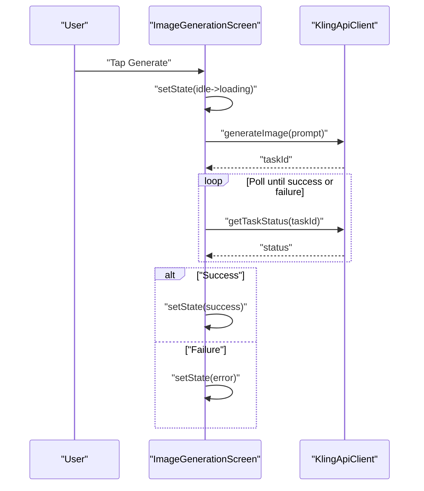
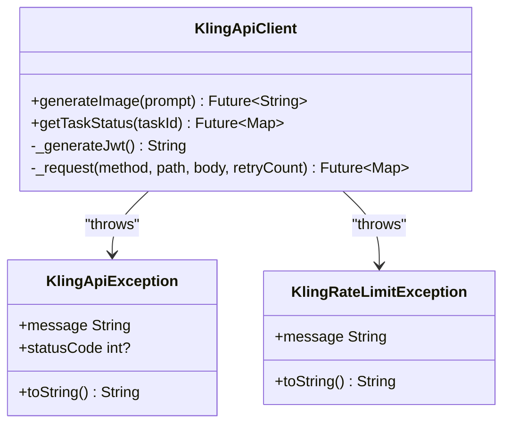
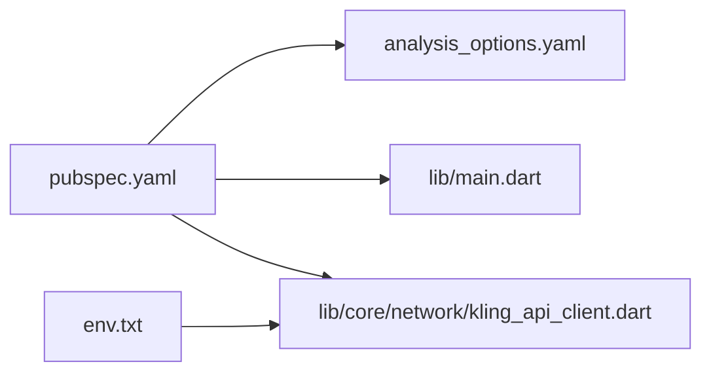

# Development Guidelines

<cite>
**Referenced Files in This Document**
- [analysis_options.yaml](file://analysis_options.yaml)
- [pubspec.yaml](file://pubspec.yaml)
- [README.md](file://README.md)
- [DESIGN.md](file://DESIGN.md)
- [lib/main.dart](file://lib/main.dart)
- [lib/core/network/kling_api_client.dart](file://lib/core/network/kling_api_client.dart)
- [env.txt](file://env.txt)
</cite>

## Table of Contents
1. [Introduction](#introduction)
2. [Project Structure](#project-structure)
3. [Core Components](#core-components)
4. [Architecture Overview](#architecture-overview)
5. [Detailed Component Analysis](#detailed-component-analysis)
6. [Dependency Analysis](#dependency-analysis)
7. [Performance Considerations](#performance-considerations)
8. [Troubleshooting Guide](#troubleshooting-guide)
9. [Development Workflow and Contribution](#development-workflow-and-contribution)
10. [Code Quality Standards](#code-quality-standards)
11. [Git Workflow and Branch Management](#git-workflow-and-branch-management)
12. [Testing Strategy](#testing-strategy)
13. [Best Practices](#best-practices)
14. [Common Pitfalls and Prevention](#common-pitfalls-and-prevention)
15. [Conclusion](#conclusion)

## Introduction
This document provides comprehensive development guidelines for the Kling AI Image Generation App. It consolidates code quality standards, testing strategy, development workflow, contribution processes, project structure conventions, naming patterns, architectural principles, Git workflow, debugging and performance optimization practices, and common pitfalls with prevention strategies. The guidelines are grounded in the repository’s configuration files and source code.

## Project Structure
The project follows a conventional Flutter layout with feature-based organization:
- Root-level configuration files define dependencies, SDK constraints, and linting rules.
- The lib directory is organized into feature-focused modules:
  - core: foundational utilities and network clients
  - features: domain-specific features (e.g., image generation)
  - shared: reusable components and utilities
  - widgets: UI components
  - config: configuration and environment management
- Platform integrations reside under android/ and ios/.

**Diagram sources**
- [pubspec.yaml:1-83](file://pubspec.yaml#L1-L83)
- [lib/main.dart:1-191](file://lib/main.dart#L1-L191)
- [lib/core/network/kling_api_client.dart:1-99](file://lib/core/network/kling_api_client.dart#L1-L99)
- [env.txt:1-3](file://env.txt#L1-L3)

**Section sources**
- [pubspec.yaml:1-83](file://pubspec.yaml#L1-L83)
- [lib/main.dart:1-191](file://lib/main.dart#L1-L191)

## Core Components
- Application entrypoint initializes the app shell and theme, and sets the primary screen.
- Network client encapsulates API interactions, JWT generation, request retries, and error handling.
- Environment configuration is loaded via a dotenv asset for API credentials.

Key responsibilities:
- lib/main.dart: App bootstrap, theme configuration, stateful UI for image generation, and state transitions.
- lib/core/network/kling_api_client.dart: Authentication via JWT, request abstraction, retry logic, and typed exceptions.

**Section sources**
- [lib/main.dart:1-191](file://lib/main.dart#L1-L191)
- [lib/core/network/kling_api_client.dart:1-99](file://lib/core/network/kling_api_client.dart#L1-L99)
- [env.txt:1-3](file://env.txt#L1-L3)

## Architecture Overview
The app follows a layered architecture:
- Presentation layer: Stateless and stateful widgets manage UI and user interactions.
- Domain layer: Feature-specific screens orchestrate user actions.
- Infrastructure layer: Network client handles external API communication and error propagation.

**Diagram sources**
- [lib/main.dart:30-191](file://lib/main.dart#L30-L191)
- [lib/core/network/kling_api_client.dart:21-99](file://lib/core/network/kling_api_client.dart#L21-L99)

## Detailed Component Analysis

### ImageGenerationScreen
Responsibilities:
- Manage user input via a text field.
- Control lifecycle of image generation requests.
- Render four distinct UI states: idle, loading, success, error.
- Dispose of controllers to prevent memory leaks.

Processing logic:
- On button press, trim input and transition to loading state.
- Invoke network client to initiate generation and poll for completion.
- Update UI based on state transitions.

**Diagram sources**
- [lib/main.dart:50-90](file://lib/main.dart#L50-L90)
- [lib/core/network/kling_api_client.dart:79-97](file://lib/core/network/kling_api_client.dart#L79-L97)

**Section sources**
- [lib/main.dart:30-191](file://lib/main.dart#L30-L191)

### KlingApiClient
Responsibilities:
- Generate JWT tokens with HMAC-SHA256 signing.
- Perform HTTP requests with timeouts and retry logic for rate limits and server errors.
- Parse responses and raise typed exceptions for distinct failure modes.

**Diagram sources**
- [lib/core/network/kling_api_client.dart:6-19](file://lib/core/network/kling_api_client.dart#L6-L19)
- [lib/core/network/kling_api_client.dart:21-99](file://lib/core/network/kling_api_client.dart#L21-L99)

**Section sources**
- [lib/core/network/kling_api_client.dart:1-99](file://lib/core/network/kling_api_client.dart#L1-L99)

## Dependency Analysis
- SDK and platform dependencies are declared in pubspec.yaml.
- Linting is configured via analysis_options.yaml, inheriting Flutter’s recommended rules.
- Environment variables are managed via env.txt and consumed by the app through flutter_dotenv.

**Diagram sources**
- [pubspec.yaml:1-83](file://pubspec.yaml#L1-L83)
- [analysis_options.yaml:10-29](file://analysis_options.yaml#L10-L29)
- [lib/main.dart:1-6](file://lib/main.dart#L1-L6)
- [lib/core/network/kling_api_client.dart:1-4](file://lib/core/network/kling_api_client.dart#L1-L4)
- [env.txt:1-3](file://env.txt#L1-L3)

**Section sources**
- [pubspec.yaml:1-83](file://pubspec.yaml#L1-L83)
- [analysis_options.yaml:10-29](file://analysis_options.yaml#L10-L29)

## Performance Considerations
- Network polling intervals: The current implementation polls every two seconds. Consider tuning this interval based on observed API latency and user feedback.
- Retry strategy: Exponential backoff is already implemented for transient failures. Ensure the maximum retry count aligns with user expectations and API SLAs.
- UI responsiveness: Keep UI updates minimal during polling to avoid jank. Debounce user input when appropriate.
- Memory management: Controllers are disposed in the widget lifecycle; ensure similar patterns for other resources.

[No sources needed since this section provides general guidance]

## Troubleshooting Guide
Common issues and resolutions:
- Network errors: Inspect thrown exceptions and differentiate between socket errors and invalid response formats. Log status codes and messages for diagnostics.
- Rate limiting: The client retries on 429 and 5xx responses with exponential backoff. Surface user-friendly messages and consider adding a cooldown indicator.
- Authentication failures: Verify JWT generation correctness and environment variable loading. Confirm keys are present and not hardcoded in production builds.
- UI state inconsistencies: Ensure setState calls are scoped to the current state and avoid stale closures.

**Section sources**
- [lib/core/network/kling_api_client.dart:54-77](file://lib/core/network/kling_api_client.dart#L54-L77)
- [lib/main.dart:84-89](file://lib/main.dart#L84-L89)

## Development Workflow and Contribution
- Setup: Install Flutter SDK per pubspec constraints, install dependencies, and configure environment variables via env.txt.
- Running: Use Flutter CLI to run the app on supported platforms.
- Contributions: Fork the repository, create feature branches, commit with clear messages, open pull requests, and ensure CI passes.

[No sources needed since this section provides general guidance]

## Code Quality Standards
- Linting: The project inherits Flutter’s recommended lint set. Customize rules in analysis_options.yaml as needed for team preferences.
- Coding conventions: Prefer single quotes, avoid print statements in production, and maintain consistent naming patterns.
- Style guidelines: Align UI and logic with the design system documented in DESIGN.md.

**Section sources**
- [analysis_options.yaml:10-29](file://analysis_options.yaml#L10-L29)
- [DESIGN.md:1-59](file://DESIGN.md#L1-L59)

## Git Workflow and Branch Management
Recommended process:
- Default branch: develop or main (as configured)
- Feature branches: feature/short-description
- Release branches: release/vX.Y.Z
- Hotfix branches: hotfix/issue-description
- Pull requests: Require reviews and passing checks before merging

[No sources needed since this section provides general guidance]

## Testing Strategy
Current state: No tests are present in the repository. Recommended approach:
- Unit tests: Validate network client behavior, exception handling, and JWT generation.
- Widget tests: Cover UI state transitions and user interactions.
- Integration tests: Verify end-to-end flows including environment loading and API calls.

[No sources needed since this section provides general guidance]

## Best Practices
- Environment management: Load secrets from env.txt and avoid hardcoding credentials.
- Error handling: Use typed exceptions and propagate meaningful messages to the UI.
- State management: Keep state minimal and update UI only when necessary.
- Logging: Replace print statements with structured logging for diagnostics.
- Security: Never commit secrets; use environment files and secure storage for production.

**Section sources**
- [env.txt:1-3](file://env.txt#L1-L3)
- [lib/core/network/kling_api_client.dart:6-19](file://lib/core/network/kling_api_client.dart#L6-L19)

## Common Pitfalls and Prevention
- Hardcoded credentials: Prevent by sourcing keys from env.txt and validating presence at startup.
- Infinite polling loops: Add timeout mechanisms and upper bounds for polling attempts.
- Memory leaks: Dispose controllers and cancel subscriptions in widget lifecycle hooks.
- Silent failures: Ensure all exceptions are caught and surfaced to users with actionable messages.

**Section sources**
- [lib/main.dart:45-48](file://lib/main.dart#L45-L48)
- [lib/core/network/kling_api_client.dart:64-77](file://lib/core/network/kling_api_client.dart#L64-L77)

## Conclusion
These guidelines consolidate the project’s architecture, quality standards, and operational practices. By adhering to the established conventions, leveraging the provided components, and implementing the recommended testing and workflow processes, contributors can maintain a high-quality, reliable, and scalable codebase.