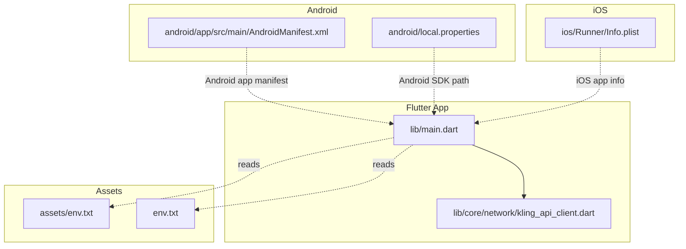
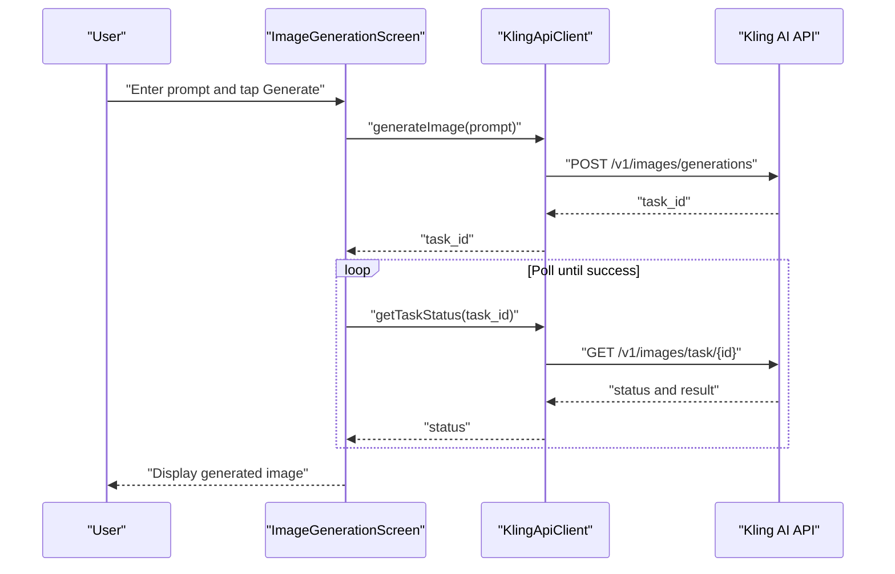
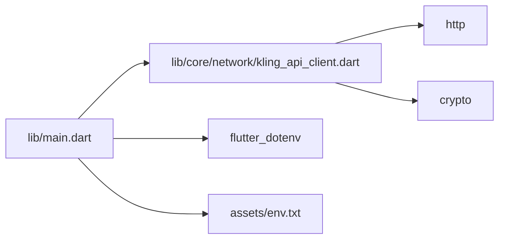

# Getting Started

<cite>
**Referenced Files in This Document**
- [README.md](file://README.md)
- [pubspec.yaml](file://pubspec.yaml)
- [lib/main.dart](file://lib/main.dart)
- [lib/core/network/kling_api_client.dart](file://lib/core/network/kling_api_client.dart)
- [env.txt](file://env.txt)
- [assets/env.txt](file://assets/env.txt)
- [android/app/src/main/AndroidManifest.xml](file://android/app/src/main/AndroidManifest.xml)
- [ios/Runner/Info.plist](file://ios/Runner/Info.plist)
- [android/local.properties](file://android/local.properties)
</cite>

## Table of Contents
1. [Introduction](#introduction)
2. [Project Structure](#project-structure)
3. [Core Components](#core-components)
4. [Architecture Overview](#architecture-overview)
5. [Detailed Component Analysis](#detailed-component-analysis)
6. [Dependency Analysis](#dependency-analysis)
7. [Performance Considerations](#performance-considerations)
8. [Troubleshooting Guide](#troubleshooting-guide)
9. [Conclusion](#conclusion)
10. [Appendices](#appendices)

## Introduction
This guide helps you set up and run the Kling AI Image Generation App locally. It covers Flutter SDK installation, IDE configuration, device setup for Android and iOS, environment configuration with API credentials, and practical steps to run, debug, and explore the project. It also includes troubleshooting tips and guidance for navigating the codebase as a first-time contributor.

## Project Structure
The project follows a standard Flutter layout with platform-specific native code under android/ and ios/, and Dart application code under lib/. Key areas:
- Application entrypoint and UI live in lib/main.dart.
- Networking and API interactions are encapsulated in lib/core/network/kling_api_client.dart.
- Environment variables for API credentials are provided via env.txt and assets/env.txt.
- Platform manifests and configuration are under android/app/src/main/AndroidManifest.xml and ios/Runner/Info.plist.
- Flutter dependencies and assets are declared in pubspec.yaml.

**Diagram sources**
- [lib/main.dart](file://lib/main.dart)
- [lib/core/network/kling_api_client.dart](file://lib/core/network/kling_api_client.dart)
- [env.txt](file://env.txt)
- [assets/env.txt](file://assets/env.txt)
- [android/app/src/main/AndroidManifest.xml](file://android/app/src/main/AndroidManifest.xml)
- [ios/Runner/Info.plist](file://ios/Runner/Info.plist)
- [android/local.properties](file://android/local.properties)

**Section sources**
- [README.md](file://README.md)
- [pubspec.yaml](file://pubspec.yaml)
- [lib/main.dart](file://lib/main.dart)
- [lib/core/network/kling_api_client.dart](file://lib/core/network/kling_api_client.dart)
- [env.txt](file://env.txt)
- [assets/env.txt](file://assets/env.txt)
- [android/app/src/main/AndroidManifest.xml](file://android/app/src/main/AndroidManifest.xml)
- [ios/Runner/Info.plist](file://ios/Runner/Info.plist)
- [android/local.properties](file://android/local.properties)

## Core Components
- Application entrypoint: Initializes the app and sets the main screen to the image generation UI.
- Image generation UI: Provides a prompt input, a generate button, and displays loading, success, or error states with the generated image.
- Network client: Handles JWT signing, HTTP requests to the Kling AI API, and basic retry logic for rate limits and server errors.

Key responsibilities:
- lib/main.dart: Defines the UI and orchestrates user actions and state transitions.
- lib/core/network/kling_api_client.dart: Manages authentication tokens, request retries, and API interactions.

**Section sources**
- [lib/main.dart](file://lib/main.dart)
- [lib/core/network/kling_api_client.dart](file://lib/core/network/kling_api_client.dart)

## Architecture Overview
The app is a thin Flutter shell around a network client that communicates with the Kling AI service. The UI triggers image generation, polls for completion, and renders results.

**Diagram sources**
- [lib/main.dart](file://lib/main.dart)
- [lib/core/network/kling_api_client.dart](file://lib/core/network/kling_api_client.dart)

## Detailed Component Analysis

### Flutter Setup and IDE Configuration
- Install Flutter SDK and configure your IDE (VS Code or Android Studio) following the official Flutter installation guide.
- Ensure your IDE recognizes the Flutter SDK path configured in your environment.

What to verify:
- Flutter doctor output is healthy.
- IDE plugins for Flutter and Dart are installed and activated.

### Android Device Setup
- Enable Developer Options and USB Debugging on your Android device.
- Connect the device via USB or start an Android emulator.
- Confirm the device appears in flutter devices.

Key configuration files:
- Android manifest declares the main activity and permissions.
- local.properties provides the Android SDK path used by Gradle.

**Section sources**
- [android/app/src/main/AndroidManifest.xml](file://android/app/src/main/AndroidManifest.xml)
- [android/local.properties](file://android/local.properties)

### iOS Device Setup
- On macOS, open the iOS simulator from Xcode or connect an iOS device via USB.
- Ensure your Apple ID and provisioning profiles are configured if targeting a physical iOS device.

Key configuration files:
- iOS Info.plist defines bundle identifiers, supported orientations, and app metadata.

**Section sources**
- [ios/Runner/Info.plist](file://ios/Runner/Info.plist)

### Environment Configuration and API Credentials
The app expects API credentials to be present. Two locations are provided:
- env.txt at the project root
- assets/env.txt included as a Flutter asset

Steps:
- Copy your KLING_ACCESS_KEY and KLING_SECRET_KEY into env.txt.
- Confirm assets/env.txt matches the values in env.txt.
- The app loads environment variables during startup to configure the network client.

Notes:
- The network client currently embeds placeholder values. Update them to match your credentials.

**Section sources**
- [env.txt](file://env.txt)
- [assets/env.txt](file://assets/env.txt)
- [lib/core/network/kling_api_client.dart](file://lib/core/network/kling_api_client.dart)

### Running the App Locally
- Install dependencies: flutter pub get
- Run on a connected device or emulator: flutter run
- Verify the UI shows the prompt input and a Generate button.

Common checks:
- Ensure the device/emulator is selected and recognized.
- Confirm environment variables are loaded and the network client can reach the API.

**Section sources**
- [lib/main.dart](file://lib/main.dart)
- [pubspec.yaml](file://pubspec.yaml)

### Debugging Setup
- Use Flutter DevTools for UI inspection and performance profiling.
- Enable logging in the network client to inspect request/response bodies and status codes.
- Set breakpoints in lib/main.dart and lib/core/network/kling_api_client.dart for step-through debugging.

**Section sources**
- [lib/main.dart](file://lib/main.dart)
- [lib/core/network/kling_api_client.dart](file://lib/core/network/kling_api_client.dart)

### Initial Project Exploration
- lib/main.dart: Entry point and UI scaffold.
- lib/core/network/kling_api_client.dart: Authentication and API interaction logic.
- pubspec.yaml: Dependencies and asset declarations.
- android/ and ios/: Platform-specific configuration and manifests.

Navigation tips:
- Start from lib/main.dart to understand the UI flow.
- Explore lib/core/network/kling_api_client.dart to learn how the app authenticates and calls the API.
- Review pubspec.yaml to understand dependencies and assets.

**Section sources**
- [lib/main.dart](file://lib/main.dart)
- [lib/core/network/kling_api_client.dart](file://lib/core/network/kling_api_client.dart)
- [pubspec.yaml](file://pubspec.yaml)

## Dependency Analysis
The app depends on Flutter SDK and several packages:
- http: For making HTTP requests.
- flutter_dotenv: For loading environment variables from .env-like files.
- crypto: For generating HMAC signatures used in JWT creation.

Asset and SDK configuration:
- pubspec.yaml declares the http and flutter_dotenv dependencies and includes assets/env.txt.

**Diagram sources**
- [lib/main.dart](file://lib/main.dart)
- [lib/core/network/kling_api_client.dart](file://lib/core/network/kling_api_client.dart)
- [pubspec.yaml](file://pubspec.yaml)
- [assets/env.txt](file://assets/env.txt)

**Section sources**
- [pubspec.yaml](file://pubspec.yaml)
- [lib/core/network/kling_api_client.dart](file://lib/core/network/kling_api_client.dart)

## Performance Considerations
- Network timeouts and retries: The network client applies exponential backoff for rate limits and server errors to avoid overwhelming the API.
- UI responsiveness: The UI remains interactive during polling by using asynchronous operations and avoiding long-running synchronous tasks.
- Asset loading: Environment variables are bundled as assets to minimize runtime overhead.

[No sources needed since this section provides general guidance]

## Troubleshooting Guide
Common setup and runtime issues:

- Flutter doctor reports missing dependencies
  - Install missing SDKs, simulators, or IDE plugins as indicated by flutter doctor.

- No device detected
  - For Android: enable developer options and USB debugging; ensure drivers are installed.
  - For iOS: open Xcode and accept any additional agreements; ensure the simulator is available.

- Build fails due to missing Android SDK path
  - Ensure flutter.sdk and sdk.dir are correctly set in android/local.properties.

- API requests fail or return rate limit errors
  - Verify KLING_ACCESS_KEY and KLING_SECRET_KEY in env.txt and assets/env.txt.
  - Confirm the network client is using your credentials (not the embedded placeholders).

- Images do not appear after generation
  - Check the UI state handling for success and error conditions.
  - Inspect network logs to confirm successful task completion and image URLs.

- Environment variables not loading
  - Ensure assets/env.txt is present and matches env.txt.
  - Confirm the dotenv loader is invoked during app initialization.

**Section sources**
- [android/local.properties](file://android/local.properties)
- [env.txt](file://env.txt)
- [assets/env.txt](file://assets/env.txt)
- [lib/core/network/kling_api_client.dart](file://lib/core/network/kling_api_client.dart)
- [lib/main.dart](file://lib/main.dart)

## Conclusion
You now have the essentials to install Flutter, configure your development environment, connect Android and iOS devices, load API credentials, and run the app locally. Use the troubleshooting guide to resolve common issues and explore the codebase by starting from the UI entrypoint and diving into the network client.

[No sources needed since this section summarizes without analyzing specific files]

## Appendices

### Quick Checklist
- Flutter SDK installed and recognized by IDE.
- Android device/emulator connected or iOS simulator available.
- KLING_ACCESS_KEY and KLING_SECRET_KEY set in env.txt and assets/env.txt.
- flutter pub get executed.
- flutter run successful on target device.

[No sources needed since this section provides general guidance]