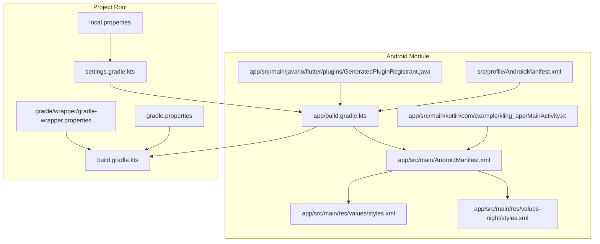
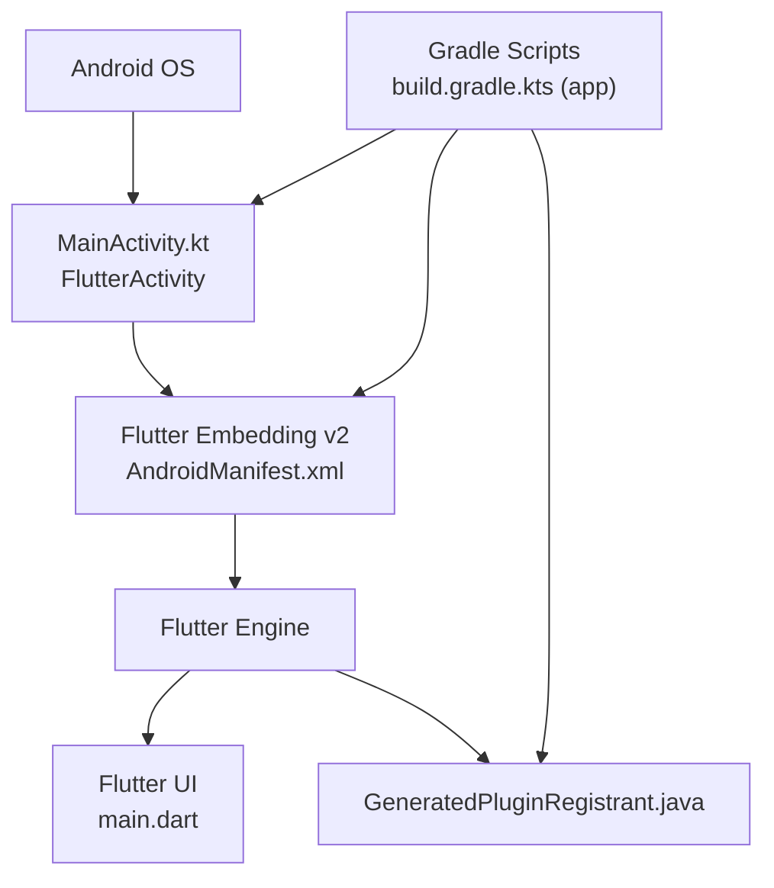
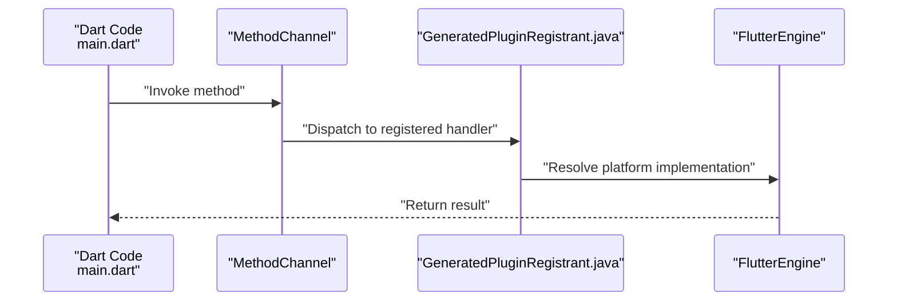
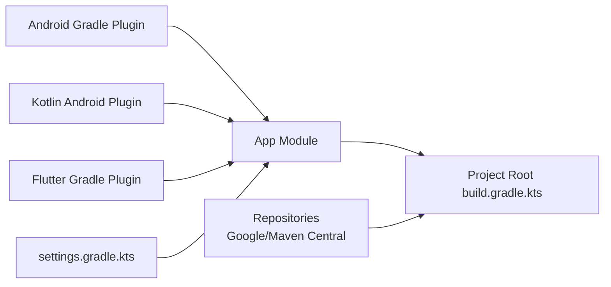

# Android Implementation

<cite>
**Referenced Files in This Document**
- [MainActivity.kt](file://android/app/src/main/kotlin/com/example/kling_app/MainActivity.kt)
- [AndroidManifest.xml](file://android/app/src/main/AndroidManifest.xml)
- [styles.xml](file://android/app/src/main/res/values/styles.xml)
- [styles.xml (night)](file://android/app/src/main/res/values-night/styles.xml)
- [GeneratedPluginRegistrant.java](file://android/app/src/main/java/io/flutter/plugins/GeneratedPluginRegistrant.java)
- [build.gradle.kts (app)](file://android/app/build.gradle.kts)
- [build.gradle.kts (project root)](file://android/build.gradle.kts)
- [settings.gradle.kts](file://android/settings.gradle.kts)
- [gradle.properties](file://android/gradle.properties)
- [local.properties](file://android/local.properties)
- [gradle-wrapper.properties](file://android/gradle/wrapper/gradle-wrapper.properties)
- [profile manifest](file://android/app/src/profile/AndroidManifest.xml)
- [main.dart](file://lib/main.dart)
</cite>

## Table of Contents
1. [Introduction](#introduction)
2. [Project Structure](#project-structure)
3. [Core Components](#core-components)
4. [Architecture Overview](#architecture-overview)
5. [Detailed Component Analysis](#detailed-component-analysis)
6. [Dependency Analysis](#dependency-analysis)
7. [Performance Considerations](#performance-considerations)
8. [Troubleshooting Guide](#troubleshooting-guide)
9. [Build and Deployment Guide](#build-and-deployment-guide)
10. [Conclusion](#conclusion)

## Introduction
This document explains the Android implementation of the Kling AI Image Generation App. It focuses on the Android entry point via MainActivity.kt, Android manifest configuration, Gradle build setup, and the Flutter Android embedding. It also covers native plugin registration, platform channel communication patterns, and practical guidance for building, signing, and deploying APK artifacts on Android devices.

## Project Structure
The Android module is organized under android/app and integrates with Flutter’s Gradle plugin. Key areas:
- Entry point activity definition and Flutter embedding metadata
- Build configuration for application packaging and signing
- Resource themes for light and dark modes
- Plugin registration scaffolding for native integrations
- Wrapper and project-wide Gradle settings

**Diagram sources**
- [AndroidManifest.xml:1-46](file://android/app/src/main/AndroidManifest.xml#L1-L46)
- [MainActivity.kt:1-6](file://android/app/src/main/kotlin/com/example/kling_app/MainActivity.kt#L1-L6)
- [styles.xml:1-19](file://android/app/src/main/res/values/styles.xml#L1-L19)
- [styles.xml (night):1-18](file://android/app/src/main/res/values-night/styles.xml#L1-L18)
- [GeneratedPluginRegistrant.java:1-20](file://android/app/src/main/java/io/flutter/plugins/GeneratedPluginRegistrant.java#L1-L20)
- [build.gradle.kts (app):1-45](file://android/app/build.gradle.kts#L1-L45)
- [build.gradle.kts (project root):1-22](file://android/build.gradle.kts#L1-L22)
- [settings.gradle.kts:1-26](file://android/settings.gradle.kts#L1-L26)
- [gradle.properties:1-4](file://android/gradle.properties#L1-L4)
- [local.properties:1-5](file://android/local.properties#L1-L5)
- [gradle-wrapper.properties:1-6](file://android/gradle/wrapper/gradle-wrapper.properties#L1-L6)
- [profile manifest:1-7](file://android/app/src/profile/AndroidManifest.xml#L1-L7)

**Section sources**
- [AndroidManifest.xml:1-46](file://android/app/src/main/AndroidManifest.xml#L1-L46)
- [build.gradle.kts (app):1-45](file://android/app/build.gradle.kts#L1-L45)
- [build.gradle.kts (project root):1-22](file://android/build.gradle.kts#L1-L22)
- [settings.gradle.kts:1-26](file://android/settings.gradle.kts#L1-L26)
- [gradle.properties:1-4](file://android/gradle.properties#L1-L4)
- [local.properties:1-5](file://android/local.properties#L1-L5)
- [gradle-wrapper.properties:1-6](file://android/gradle/wrapper/gradle-wrapper.properties#L1-L6)

## Core Components
- MainActivity.kt: Minimal FlutterActivity subclass that delegates lifecycle and rendering to Flutter.
- AndroidManifest.xml: Declares the launcher activity, embedding metadata, hardware acceleration, configuration changes, and package-visibility queries.
- Styles resources: Define launch and normal themes for light and dark modes.
- GeneratedPluginRegistrant.java: Scaffolding for native plugin registration; empty in current setup.
- Gradle build scripts: Configure SDK versions, Java/Kotlin targets, default app config, build types, and Flutter source location.
- Project settings: Centralized plugin management, repository configuration, and inclusion of the app module.

**Section sources**
- [MainActivity.kt:1-6](file://android/app/src/main/kotlin/com/example/kling_app/MainActivity.kt#L1-L6)
- [AndroidManifest.xml:1-46](file://android/app/src/main/AndroidManifest.xml#L1-L46)
- [styles.xml:1-19](file://android/app/src/main/res/values/styles.xml#L1-L19)
- [styles.xml (night):1-18](file://android/app/src/main/res/values-night/styles.xml#L1-L18)
- [GeneratedPluginRegistrant.java:1-20](file://android/app/src/main/java/io/flutter/plugins/GeneratedPluginRegistrant.java#L1-L20)
- [build.gradle.kts (app):1-45](file://android/app/build.gradle.kts#L1-L45)
- [settings.gradle.kts:1-26](file://android/settings.gradle.kts#L1-L26)

## Architecture Overview
The Android entry point integrates with Flutter’s Android embedding. MainActivity extends FlutterActivity, enabling Flutter to initialize and render the app UI. The manifest declares the activity as exported and sets up embedding metadata and intent filters. Build scripts coordinate with the Flutter Gradle plugin to assemble the APK.

**Diagram sources**
- [MainActivity.kt:1-6](file://android/app/src/main/kotlin/com/example/kling_app/MainActivity.kt#L1-L6)
- [AndroidManifest.xml:6-32](file://android/app/src/main/AndroidManifest.xml#L6-L32)
- [GeneratedPluginRegistrant.java:15-18](file://android/app/src/main/java/io/flutter/plugins/GeneratedPluginRegistrant.java#L15-L18)
- [build.gradle.kts (app):1-45](file://android/app/build.gradle.kts#L1-L45)
- [main.dart:1-191](file://lib/main.dart#L1-L191)

## Detailed Component Analysis

### MainActivity.kt
- Role: Android entry point activity extending FlutterActivity. It enables Flutter to manage the app lifecycle and rendering.
- Configuration: Inherits FlutterActivity defaults; no overrides are present in this project.
- Implications: Simplifies integration with Flutter’s engine and reduces boilerplate.

**Section sources**
- [MainActivity.kt:1-6](file://android/app/src/main/kotlin/com/example/kling_app/MainActivity.kt#L1-L6)

### AndroidManifest.xml
- Activity declaration:
  - Exported for launcher visibility.
  - SingleTop launch mode and adjusted window soft input mode for resizing.
  - Hardware acceleration enabled.
  - Handles a wide range of configuration changes for robustness.
- Flutter embedding metadata:
  - Embedding version declared for compatibility.
- Queries:
  - Declares package-visibility for text processing actions used by Flutter plugins.

**Section sources**
- [AndroidManifest.xml:6-32](file://android/app/src/main/AndroidManifest.xml#L6-L32)
- [AndroidManifest.xml:39-44](file://android/app/src/main/AndroidManifest.xml#L39-L44)

### Resource Themes (Light/Dark Modes)
- LaunchTheme: Splash background applied during initialization.
- NormalTheme: Theme applied once Flutter UI is ready; supports both light and dark variants.

**Section sources**
- [styles.xml:3-17](file://android/app/src/main/res/values/styles.xml#L3-L17)
- [styles.xml (night):3-17](file://android/app/src/main/res/values-night/styles.xml#L3-L17)

### Native Plugin Registration
- GeneratedPluginRegistrant.java: Provides a registration hook for plugins. Current implementation is empty, indicating no explicit plugin registrations are added here.

**Section sources**
- [GeneratedPluginRegistrant.java:15-18](file://android/app/src/main/java/io/flutter/plugins/GeneratedPluginRegistrant.java#L15-L18)

### Gradle Build Configuration (App)
- Plugins: Android application, Kotlin Android, and Flutter Gradle plugin.
- Android block:
  - Namespace and SDK versions sourced from Flutter.
  - Java/Kotlin 11 compatibility.
  - Application defaults: applicationId, minSdk, targetSdk, versionCode, versionName.
  - Build types: release uses debug signing config for convenience.
- Flutter block: Points to the Flutter project root.

**Section sources**
- [build.gradle.kts (app):1-45](file://android/app/build.gradle.kts#L1-L45)

### Project-Wide Gradle Settings
- Repositories: Google and Maven Central configured globally.
- Build directory: Centralized build directory moved to a shared location.
- Subprojects: Consistent build directory and evaluation dependency on app module.
- Clean task: Deletes the centralized build directory.

**Section sources**
- [build.gradle.kts (project root):1-22](file://android/build.gradle.kts#L1-L22)

### Settings and Wrapper
- settings.gradle.kts:
  - Loads Flutter SDK path from local.properties.
  - Includes Flutter tooling build and registers repositories.
  - Applies plugin loader and includes the app module.
- gradle-wrapper.properties: Defines Gradle distribution URL for reproducible builds.

**Section sources**
- [settings.gradle.kts:1-26](file://android/settings.gradle.kts#L1-L26)
- [gradle-wrapper.properties:1-6](file://android/gradle/wrapper/gradle-wrapper.properties#L1-L6)

### Environment Variables and Properties
- gradle.properties:
  - JVM heap and metaspace sizing for improved build performance.
  - AndroidX and Jetifier flags enabled for compatibility.
- local.properties:
  - SDK paths for Android SDK and Flutter SDK.
  - Default build mode, version name, and version code.

**Section sources**
- [gradle.properties:1-4](file://android/gradle.properties#L1-L4)
- [local.properties:1-5](file://android/local.properties#L1-L5)

### Platform Channel Communication
- Pattern: Flutter embeds a platform channel bridge to communicate with Android. While the current plugin registrant is empty, platform channels can be introduced by:
  - Defining method channels in Dart.
  - Registering platform-specific handlers in GeneratedPluginRegistrant or via a dedicated registrar.
  - Implementing Android-side handlers in Kotlin/Java to process requests and return results.

**Diagram sources**
- [GeneratedPluginRegistrant.java:15-18](file://android/app/src/main/java/io/flutter/plugins/GeneratedPluginRegistrant.java#L15-L18)
- [main.dart:50-90](file://lib/main.dart#L50-L90)

## Dependency Analysis
- Plugin dependencies:
  - Android Gradle Plugin and Kotlin Android Gradle Plugin applied at the app level.
  - Flutter Gradle Plugin applied after Android/Kotlin plugins.
- Project-level plugin management:
  - Plugin loader and repository configuration managed centrally.
- Module inclusion:
  - App module included via settings.gradle.kts.

**Diagram sources**
- [build.gradle.kts (app):1-6](file://android/app/build.gradle.kts#L1-L6)
- [build.gradle.kts (project root):2-5](file://android/build.gradle.kts#L2-L5)
- [settings.gradle.kts:19-26](file://android/settings.gradle.kts#L19-L26)

**Section sources**
- [build.gradle.kts (app):1-6](file://android/app/build.gradle.kts#L1-L6)
- [build.gradle.kts (project root):1-22](file://android/build.gradle.kts#L1-L22)
- [settings.gradle.kts:1-26](file://android/settings.gradle.kts#L1-L26)

## Performance Considerations
- Hardware acceleration: Enabled in the manifest for smoother rendering.
- Configuration change handling: Comprehensive configChanges reduce unnecessary restarts during orientation or density changes.
- Build performance:
  - Gradle JVM args tuned for larger heap and metaspace sizes.
  - AndroidX and Jetifier enabled for modern compatibility.
- UI rendering:
  - Flutter’s virtual display and engine-driven rendering minimize layout thrashing.
- Memory management:
  - Dispose controllers and resources in Flutter widgets to avoid leaks.
  - Avoid retaining large bitmaps or streams longer than necessary.

[No sources needed since this section provides general guidance]

## Troubleshooting Guide
- Internet permission for development:
  - Profile manifest includes INTERNET permission for hot reload and debugging.
- Manifest export flag:
  - Activity exported to allow launching from the home screen.
- Package visibility:
  - Queries section declares text-processing intents for Flutter plugins.
- Build failures:
  - Ensure local.properties points to valid SDK locations.
  - Confirm Gradle wrapper distribution URL is reachable.
  - Verify Java/Kotlin 11 compatibility and Android Gradle Plugin version alignment.

**Section sources**
- [profile manifest:1-7](file://android/app/src/profile/AndroidManifest.xml#L1-L7)
- [AndroidManifest.xml:8-14](file://android/app/src/main/AndroidManifest.xml#L8-L14)
- [AndroidManifest.xml:39-44](file://android/app/src/main/AndroidManifest.xml#L39-L44)
- [local.properties:1-5](file://android/local.properties#L1-L5)
- [gradle-wrapper.properties:5-6](file://android/gradle/wrapper/gradle-wrapper.properties#L5-L6)

## Build and Deployment Guide

### Prerequisites
- Android SDK and Flutter SDK paths configured in local.properties.
- Java 11+ compatible toolchain.
- Optional keystore for signed release builds.

### Steps to Build an APK
1. Open terminal in the project root.
2. Run the Flutter build command to assemble the app:
   - Debug APK: flutter build apk
   - Release APK: flutter build apk --release
3. Locate the APK:
   - Debug: build/app/outputs/flutter-apk/app-debug.apk
   - Release: build/app/outputs/flutter-apk/app-release.apk

### Signing Configuration
- Current release build uses debug signing config for convenience.
- To sign releases:
  - Create or obtain a keystore.
  - Configure signingConfig in the app build script with keystore path, passwords, and key alias.
  - Rebuild the release APK.

### Deployment Preparation
- Enable installation from unknown sources on target devices if sideloading.
- For distribution, prepare an app bundle (.aab) using flutter build appbundle for Google Play.
- Ensure minimum and target SDK versions align with device compatibility.

[No sources needed since this section provides general guidance]

## Conclusion
The Android implementation leverages Flutter’s Android embedding with a minimal MainActivity.kt and a well-structured Gradle setup. The manifest defines a robust entry point with hardware acceleration and configuration change handling. The Gradle scripts centralize plugin management and build configuration, while resource themes support light and dark modes. For production, introduce proper signing, optimize build performance, and adopt platform channels for native integrations as needed.