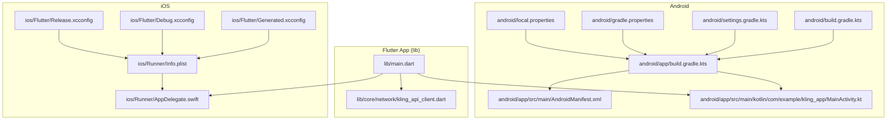
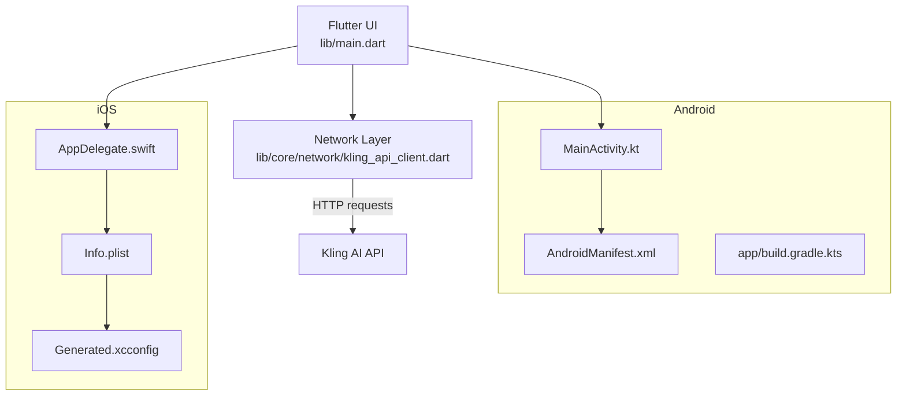
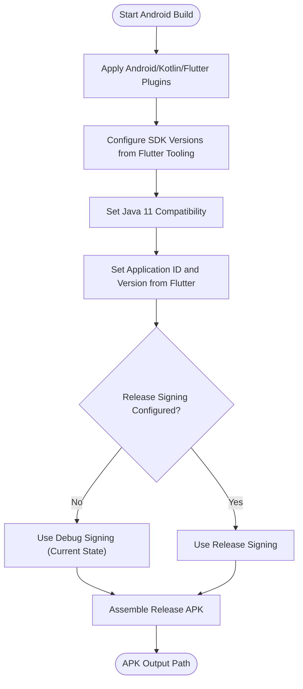
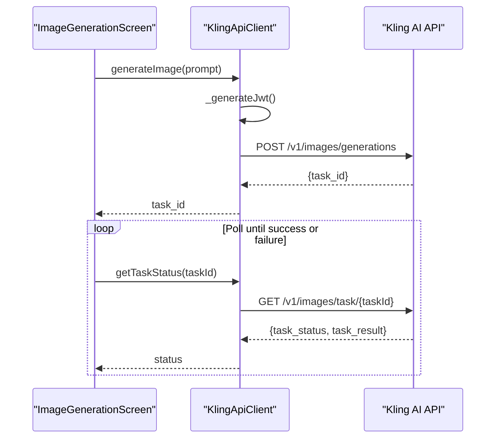
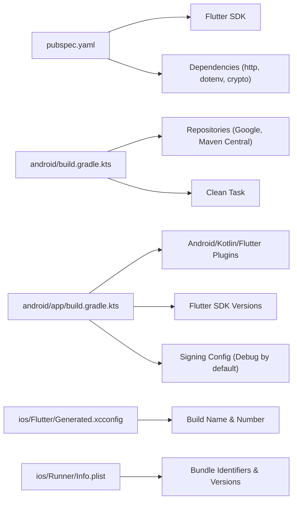

# Platform Support

<cite>
**Referenced Files in This Document**
- [lib/main.dart](file://lib/main.dart)
- [lib/core/network/kling_api_client.dart](file://lib/core/network/kling_api_client.dart)
- [android/app/src/main/kotlin/com/example/kling_app/MainActivity.kt](file://android/app/src/main/kotlin/com/example/kling_app/MainActivity.kt)
- [android/app/src/main/AndroidManifest.xml](file://android/app/src/main/AndroidManifest.xml)
- [android/app/build.gradle.kts](file://android/app/build.gradle.kts)
- [android/gradle.properties](file://android/gradle.properties)
- [android/local.properties](file://android/local.properties)
- [android/build.gradle.kts](file://android/build.gradle.kts)
- [android/settings.gradle.kts](file://android/settings.gradle.kts)
- [android/gradlew.bat](file://android/gradlew.bat)
- [ios/Runner/AppDelegate.swift](file://ios/Runner/AppDelegate.swift)
- [ios/Runner/Info.plist](file://ios/Runner/Info.plist)
- [ios/Flutter/Generated.xcconfig](file://ios/Flutter/Generated.xcconfig)
- [ios/Flutter/Debug.xcconfig](file://ios/Flutter/Debug.xcconfig)
- [ios/Flutter/Release.xcconfig](file://ios/Flutter/Release.xcconfig)
- [pubspec.yaml](file://pubspec.yaml)
</cite>

## Table of Contents
1. [Introduction](#introduction)
2. [Project Structure](#project-structure)
3. [Core Components](#core-components)
4. [Architecture Overview](#architecture-overview)
5. [Detailed Component Analysis](#detailed-component-analysis)
6. [Dependency Analysis](#dependency-analysis)
7. [Performance Considerations](#performance-considerations)
8. [Troubleshooting Guide](#troubleshooting-guide)
9. [Conclusion](#conclusion)

## Introduction
This document explains the platform support for the Kling AI Image Generation App built with Flutter. It covers the cross-platform mobile development approach targeting Android and iOS, including Android implementation details (MainActivity.kt configuration, Gradle build setup, permissions, and APK generation) and iOS implementation details (AppDelegate.swift configuration, Xcode project setup, provisioning profiles, and IPA generation for App Store distribution). It also documents platform-specific considerations, native integration points, deployment strategies, build configuration, signing requirements, and troubleshooting approaches.

## Project Structure
The project follows a standard Flutter layout with platform-specific folders under android and ios. The Dart application code resides under lib, with the main entry point in lib/main.dart. Platform integrations are minimal and rely on Flutter’s embedding model for both platforms.

**Diagram sources**
- [lib/main.dart:1-191](file://lib/main.dart#L1-L191)
- [lib/core/network/kling_api_client.dart:1-99](file://lib/core/network/kling_api_client.dart#L1-L99)
- [android/app/build.gradle.kts:1-45](file://android/app/build.gradle.kts#L1-L45)
- [android/build.gradle.kts:1-22](file://android/build.gradle.kts#L1-L22)
- [android/settings.gradle.kts:1-26](file://android/settings.gradle.kts#L1-L26)
- [android/gradle.properties:1-4](file://android/gradle.properties#L1-L4)
- [android/local.properties:1-5](file://android/local.properties#L1-L5)
- [android/app/src/main/AndroidManifest.xml:1-46](file://android/app/src/main/AndroidManifest.xml#L1-L46)
- [android/app/src/main/kotlin/com/example/kling_app/MainActivity.kt:1-6](file://android/app/src/main/kotlin/com/example/kling_app/MainActivity.kt#L1-L6)
- [ios/Runner/Info.plist:1-50](file://ios/Runner/Info.plist#L1-L50)
- [ios/Runner/AppDelegate.swift:1-14](file://ios/Runner/AppDelegate.swift#L1-L14)
- [ios/Flutter/Generated.xcconfig:1-15](file://ios/Flutter/Generated.xcconfig#L1-L15)
- [ios/Flutter/Debug.xcconfig:1-2](file://ios/Flutter/Debug.xcconfig#L1-L2)
- [ios/Flutter/Release.xcconfig:1-2](file://ios/Flutter/Release.xcconfig#L1-L2)

**Section sources**
- [lib/main.dart:1-191](file://lib/main.dart#L1-L191)
- [pubspec.yaml:1-83](file://pubspec.yaml#L1-L83)

## Core Components
- Android entry point: MainActivity.kt extends FlutterActivity, enabling Flutter’s Android embedding.
- Android manifest: Declares the main activity, exported launch intent, and queries for text processing.
- Android Gradle configuration: Applies Android, Kotlin, and Flutter Gradle plugins; sets SDK versions via Flutter tooling; defaults to debug signing for release builds.
- iOS entry point: AppDelegate.swift registers plugins and delegates application lifecycle to Flutter.
- iOS Info.plist: Defines bundle identifiers, supported orientations, and UI configurations.
- Network client: Implements JWT-based authentication and HTTP requests to the Kling AI API, with retry logic and error handling.

**Section sources**
- [android/app/src/main/kotlin/com/example/kling_app/MainActivity.kt:1-6](file://android/app/src/main/kotlin/com/example/kling_app/MainActivity.kt#L1-L6)
- [android/app/src/main/AndroidManifest.xml:1-46](file://android/app/src/main/AndroidManifest.xml#L1-L46)
- [android/app/build.gradle.kts:1-45](file://android/app/build.gradle.kts#L1-L45)
- [ios/Runner/AppDelegate.swift:1-14](file://ios/Runner/AppDelegate.swift#L1-L14)
- [ios/Runner/Info.plist:1-50](file://ios/Runner/Info.plist#L1-L50)
- [lib/core/network/kling_api_client.dart:1-99](file://lib/core/network/kling_api_client.dart#L1-L99)

## Architecture Overview
The app uses Flutter’s unified UI and business logic across platforms, with platform-specific embedding and build systems handling packaging and distribution.

**Diagram sources**
- [lib/main.dart:1-191](file://lib/main.dart#L1-L191)
- [lib/core/network/kling_api_client.dart:1-99](file://lib/core/network/kling_api_client.dart#L1-L99)
- [android/app/src/main/kotlin/com/example/kling_app/MainActivity.kt:1-6](file://android/app/src/main/kotlin/com/example/kling_app/MainActivity.kt#L1-L6)
- [android/app/src/main/AndroidManifest.xml:1-46](file://android/app/src/main/AndroidManifest.xml#L1-L46)
- [android/app/build.gradle.kts:1-45](file://android/app/build.gradle.kts#L1-L45)
- [ios/Runner/AppDelegate.swift:1-14](file://ios/Runner/AppDelegate.swift#L1-L14)
- [ios/Runner/Info.plist:1-50](file://ios/Runner/Info.plist#L1-L50)
- [ios/Flutter/Generated.xcconfig:1-15](file://ios/Flutter/Generated.xcconfig#L1-L15)

## Detailed Component Analysis

### Android Implementation

#### MainActivity.kt Configuration
- Purpose: Minimal FlutterActivity subclass to embed Flutter engine in the Android app.
- Behavior: Inherits FlutterActivity; no overrides are needed for basic operation.

**Section sources**
- [android/app/src/main/kotlin/com/example/kling_app/MainActivity.kt:1-6](file://android/app/src/main/kotlin/com/example/kling_app/MainActivity.kt#L1-L6)

#### Android Manifest and Permissions
- Activity declaration: Main activity exported with standard Flutter launch theme and configuration changes.
- Queries: Declares intent to process text, required by Flutter’s text processing plugin.
- Internet permission: Present in the profile manifest for development hot reload and debugging.

**Section sources**
- [android/app/src/main/AndroidManifest.xml:1-46](file://android/app/src/main/AndroidManifest.xml#L1-L46)
- [android/app/src/profile/AndroidManifest.xml:1-7](file://android/app/src/profile/AndroidManifest.xml#L1-L7)

#### Gradle Build Setup
- Plugins: Android application, Kotlin Android, and Flutter Gradle plugin applied in the correct order.
- SDK versions: Derived from Flutter tooling (compileSdk, targetSdk, minSdk, NDK).
- Java/Kotlin compatibility: Java 11 compatibility and Kotlin options set to JVM 11.
- Default configuration: Application ID, version code/name from Flutter tooling.
- Release signing: Defaults to debug signing; recommended to configure release signing in a dedicated signing config.

**Section sources**
- [android/app/build.gradle.kts:1-45](file://android/app/build.gradle.kts#L1-L45)
- [android/gradle.properties:1-4](file://android/gradle.properties#L1-L4)
- [android/local.properties:1-5](file://android/local.properties#L1-L5)

#### Build and Packaging Workflow (APK)
- Build command: Use Gradle wrapper to assemble release APK.
- Signing: Configure a release signingConfig and keystore properties; current release defaults to debug signing.
- Output: APK produced under the standard Gradle build outputs.

**Diagram sources**
- [android/app/build.gradle.kts:1-45](file://android/app/build.gradle.kts#L1-L45)

**Section sources**
- [android/app/build.gradle.kts:33-39](file://android/app/build.gradle.kts#L33-L39)

### iOS Implementation

#### AppDelegate.swift Configuration
- Purpose: Registers Flutter plugin registrant and defers application lifecycle to Flutter.
- Behavior: Overrides applicationDidFinishLaunchingWithOptions to register plugins.

**Section sources**
- [ios/Runner/AppDelegate.swift:1-14](file://ios/Runner/AppDelegate.swift#L1-L14)

#### Xcode Project Setup and Info.plist
- Bundle identifiers and versions: Provided via Flutter-generated configuration and Info.plist keys.
- Supported orientations: Portrait and landscape for iPhone; portrait and landscape for iPad.
- Minimum OS requirement: LSRequiresIPhoneOS set to true.
- Generated.xcconfig: Includes FLUTTER_BUILD_NAME and FLUTTER_BUILD_NUMBER for iOS versioning.

**Section sources**
- [ios/Runner/Info.plist:1-50](file://ios/Runner/Info.plist#L1-L50)
- [ios/Flutter/Generated.xcconfig:1-15](file://ios/Flutter/Generated.xcconfig#L1-L15)
- [ios/Flutter/Debug.xcconfig:1-2](file://ios/Flutter/Debug.xcconfig#L1-L2)
- [ios/Flutter/Release.xcconfig:1-2](file://ios/Flutter/Release.xcconfig#L1-L2)

#### Provisioning Profiles and Distribution (IPA)
- Provisioning: Configure Apple certificates and provisioning profiles in Xcode for distribution.
- Archive: Archive the project in Xcode Organizer.
- Export: Export an IPA for App Store distribution using the correct export options.

[No sources needed since this section provides general guidance]

### Cross-Platform Networking and API Client
- Authentication: Generates a JWT with HMAC SHA-256 using access and secret keys.
- Requests: Uses HTTP client with timeouts and retry logic for rate limits and transient errors.
- Endpoints: Calls Kling AI API for image generation and polling task status.

**Diagram sources**
- [lib/main.dart:50-90](file://lib/main.dart#L50-L90)
- [lib/core/network/kling_api_client.dart:79-97](file://lib/core/network/kling_api_client.dart#L79-L97)

**Section sources**
- [lib/core/network/kling_api_client.dart:21-99](file://lib/core/network/kling_api_client.dart#L21-L99)

## Dependency Analysis
- Flutter SDK and dependencies: Defined in pubspec.yaml, including http, flutter_dotenv, and crypto.
- Android Gradle: Root and app-level Gradle files manage repositories, plugin versions, and evaluation dependencies.
- iOS configuration: Generated.xcconfig supplies build name and number; Debug/Release.xcconfig include generated settings.

**Diagram sources**
- [pubspec.yaml:1-83](file://pubspec.yaml#L1-L83)
- [android/build.gradle.kts:1-22](file://android/build.gradle.kts#L1-L22)
- [android/app/build.gradle.kts:1-45](file://android/app/build.gradle.kts#L1-L45)
- [ios/Flutter/Generated.xcconfig:1-15](file://ios/Flutter/Generated.xcconfig#L1-L15)
- [ios/Runner/Info.plist:1-50](file://ios/Runner/Info.plist#L1-L50)

**Section sources**
- [pubspec.yaml:1-83](file://pubspec.yaml#L1-L83)
- [android/build.gradle.kts:1-22](file://android/build.gradle.kts#L1-L22)
- [android/settings.gradle.kts:1-26](file://android/settings.gradle.kts#L1-L26)
- [ios/Flutter/Generated.xcconfig:1-15](file://ios/Flutter/Generated.xcconfig#L1-L15)

## Performance Considerations
- Network timeouts: Requests timeout after a fixed duration to avoid hanging UI threads.
- Retry strategy: Exponential backoff for rate limits and server-side 5xx errors.
- UI responsiveness: Loading states and progress indicators prevent blocking during long-running tasks.
- Asset delivery: Keep image sizes reasonable and leverage caching where appropriate.

[No sources needed since this section provides general guidance]

## Troubleshooting Guide

### Android-Specific Issues
- Missing internet permission: Ensure INTERNET permission is present in the profile manifest for development and runtime connectivity.
- Release signing failures: Configure a release signingConfig and keystore properties in Gradle; otherwise, release builds default to debug signing.
- Java/Kotlin compatibility: Verify Java 11 compatibility and Kotlin options align with the configured JVM target.

**Section sources**
- [android/app/src/profile/AndroidManifest.xml:1-7](file://android/app/src/profile/AndroidManifest.xml#L1-L7)
- [android/app/build.gradle.kts:33-39](file://android/app/build.gradle.kts#L33-L39)
- [android/app/build.gradle.kts:13-20](file://android/app/build.gradle.kts#L13-L20)

### iOS-Specific Issues
- Build name and number mismatch: Confirm FLUTTER_BUILD_NAME and FLUTTER_BUILD_NUMBER in Generated.xcconfig match Info.plist keys.
- Orientation issues: Verify UISupportedInterfaceOrientations and UISupportedInterfaceOrientations~ipad entries in Info.plist.
- Plugin registration: Ensure GeneratedPluginRegistrant is registered in AppDelegate.

**Section sources**
- [ios/Flutter/Generated.xcconfig:7-8](file://ios/Flutter/Generated.xcconfig#L7-L8)
- [ios/Runner/Info.plist:31-47](file://ios/Runner/Info.plist#L31-L47)
- [ios/Runner/AppDelegate.swift:10-12](file://ios/Runner/AppDelegate.swift#L10-L12)

### Networking and API Issues
- Rate limiting: The client retries with exponential backoff for 429 and 5xx responses.
- Network errors: Socket exceptions are caught and surfaced as API exceptions.
- JWT expiration: The client generates a fresh JWT per request with a short expiration window.

**Section sources**
- [lib/core/network/kling_api_client.dart:59-77](file://lib/core/network/kling_api_client.dart#L59-L77)
- [lib/core/network/kling_api_client.dart:26-40](file://lib/core/network/kling_api_client.dart#L26-L40)

## Conclusion
The Kling AI Image Generation App leverages Flutter for a unified UI and business logic while relying on platform-specific embedding and build systems for Android and iOS. Android uses a minimal MainActivity.kt and a Gradle configuration that derives SDK versions from Flutter tooling, defaulting to debug signing for releases. iOS integrates via AppDelegate.swift and Info.plist, with build name and number managed by Generated.xcconfig. The network client handles authentication and robust retry logic for reliable API communication. For production, configure release signing on Android and proper provisioning profiles/IPA export on iOS.