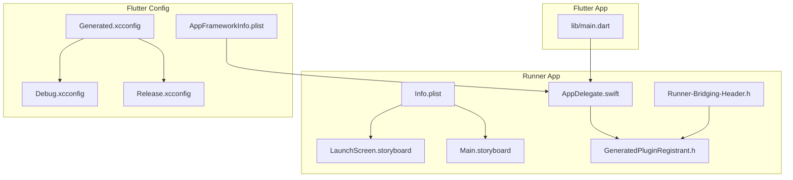
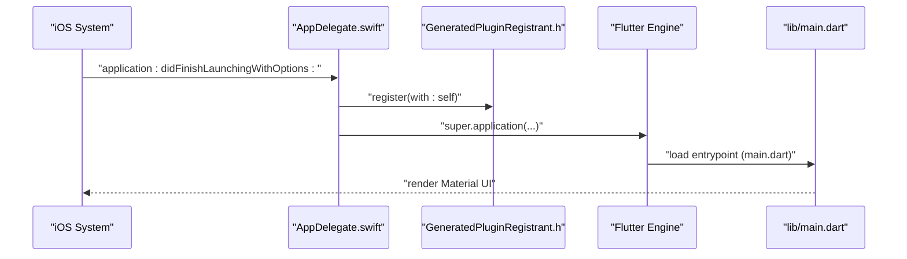
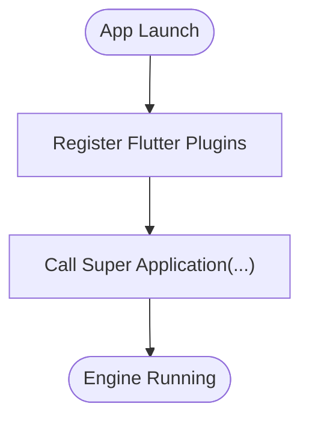
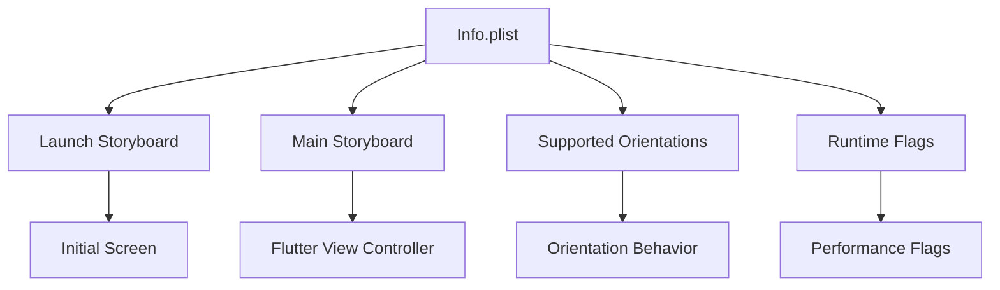
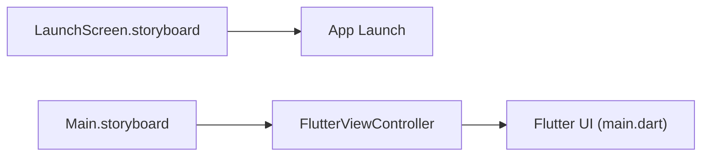
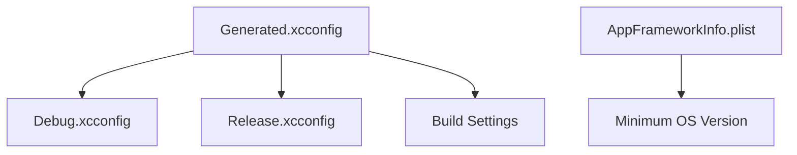
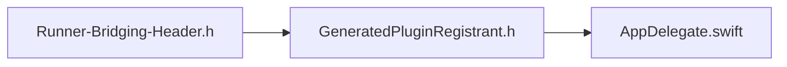
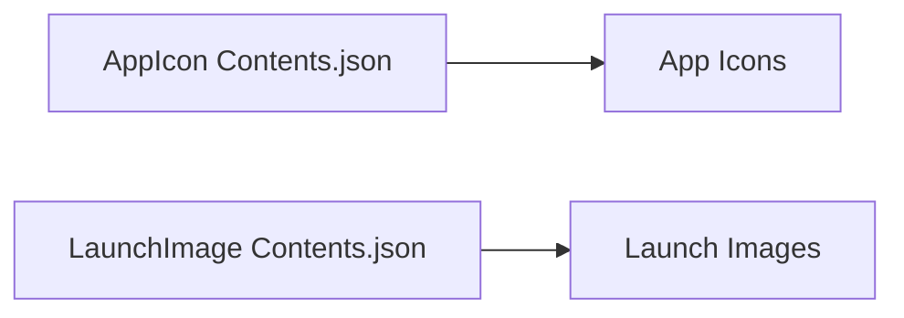
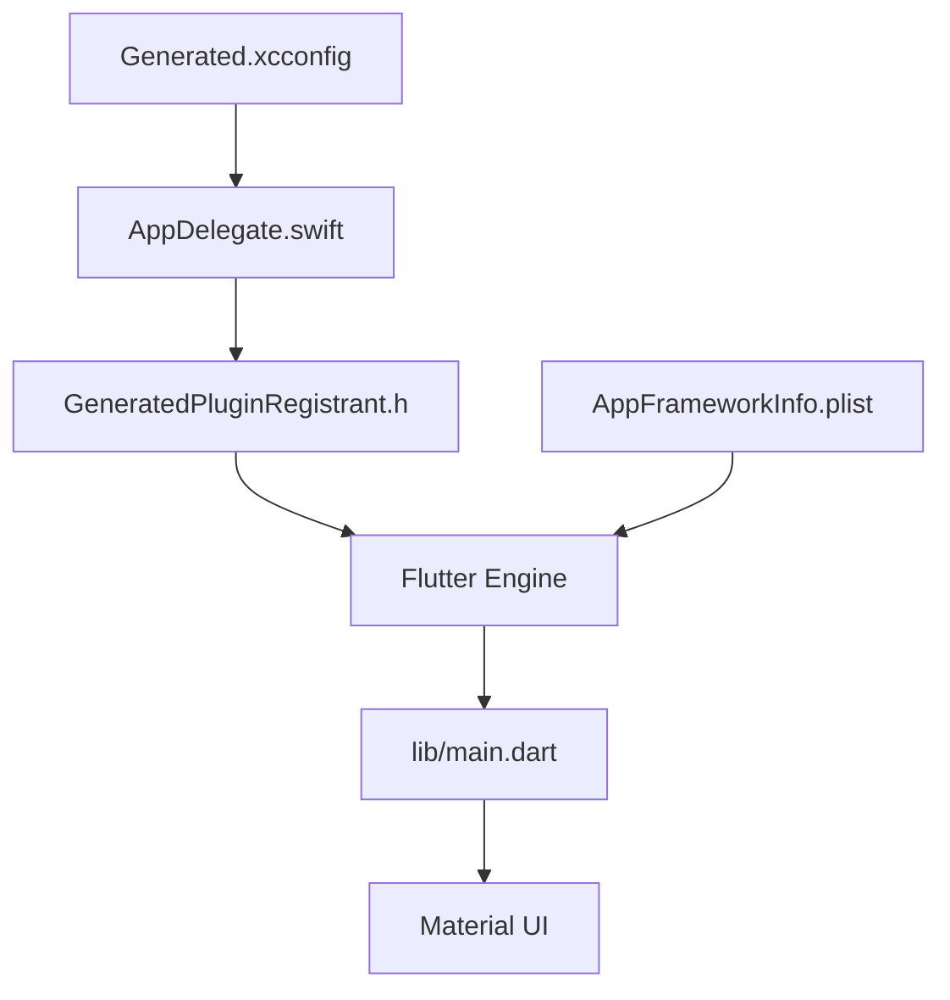

# iOS Implementation

<cite>
**Referenced Files in This Document**
- [AppDelegate.swift](file://ios/Runner/AppDelegate.swift)
- [Info.plist](file://ios/Runner/Info.plist)
- [LaunchScreen.storyboard](file://ios/Runner/Base.lproj/LaunchScreen.storyboard)
- [Main.storyboard](file://ios/Runner/Base.lproj/Main.storyboard)
- [Runner-Bridging-Header.h](file://ios/Runner/Runner-Bridging-Header.h)
- [AppFrameworkInfo.plist](file://ios/Flutter/AppFrameworkInfo.plist)
- [Generated.xcconfig](file://ios/Flutter/Generated.xcconfig)
- [Debug.xcconfig](file://ios/Flutter/Debug.xcconfig)
- [Release.xcconfig](file://ios/Flutter/Release.xcconfig)
- [GeneratedPluginRegistrant.h](file://ios/Runner/GeneratedPluginRegistrant.h)
- [main.dart](file://lib/main.dart)
- [pubspec.yaml](file://pubspec.yaml)
- [AppIcon Contents.json](file://ios/Runner/Assets.xcassets/AppIcon.appiconset/Contents.json)
- [LaunchImage Contents.json](file://ios/Runner/Assets.xcassets/LaunchImage.imageset/Contents.json)
</cite>

## Table of Contents
1. [Introduction](#introduction)
2. [Project Structure](#project-structure)
3. [Core Components](#core-components)
4. [Architecture Overview](#architecture-overview)
5. [Detailed Component Analysis](#detailed-component-analysis)
6. [Dependency Analysis](#dependency-analysis)
7. [Performance Considerations](#performance-considerations)
8. [Troubleshooting Guide](#troubleshooting-guide)
9. [Build and Distribution](#build-and-distribution)
10. [iOS-Specific Considerations](#ios-specific-considerations)
11. [Conclusion](#conclusion)

## Introduction
This document explains the iOS implementation of the Kling AI Image Generation App built with Flutter. It focuses on the iOS application lifecycle managed by AppDelegate.swift, Info.plist configuration for permissions and deployment settings, storyboard setup for launch and main interface, Flutter iOS integration via xcconfig and bridging headers, and practical guidance for building and distributing the app to the App Store. It also covers iOS-specific considerations such as background processing, memory management, device orientation, and minimum OS version compatibility.

## Project Structure
The iOS project integrates tightly with Flutter’s generated configuration and resources:
- Runner app targets the native iOS host app (Swift/Objective-C).
- Flutter framework settings are defined under ios/Flutter/*.
- Assets and storyboards live under ios/Runner/Base.lproj and ios/Runner/Assets.xcassets.
- The Flutter app entry point is lib/main.dart.

**Diagram sources**
- [AppDelegate.swift:1-14](file://ios/Runner/AppDelegate.swift#L1-L14)
- [Info.plist:1-50](file://ios/Runner/Info.plist#L1-L50)
- [LaunchScreen.storyboard:1-38](file://ios/Runner/Base.lproj/LaunchScreen.storyboard#L1-L38)
- [Main.storyboard:1-27](file://ios/Runner/Base.lproj/Main.storyboard#L1-L27)
- [Runner-Bridging-Header.h:1-2](file://ios/Runner/Runner-Bridging-Header.h#L1-L2)
- [GeneratedPluginRegistrant.h:1-20](file://ios/Runner/GeneratedPluginRegistrant.h#L1-L20)
- [Generated.xcconfig:1-15](file://ios/Flutter/Generated.xcconfig#L1-L15)
- [Debug.xcconfig:1-2](file://ios/Flutter/Debug.xcconfig#L1-L2)
- [Release.xcconfig:1-2](file://ios/Flutter/Release.xcconfig#L1-L2)
- [AppFrameworkInfo.plist:1-27](file://ios/Flutter/AppFrameworkInfo.plist#L1-L27)
- [main.dart:1-191](file://lib/main.dart#L1-L191)

**Section sources**
- [AppDelegate.swift:1-14](file://ios/Runner/AppDelegate.swift#L1-L14)
- [Info.plist:1-50](file://ios/Runner/Info.plist#L1-L50)
- [LaunchScreen.storyboard:1-38](file://ios/Runner/Base.lproj/LaunchScreen.storyboard#L1-L38)
- [Main.storyboard:1-27](file://ios/Runner/Base.lproj/Main.storyboard#L1-L27)
- [Runner-Bridging-Header.h:1-2](file://ios/Runner/Runner-Bridging-Header.h#L1-L2)
- [GeneratedPluginRegistrant.h:1-20](file://ios/Runner/GeneratedPluginRegistrant.h#L1-L20)
- [Generated.xcconfig:1-15](file://ios/Flutter/Generated.xcconfig#L1-L15)
- [Debug.xcconfig:1-2](file://ios/Flutter/Debug.xcconfig#L1-L2)
- [Release.xcconfig:1-2](file://ios/Flutter/Release.xcconfig#L1-L2)
- [AppFrameworkInfo.plist:1-27](file://ios/Flutter/AppFrameworkInfo.plist#L1-L27)
- [main.dart:1-191](file://lib/main.dart#L1-L191)

## Core Components
- AppDelegate.swift: Minimal lifecycle hook that registers Flutter plugins during launch and delegates to the Flutter application lifecycle.
- Info.plist: Declares bundle metadata, supported orientations, launch storyboard, and runtime support flags.
- Storyboards: LaunchScreen.storyboard defines the initial loading screen; Main.storyboard hosts the Flutter-managed view controller.
- Bridging Header: Connects Objective-C plugin registration to Swift.
- Flutter Config: Generated.xcconfig and Debug/Release.xcconfig define build-time settings and include the generated configuration.
- AppFrameworkInfo.plist: Defines Flutter framework metadata and minimum OS version.

**Section sources**
- [AppDelegate.swift:1-14](file://ios/Runner/AppDelegate.swift#L1-L14)
- [Info.plist:1-50](file://ios/Runner/Info.plist#L1-L50)
- [LaunchScreen.storyboard:1-38](file://ios/Runner/Base.lproj/LaunchScreen.storyboard#L1-L38)
- [Main.storyboard:1-27](file://ios/Runner/Base.lproj/Main.storyboard#L1-L27)
- [Runner-Bridging-Header.h:1-2](file://ios/Runner/Runner-Bridging-Header.h#L1-L2)
- [GeneratedPluginRegistrant.h:1-20](file://ios/Runner/GeneratedPluginRegistrant.h#L1-L20)
- [Generated.xcconfig:1-15](file://ios/Flutter/Generated.xcconfig#L1-L15)
- [AppFrameworkInfo.plist:1-27](file://ios/Flutter/AppFrameworkInfo.plist#L1-L27)

## Architecture Overview
The iOS app boots through AppDelegate.swift, which registers Flutter plugins and starts the Flutter engine. The Flutter engine renders the UI defined in lib/main.dart. Info.plist controls the app’s identity, supported orientations, and launch storyboard. The bridging header ensures plugin registration is visible to Objective-C code paths.

**Diagram sources**
- [AppDelegate.swift:1-14](file://ios/Runner/AppDelegate.swift#L1-L14)
- [GeneratedPluginRegistrant.h:1-20](file://ios/Runner/GeneratedPluginRegistrant.h#L1-L20)
- [main.dart:1-191](file://lib/main.dart#L1-L191)

## Detailed Component Analysis

### AppDelegate.swift Lifecycle Management
- Role: Registers Flutter plugins early in the app lifecycle and defers normal app delegate behavior to Flutter.
- Key behavior: Overrides the launch method to register plugins and then calls the superclass implementation.
- Implications: Ensures all Flutter plugins are available before the Flutter engine begins rendering UI.

**Diagram sources**
- [AppDelegate.swift:6-12](file://ios/Runner/AppDelegate.swift#L6-L12)

**Section sources**
- [AppDelegate.swift:1-14](file://ios/Runner/AppDelegate.swift#L1-L14)

### Info.plist Configuration
- Bundle identity and metadata: Display name, executable, identifier, versioning.
- Deployment and UI: Launch storyboard, main storyboard, supported orientations for iPhone and iPad, input event support, and frame duration toggle.
- Impact: Controls how iOS launches and presents the app, including orientation behavior and initial UI.

**Diagram sources**
- [Info.plist:25-47](file://ios/Runner/Info.plist#L25-L47)

**Section sources**
- [Info.plist:1-50](file://ios/Runner/Info.plist#L1-L50)

### Storyboard Setup
- LaunchScreen.storyboard: Provides a static launch screen centered around an image resource.
- Main.storyboard: Hosts a Flutter-managed view controller, enabling Flutter to render the app UI.

**Diagram sources**
- [LaunchScreen.storyboard:16-27](file://ios/Runner/Base.lproj/LaunchScreen.storyboard#L16-L27)
- [Main.storyboard:11-21](file://ios/Runner/Base.lproj/Main.storyboard#L11-L21)

**Section sources**
- [LaunchScreen.storyboard:1-38](file://ios/Runner/Base.lproj/LaunchScreen.storyboard#L1-L38)
- [Main.storyboard:1-27](file://ios/Runner/Base.lproj/Main.storyboard#L1-L27)

### Flutter iOS Integration and Build Configuration
- Generated.xcconfig: Centralized build settings including target path, build name/version, simulator/armv7 exclusions, and Dart flags.
- Debug.xcconfig and Release.xcconfig: Include the generated configuration to unify build behavior.
- AppFrameworkInfo.plist: Declares Flutter framework metadata and sets the minimum OS version.

**Diagram sources**
- [Generated.xcconfig:1-15](file://ios/Flutter/Generated.xcconfig#L1-L15)
- [Debug.xcconfig:1-2](file://ios/Flutter/Debug.xcconfig#L1-L2)
- [Release.xcconfig:1-2](file://ios/Flutter/Release.xcconfig#L1-L2)
- [AppFrameworkInfo.plist:23-24](file://ios/Flutter/AppFrameworkInfo.plist#L23-L24)

**Section sources**
- [Generated.xcconfig:1-15](file://ios/Flutter/Generated.xcconfig#L1-L15)
- [Debug.xcconfig:1-2](file://ios/Flutter/Debug.xcconfig#L1-L2)
- [Release.xcconfig:1-2](file://ios/Flutter/Release.xcconfig#L1-L2)
- [AppFrameworkInfo.plist:1-27](file://ios/Flutter/AppFrameworkInfo.plist#L1-L27)

### Bridging Header for Interoperability
- Purpose: Exposes plugin registration to Objective-C contexts so the app can initialize Flutter plugins at startup.
- Location: Runner-Bridging-Header.h includes GeneratedPluginRegistrant.h.

**Diagram sources**
- [Runner-Bridging-Header.h:1-2](file://ios/Runner/Runner-Bridging-Header.h#L1-L2)
- [GeneratedPluginRegistrant.h:14-16](file://ios/Runner/GeneratedPluginRegistrant.h#L14-L16)
- [AppDelegate.swift:10-10](file://ios/Runner/AppDelegate.swift#L10-L10)

**Section sources**
- [Runner-Bridging-Header.h:1-2](file://ios/Runner/Runner-Bridging-Header.h#L1-L2)
- [GeneratedPluginRegistrant.h:1-20](file://ios/Runner/GeneratedPluginRegistrant.h#L1-L20)
- [AppDelegate.swift:1-14](file://ios/Runner/AppDelegate.swift#L1-L14)

### Asset Catalogs and Resources
- AppIcon.appiconset: Provides icon sizes for iPhone, iPad, and marketing assets.
- LaunchImage.imageset: Supplies launch screen images for different scale factors.

**Diagram sources**
- [AppIcon Contents.json:1-123](file://ios/Runner/Assets.xcassets/AppIcon.appiconset/Contents.json#L1-L123)
- [LaunchImage Contents.json:1-24](file://ios/Runner/Assets.xcassets/LaunchImage.imageset/Contents.json#L1-L24)

**Section sources**
- [AppIcon Contents.json:1-123](file://ios/Runner/Assets.xcassets/AppIcon.appiconset/Contents.json#L1-L123)
- [LaunchImage Contents.json:1-24](file://ios/Runner/Assets.xcassets/LaunchImage.imageset/Contents.json#L1-L24)

## Dependency Analysis
The iOS app depends on Flutter’s engine and plugin system, configured via xcconfig and bridged through the Objective-C header. The app’s UI is defined in Dart and rendered by Flutter.

**Diagram sources**
- [AppDelegate.swift:1-14](file://ios/Runner/AppDelegate.swift#L1-L14)
- [GeneratedPluginRegistrant.h:1-20](file://ios/Runner/GeneratedPluginRegistrant.h#L1-L20)
- [Generated.xcconfig:1-15](file://ios/Flutter/Generated.xcconfig#L1-L15)
- [AppFrameworkInfo.plist:1-27](file://ios/Flutter/AppFrameworkInfo.plist#L1-L27)
- [main.dart:1-191](file://lib/main.dart#L1-L191)

**Section sources**
- [AppDelegate.swift:1-14](file://ios/Runner/AppDelegate.swift#L1-L14)
- [GeneratedPluginRegistrant.h:1-20](file://ios/Runner/GeneratedPluginRegistrant.h#L1-L20)
- [Generated.xcconfig:1-15](file://ios/Flutter/Generated.xcconfig#L1-L15)
- [AppFrameworkInfo.plist:1-27](file://ios/Flutter/AppFrameworkInfo.plist#L1-L27)
- [main.dart:1-191](file://lib/main.dart#L1-L191)

## Performance Considerations
- Minimum frame duration on phone: Disabled to allow lower latency rendering on supported devices.
- Indirect input events: Enabled to improve responsiveness for external input accessories.
- Build configuration: Generated.xcconfig sets simulator/armv7 exclusions and Dart flags that influence build size and runtime behavior.

Practical guidance:
- Keep the UI responsive by avoiding heavy synchronous work on the main thread.
- Use asynchronous APIs for network requests and image loading.
- Profile memory usage and avoid retaining large bitmaps unnecessarily.

**Section sources**
- [Info.plist:44-47](file://ios/Runner/Info.plist#L44-L47)
- [Generated.xcconfig:1-15](file://ios/Flutter/Generated.xcconfig#L1-L15)

## Troubleshooting Guide
Common issues and checks:
- Plugin registration failures: Verify the bridging header includes the generated registrant and that AppDelegate registers plugins during launch.
- Orientation problems: Confirm Info.plist orientation keys match desired behavior for iPhone and iPad.
- Launch screen not appearing: Ensure UILaunchStoryboardName matches the intended storyboard and assets are present.
- Build errors: Validate Generated.xcconfig is included by Debug/Release.xcconfig and that Flutter SDK paths are correct.

**Section sources**
- [Runner-Bridging-Header.h:1-2](file://ios/Runner/Runner-Bridging-Header.h#L1-L2)
- [GeneratedPluginRegistrant.h:1-20](file://ios/Runner/GeneratedPluginRegistrant.h#L1-L20)
- [AppDelegate.swift:1-14](file://ios/Runner/AppDelegate.swift#L1-L14)
- [Info.plist:27-36](file://ios/Runner/Info.plist#L27-L36)
- [Generated.xcconfig:1-15](file://ios/Flutter/Generated.xcconfig#L1-L15)

## Build and Distribution
This section outlines the steps to produce an IPA and prepare for App Store submission. These steps align with the Flutter iOS workflow and the repository’s configuration.

- Prerequisites
  - Xcode installed and openable from the command line.
  - Valid Apple Developer account and provisioning profiles/certificates configured in Xcode.
  - Runner app configured with correct bundle identifier and signing team.

- Steps
  1. Open the workspace
     - Open ios/Runner.xcworkspace in Xcode.
  2. Configure signing and capabilities
     - Select Runner target > Signing & Capabilities.
     - Set Team to your Apple Developer team.
     - Ensure Provisioning Profile and Code Signing Identity are set.
  3. Archive
     - Choose Product > Archive from Xcode menu.
     - Organizer opens after archive completes.
  4. Validate and export
     - In Organizer, select the archive and click Export.
     - Choose App Store Connect for App Store submission.
  5. Upload to App Store Connect
     - Complete the upload process in Organizer.
  6. Post-upload
     - Submit a new release build from App Store Connect.
     - Add release notes and metadata as needed.

Notes:
- The app’s bundle identifiers and version strings are controlled by Flutter’s configuration and Info.plist. Ensure they match your distribution requirements.
- Generated.xcconfig centralizes build settings; changes there propagate to Debug and Release builds.

**Section sources**
- [Generated.xcconfig:1-15](file://ios/Flutter/Generated.xcconfig#L1-L15)
- [Info.plist:11-24](file://ios/Runner/Info.plist#L11-L24)

## iOS-Specific Considerations
- Background processing limitations
  - iOS restricts background execution for apps. Long-running tasks should leverage background modes only if applicable and approved.
  - For image generation workflows, keep operations within the foreground lifecycle or use platform-specific background tasks judiciously.
- Memory management
  - Dispose of controllers and resources in Flutter screens to prevent leaks.
  - Avoid retaining large images; use streaming or caching libraries designed for mobile.
- Device orientation handling
  - Supported orientations are declared in Info.plist for iPhone and iPad. Adjust arrays to match app requirements.
- iOS version compatibility
  - The Flutter framework declares a minimum OS version. Ensure this meets your deployment target and test coverage.

**Section sources**
- [Info.plist:31-43](file://ios/Runner/Info.plist#L31-L43)
- [AppFrameworkInfo.plist:23-24](file://ios/Flutter/AppFrameworkInfo.plist#L23-L24)
- [main.dart:30-90](file://lib/main.dart#L30-L90)

## Conclusion
The iOS implementation integrates Flutter seamlessly with minimal native code. AppDelegate.swift initializes the plugin registry, Info.plist defines UI and deployment settings, and storyboards provide the launch and main interfaces. The bridging header and xcconfig files tie everything together for a consistent build and runtime experience. Following the outlined build and distribution steps will enable you to produce an IPA and submit to the App Store while respecting iOS constraints.