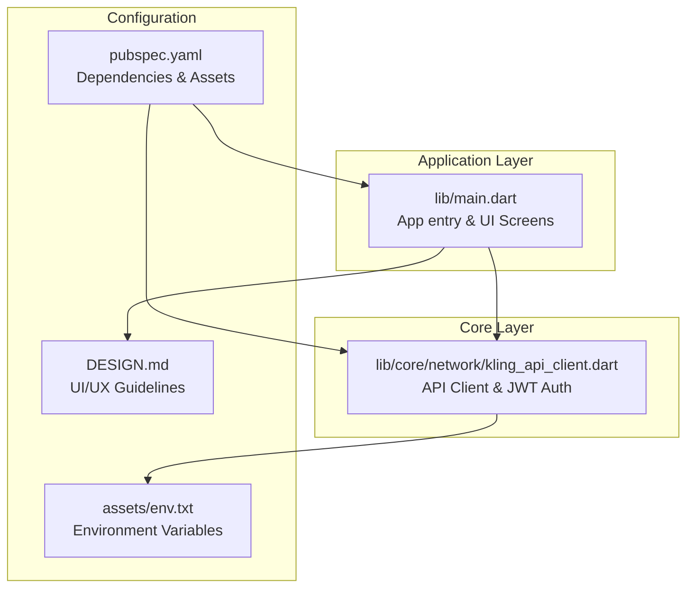
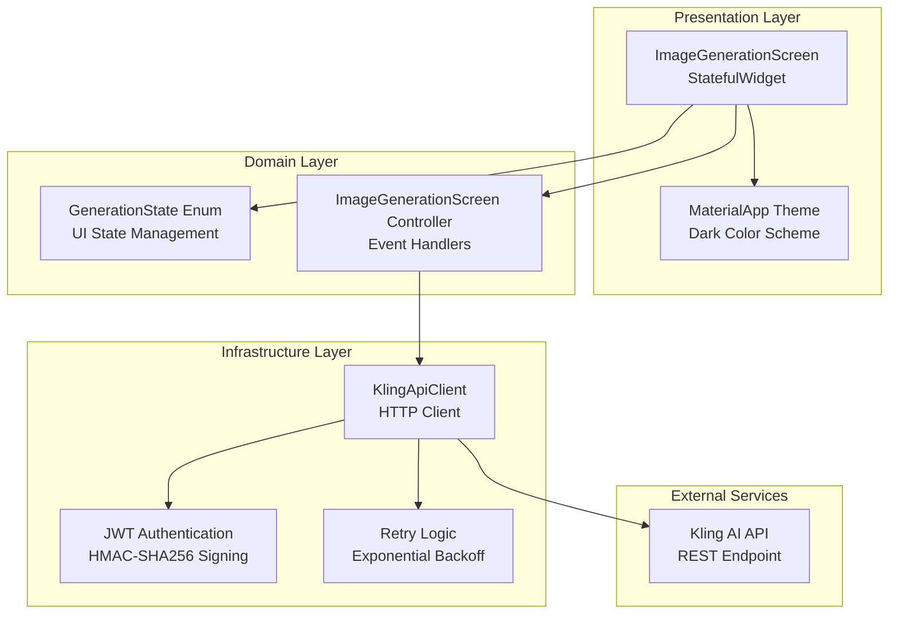
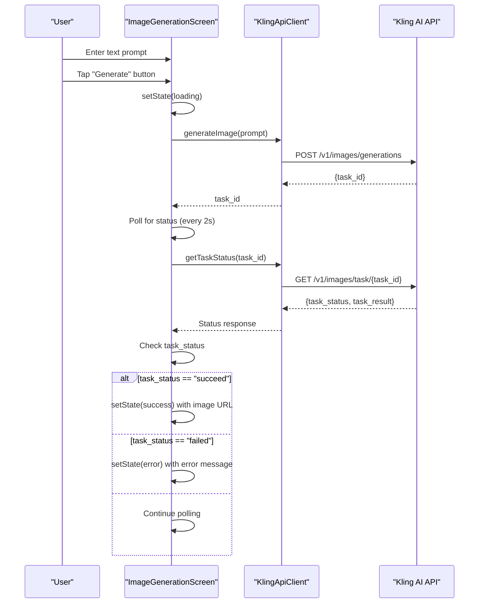
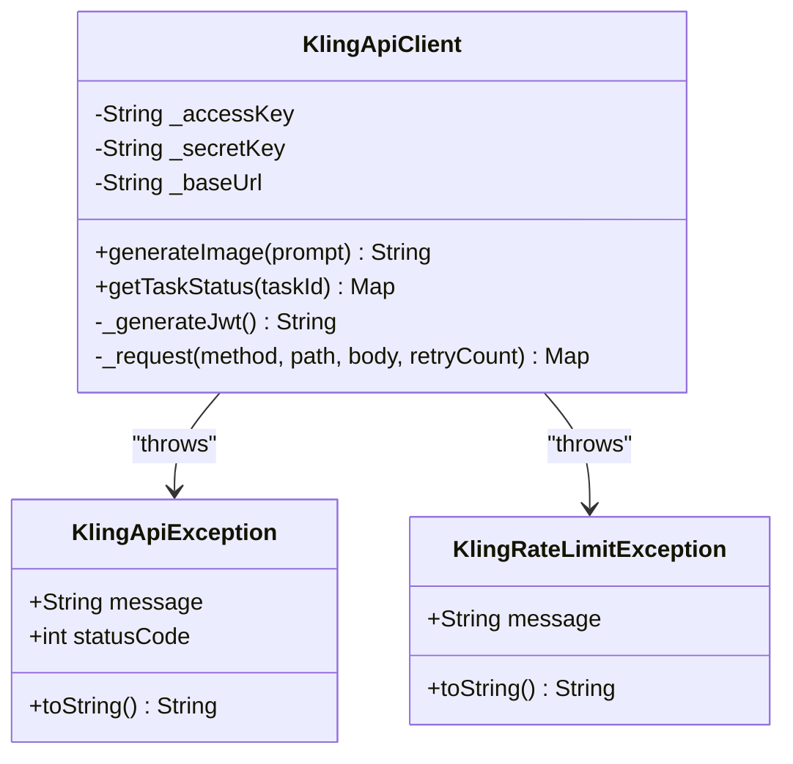

# Project Overview

<cite>
**Referenced Files in This Document**
- [README.md](file://README.md)
- [pubspec.yaml](file://pubspec.yaml)
- [lib/main.dart](file://lib/main.dart)
- [lib/core/network/kling_api_client.dart](file://lib/core/network/kling_api_client.dart)
- [env.txt](file://env.txt)
- [DESIGN.md](file://DESIGN.md)
</cite>

## Table of Contents
1. [Introduction](#introduction)
2. [Project Structure](#project-structure)
3. [Core Components](#core-components)
4. [Architecture Overview](#architecture-overview)
5. [Detailed Component Analysis](#detailed-component-analysis)
6. [Dependency Analysis](#dependency-analysis)
7. [Performance Considerations](#performance-considerations)
8. [Troubleshooting Guide](#troubleshooting-guide)
9. [Conclusion](#conclusion)

## Introduction
Kling AI Image Generation App is a Flutter-based mobile application that enables users to generate AI-powered images from text prompts. The app integrates with the Kling AI API to process user requests asynchronously, displaying generated images in a clean, dark-themed interface optimized for content-focused workflows.

Target audience:
- Content creators seeking quick visual ideation
- Developers exploring Flutter and AI API integrations
- Users who prefer minimal, distraction-free interfaces for creative tasks

Key features:
- Text-to-image generation via Kling AI API
- Asynchronous task polling with status updates
- Dark theme UI with Material Design components
- Responsive loading states and error handling
- Cross-platform support for Android and iOS

## Project Structure
The project follows a modular Flutter layout with clear separation of concerns:
- Application entry point and UI screens in lib/main.dart
- Networking layer encapsulated in lib/core/network/kling_api_client.dart
- Environment configuration via assets/env.txt
- Design system documentation in DESIGN.md
- Package dependencies and Flutter assets defined in pubspec.yaml

**Diagram sources**
- [lib/main.dart:1-191](file://lib/main.dart#L1-L191)
- [lib/core/network/kling_api_client.dart:1-99](file://lib/core/network/kling_api_client.dart#L1-L99)
- [env.txt:1-3](file://env.txt#L1-L3)
- [pubspec.yaml:1-83](file://pubspec.yaml#L1-L83)
- [DESIGN.md:1-59](file://DESIGN.md#L1-L59)

**Section sources**
- [lib/main.dart:1-191](file://lib/main.dart#L1-L191)
- [lib/core/network/kling_api_client.dart:1-99](file://lib/core/network/kling_api_client.dart#L1-L99)
- [pubspec.yaml:1-83](file://pubspec.yaml#L1-L83)
- [DESIGN.md:1-59](file://DESIGN.md#L1-L59)

## Core Components
The application comprises two primary components:

1) UI and State Management (lib/main.dart):
- MyApp: MaterialApp wrapper with dark theme configuration
- ImageGenerationScreen: StatefulWidget managing prompt input, generation flow, and result display
- GenerationState enum: Tracks UI state transitions (idle, loading, success, error)
- Integration with KlingApiClient for asynchronous image generation

2) Networking and Authentication (lib/core/network/kling_api_client.dart):
- KlingApiClient: Encapsulates API communication with Kling AI
- JWT token generation using HMAC-SHA256 signing
- Request retry logic for rate limits and server errors
- Task-based image generation with polling for completion status

**Section sources**
- [lib/main.dart:28-191](file://lib/main.dart#L28-L191)
- [lib/core/network/kling_api_client.dart:21-99](file://lib/core/network/kling_api_client.dart#L21-L99)

## Architecture Overview
The app follows a layered architecture pattern with clear separation between presentation, business logic, and data access layers.

**Diagram sources**
- [lib/main.dart:8-26](file://lib/main.dart#L8-L26)
- [lib/main.dart:30-191](file://lib/main.dart#L30-L191)
- [lib/core/network/kling_api_client.dart:21-99](file://lib/core/network/kling_api_client.dart#L21-L99)

The architecture emphasizes:
- Separation of concerns through distinct layers
- Asynchronous task processing with polling
- Robust error handling and retry mechanisms
- Clean UI state management with enum-based states

## Detailed Component Analysis

### Image Generation Workflow
The core user journey follows a structured sequence from prompt input to image display:

**Diagram sources**
- [lib/main.dart:50-90](file://lib/main.dart#L50-L90)
- [lib/core/network/kling_api_client.dart:79-97](file://lib/core/network/kling_api_client.dart#L79-L97)

### API Client Implementation
The networking layer implements robust communication with the Kling AI service:

**Diagram sources**
- [lib/core/network/kling_api_client.dart:21-99](file://lib/core/network/kling_api_client.dart#L21-L99)

**Section sources**
- [lib/main.dart:50-90](file://lib/main.dart#L50-L90)
- [lib/core/network/kling_api_client.dart:21-99](file://lib/core/network/kling_api_client.dart#L21-L99)

## Dependency Analysis
The project leverages a focused set of dependencies optimized for mobile development and AI API integration:

```mermaid
graph LR
subgraph "Flutter Framework"
Flutter["flutter:<br/>Material Design Widgets"]
DotEnv["flutter_dotenv:<br/>Environment Variable Loading"]
Http["http:<br/>HTTP Client Library"]
Crypto["crypto:<br/>HMAC-SHA256 Signing"]
end
subgraph "Application"
Main["lib/main.dart"]
Client["lib/core/network/kling_api_client.dart"]
Env["assets/env.txt"]
end
Main --> Flutter
Main --> Client
Client --> Http
Client --> Crypto
Main --> DotEnv
DotEnv --> Env
```

**Diagram sources**
- [pubspec.yaml:30-45](file://pubspec.yaml#L30-L45)
- [lib/main.dart:1-6](file://lib/main.dart#L1-L6)
- [lib/core/network/kling_api_client.dart:1-5](file://lib/core/network/kling_api_client.dart#L1-L5)

**Section sources**
- [pubspec.yaml:30-45](file://pubspec.yaml#L30-L45)
- [pubspec.yaml:47-51](file://pubspec.yaml#L47-L51)

## Performance Considerations
- Asynchronous polling reduces UI blocking during image generation
- Exponential backoff retry mechanism prevents API saturation
- JWT tokens expire hourly, minimizing authentication overhead
- Network timeouts prevent indefinite hanging requests
- Material Design components ensure efficient rendering on mobile devices

## Troubleshooting Guide
Common issues and resolutions:

1) Authentication failures:
- Verify KLING_ACCESS_KEY and KLING_SECRET_KEY in env.txt
- Ensure proper JWT token generation with correct secret key
- Check network connectivity to api.klingai.com

2) Rate limiting:
- Implement exponential backoff (already built-in)
- Monitor API quota usage
- Add user feedback for retry attempts

3) Network errors:
- Verify internet connection
- Check firewall/proxy settings
- Review timeout configurations

4) UI state inconsistencies:
- Ensure setState() calls occur within widget lifecycle
- Validate GenerationState transitions
- Check for proper error state handling

**Section sources**
- [lib/core/network/kling_api_client.dart:59-77](file://lib/core/network/kling_api_client.dart#L59-L77)
- [lib/main.dart:84-89](file://lib/main.dart#L84-L89)

## Conclusion
Kling AI Image Generation App demonstrates a clean, modular approach to building Flutter applications that integrate with external AI services. The architecture balances simplicity with robustness, providing a solid foundation for AI-powered mobile experiences. The project showcases effective separation of concerns, comprehensive error handling, and thoughtful UI/UX design principles that prioritize user focus and productivity.