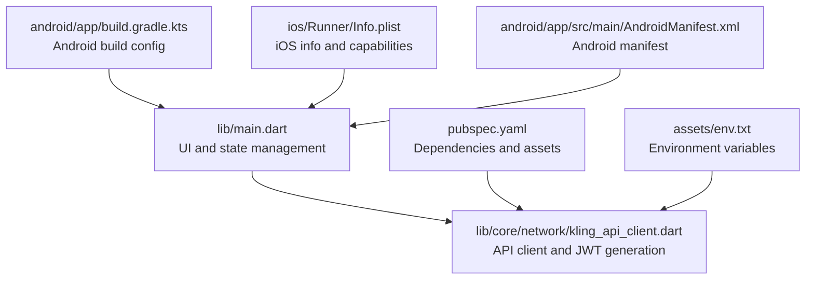
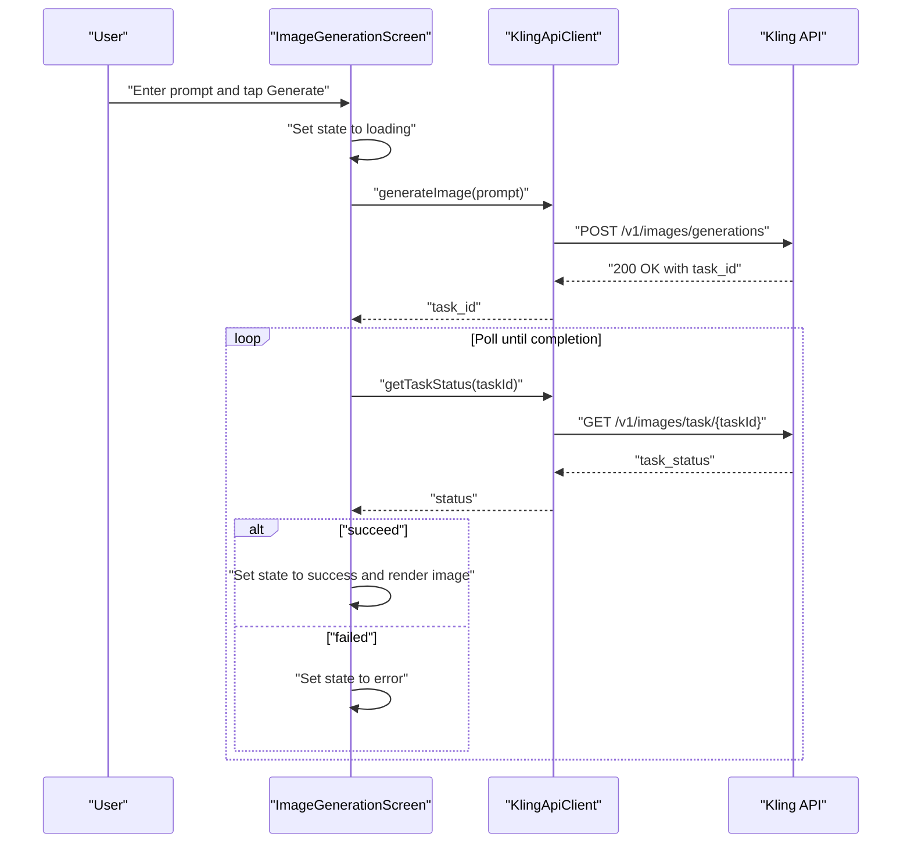
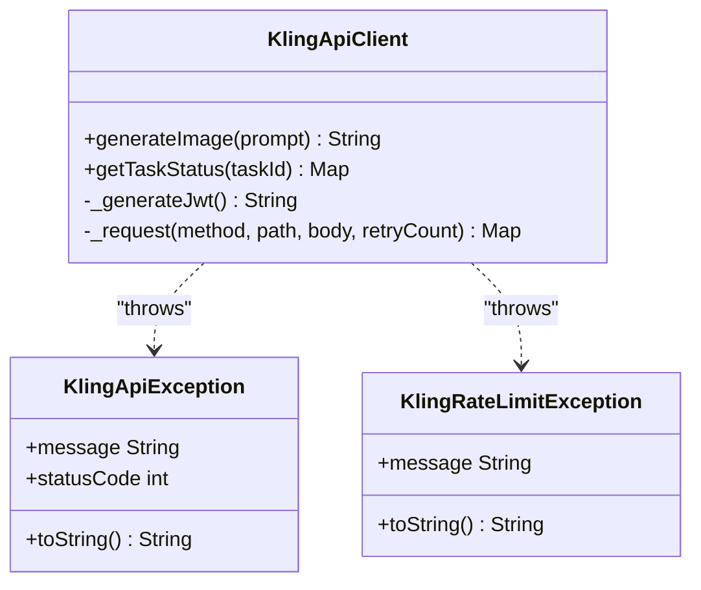
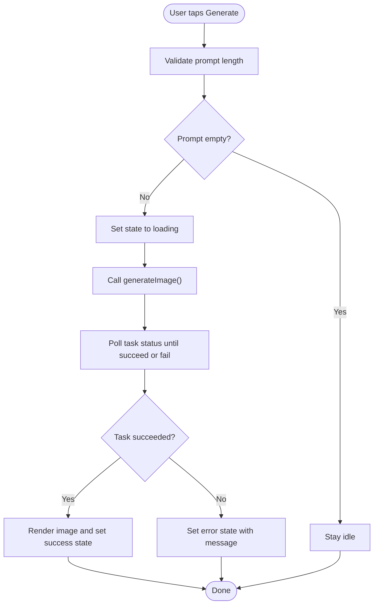
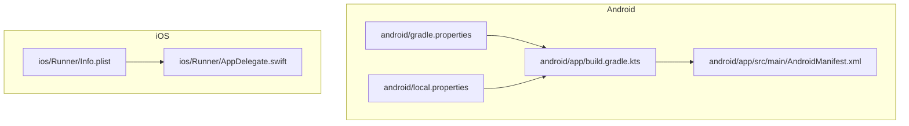
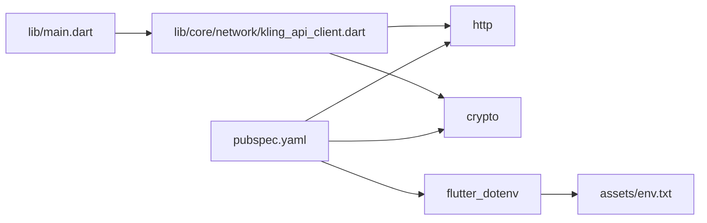

# Troubleshooting & FAQ

<cite>
**Referenced Files in This Document**
- [lib/main.dart](file://lib/main.dart)
- [lib/core/network/kling_api_client.dart](file://lib/core/network/kling_api_client.dart)
- [pubspec.yaml](file://pubspec.yaml)
- [env.txt](file://env.txt)
- [assets/env.txt](file://assets/env.txt)
- [android/app/build.gradle.kts](file://android/app/build.gradle.kts)
- [android/app/src/main/AndroidManifest.xml](file://android/app/src/main/AndroidManifest.xml)
- [android/gradle.properties](file://android/gradle.properties)
- [android/local.properties](file://android/local.properties)
- [ios/Runner/AppDelegate.swift](file://ios/Runner/AppDelegate.swift)
- [ios/Runner/Info.plist](file://ios/Runner/Info.plist)
- [README.md](file://README.md)
</cite>

## Table of Contents
1. [Introduction](#introduction)
2. [Project Structure](#project-structure)
3. [Core Components](#core-components)
4. [Architecture Overview](#architecture-overview)
5. [Detailed Component Analysis](#detailed-component-analysis)
6. [Dependency Analysis](#dependency-analysis)
7. [Performance Considerations](#performance-considerations)
8. [Troubleshooting Guide](#troubleshooting-guide)
9. [Conclusion](#conclusion)
10. [Appendices](#appendices)

## Introduction
This section provides a comprehensive troubleshooting guide and FAQ for the Kling AI Image Generation App. It focuses on diagnosing and resolving common issues such as network connectivity problems, API authentication failures, rate limit handling, and platform-specific build errors. It also covers systematic debugging approaches for state management issues, API integration problems, UI rendering challenges, performance bottlenecks, memory-related concerns, and platform compatibility. Practical diagnostic techniques, error code interpretation, log analysis strategies, and resolution workflows are included to help developers and users resolve issues quickly.

## Project Structure
The application is a Flutter project with platform-specific configurations for Android and iOS. The core logic resides in the main screen widget and the API client module. Environment variables for credentials are stored under assets and loaded via the dot-env package. Platform build files define SDK versions, signing, and manifest entries.

**Diagram sources**
- [lib/main.dart](file://lib/main.dart)
- [lib/core/network/kling_api_client.dart](file://lib/core/network/kling_api_client.dart)
- [pubspec.yaml](file://pubspec.yaml)
- [assets/env.txt](file://assets/env.txt)
- [android/app/build.gradle.kts](file://android/app/build.gradle.kts)
- [android/app/src/main/AndroidManifest.xml](file://android/app/src/main/AndroidManifest.xml)
- [ios/Runner/Info.plist](file://ios/Runner/Info.plist)

**Section sources**
- [lib/main.dart](file://lib/main.dart)
- [pubspec.yaml](file://pubspec.yaml)
- [assets/env.txt](file://assets/env.txt)

## Core Components
- UI and state management: The main screen widget manages four states (idle, loading, success, error) and orchestrates user input, button states, and image rendering. It integrates with the API client to generate images and poll task status.
- API client: Implements JWT-based authentication, request retries, and robust error handling for network and server-side failures. It exposes methods to submit generation requests and poll task completion.

Key responsibilities:
- State transitions and UI updates
- Prompt validation and submission
- Polling task status until completion or failure
- Rendering success/error states and displaying images

**Section sources**
- [lib/main.dart](file://lib/main.dart)
- [lib/core/network/kling_api_client.dart](file://lib/core/network/kling_api_client.dart)

## Architecture Overview
The app follows a straightforward MVVM-like pattern:
- UI layer (main screen) handles user interactions and renders states
- Business logic layer (state machine) controls transitions and polling
- Data access layer (API client) encapsulates HTTP communication and authentication

**Diagram sources**
- [lib/main.dart](file://lib/main.dart)
- [lib/core/network/kling_api_client.dart](file://lib/core/network/kling_api_client.dart)

## Detailed Component Analysis

### API Client: Authentication, Retries, and Error Handling
- JWT generation: Uses HS256 with issuer, expiration, and issued-at claims. The secret and access key are embedded constants.
- Request lifecycle: Adds Authorization header, applies timeouts, and retries on rate limits or server errors up to a bounded number of attempts.
- Error types: Distinguishes between network errors, invalid response formats, rate limit exceptions, and generic API failures.

**Diagram sources**
- [lib/core/network/kling_api_client.dart](file://lib/core/network/kling_api_client.dart)

**Section sources**
- [lib/core/network/kling_api_client.dart](file://lib/core/network/kling_api_client.dart)

### UI and State Management: Generation States and Rendering
- States: idle, loading, success, error
- Behavior: Disables the generate button during loading, shows a progress indicator, renders an image upon success, and displays an error message on failure.
- Image rendering: Uses network image with BoxFit containment and rounded corners.

**Diagram sources**
- [lib/main.dart](file://lib/main.dart)

**Section sources**
- [lib/main.dart](file://lib/main.dart)

### Platform-Specific Build Configurations
- Android: Defines compile/target SDK, JVM target, signing config, and Flutter source location. Manifest enables hardware acceleration and declares queries.
- iOS: Provides bundle identifiers, supported orientations, and launch storyboard configuration.

**Diagram sources**
- [android/app/build.gradle.kts](file://android/app/build.gradle.kts)
- [android/app/src/main/AndroidManifest.xml](file://android/app/src/main/AndroidManifest.xml)
- [android/gradle.properties](file://android/gradle.properties)
- [android/local.properties](file://android/local.properties)
- [ios/Runner/Info.plist](file://ios/Runner/Info.plist)
- [ios/Runner/AppDelegate.swift](file://ios/Runner/AppDelegate.swift)

**Section sources**
- [android/app/build.gradle.kts](file://android/app/build.gradle.kts)
- [android/app/src/main/AndroidManifest.xml](file://android/app/src/main/AndroidManifest.xml)
- [android/gradle.properties](file://android/gradle.properties)
- [android/local.properties](file://android/local.properties)
- [ios/Runner/Info.plist](file://ios/Runner/Info.plist)
- [ios/Runner/AppDelegate.swift](file://ios/Runner/AppDelegate.swift)

## Dependency Analysis
- Network and cryptography: The app depends on HTTP and crypto packages for requests and JWT signing.
- Environment loading: The dot-env package loads environment variables from assets for credentials.
- Asset configuration: The pubspec file registers the env asset for runtime loading.

**Diagram sources**
- [pubspec.yaml](file://pubspec.yaml)
- [assets/env.txt](file://assets/env.txt)
- [lib/main.dart](file://lib/main.dart)
- [lib/core/network/kling_api_client.dart](file://lib/core/network/kling_api_client.dart)

**Section sources**
- [pubspec.yaml](file://pubspec.yaml)
- [assets/env.txt](file://assets/env.txt)
- [lib/main.dart](file://lib/main.dart)
- [lib/core/network/kling_api_client.dart](file://lib/core/network/kling_api_client.dart)

## Performance Considerations
- Network timeouts: Requests are subject to a timeout to prevent indefinite waits.
- Retry strategy: Exponential backoff is applied for rate limits and server errors to avoid overwhelming the API.
- UI responsiveness: Loading state prevents duplicate submissions and keeps the interface responsive.
- Memory management: Avoid retaining large image buffers unnecessarily; rely on Flutter’s image caching and disposal patterns.

[No sources needed since this section provides general guidance]

## Troubleshooting Guide

### Network Connectivity Problems
Symptoms:
- UI remains in loading state indefinitely
- Error messages indicating network failures

Diagnostic steps:
- Verify device/emulator network access and DNS resolution
- Confirm the base URL and endpoint paths used by the API client
- Check for firewall or proxy restrictions blocking outbound HTTPS traffic

Resolution:
- Ensure the device has internet access
- Test the API endpoints with a generic HTTP client outside the app
- Review proxy and certificate trust settings if applicable

**Section sources**
- [lib/core/network/kling_api_client.dart](file://lib/core/network/kling_api_client.dart)

### API Authentication Failures
Symptoms:
- Immediate rejection with authentication-related errors
- Rate limit or unauthorized responses

Diagnostic steps:
- Confirm that the embedded access key and secret key are correct and not expired
- Verify JWT generation logic and header inclusion
- Inspect request headers and ensure Authorization bearer token is present

Resolution:
- Replace placeholder credentials with valid keys
- Regenerate JWT if clock skew or expiration issues are suspected
- Reinitialize the API client after updating credentials

**Section sources**
- [lib/core/network/kling_api_client.dart](file://lib/core/network/kling_api_client.dart)
- [env.txt](file://env.txt)
- [assets/env.txt](file://assets/env.txt)

### Rate Limit Handling
Symptoms:
- Repeated 429 responses or server-side 5xx errors
- Automatic retries followed by failure

Diagnostic steps:
- Monitor retry count and backoff intervals
- Check response status codes and error messages
- Validate that exponential backoff is applied and not exceeded

Resolution:
- Reduce request frequency or batch prompts
- Implement client-side throttling
- Adjust retry policy or increase wait time between attempts

**Section sources**
- [lib/core/network/kling_api_client.dart](file://lib/core/network/kling_api_client.dart)

### Platform-Specific Build Errors
Common issues and fixes:
- Android SDK/NDK/JDK mismatches
  - Ensure Java 11 compatibility and correct SDK/NDK versions
  - Align Gradle and Android Gradle Plugin versions
- iOS signing and entitlements
  - Verify bundle identifiers and provisioning profiles
  - Confirm Info.plist entries for supported orientations and launch storyboards
- Manifest and permissions
  - Confirm hardware acceleration and intent filters in Android manifest

**Section sources**
- [android/app/build.gradle.kts](file://android/app/build.gradle.kts)
- [android/app/src/main/AndroidManifest.xml](file://android/app/src/main/AndroidManifest.xml)
- [android/gradle.properties](file://android/gradle.properties)
- [android/local.properties](file://android/local.properties)
- [ios/Runner/Info.plist](file://ios/Runner/Info.plist)
- [ios/Runner/AppDelegate.swift](file://ios/Runner/AppDelegate.swift)

### State Management Issues
Symptoms:
- UI does not reflect loading or error states
- Duplicate submissions or inconsistent state transitions

Diagnostic steps:
- Log state transitions and confirm setState calls occur
- Validate button enable/disable logic based on current state
- Inspect polling loop termination conditions

Resolution:
- Ensure state is updated before initiating long-running operations
- Prevent concurrent submissions by disabling the generate button during loading
- Add explicit checks for null or empty responses before transitioning to success

**Section sources**
- [lib/main.dart](file://lib/main.dart)

### API Integration Problems
Symptoms:
- Task ID missing from response
- Polling returns unexpected statuses

Diagnostic steps:
- Verify request payloads and endpoint paths
- Inspect response parsing for task_id and task_status
- Confirm task polling interval and timeout behavior

Resolution:
- Correct payload fields and sizes per API specification
- Implement robust parsing with null checks and fallbacks
- Increase polling interval or reduce frequency to avoid throttling

**Section sources**
- [lib/core/network/kling_api_client.dart](file://lib/core/network/kling_api_client.dart)
- [lib/main.dart](file://lib/main.dart)

### UI Rendering Challenges
Symptoms:
- Images not displayed or distorted
- Progress indicators not visible

Diagnostic steps:
- Confirm image URL validity and accessibility
- Check BoxFit and container sizing
- Validate CircularProgressIndicator visibility and colors

Resolution:
- Ensure URLs are publicly accessible and not blocked by CORS
- Adjust container constraints and image fit
- Verify theme colors and contrast for progress indicators

**Section sources**
- [lib/main.dart](file://lib/main.dart)

### Performance and Memory Issues
Symptoms:
- Slow image loading or UI freezes
- Out-of-memory errors on devices with limited RAM

Diagnostic steps:
- Profile memory usage and image cache behavior
- Measure network latency and response sizes
- Monitor UI thread responsiveness during polling

Resolution:
- Use efficient image loading and caching strategies
- Implement pagination or reduced resolution for testing
- Optimize polling intervals and cancel ongoing tasks when leaving the screen

**Section sources**
- [lib/main.dart](file://lib/main.dart)
- [android/gradle.properties](file://android/gradle.properties)

### Platform Compatibility Concerns
Symptoms:
- App crashes on specific Android versions
- iOS app not appearing in landscape orientation

Diagnostic steps:
- Compare minSdk/targetSdk with device capabilities
- Verify Info.plist orientation settings and supported devices
- Check Android manifest hardware acceleration and meta-data

Resolution:
- Adjust SDK levels and capabilities to match target devices
- Update Info.plist to include desired orientations
- Confirm manifest entries for queries and activity metadata

**Section sources**
- [android/app/build.gradle.kts](file://android/app/build.gradle.kts)
- [android/app/src/main/AndroidManifest.xml](file://android/app/src/main/AndroidManifest.xml)
- [ios/Runner/Info.plist](file://ios/Runner/Info.plist)

### Error Codes and Log Analysis Strategies
Common error categories:
- Network errors: Socket exceptions indicate connectivity or DNS issues
- Format errors: JSON decode failures suggest malformed responses
- HTTP errors: Status codes outside 2xx require investigation
- Rate limit errors: 429 or 5xx with retryable responses
- Authentication errors: Unauthorized or invalid credentials

Log analysis tips:
- Capture request/response bodies and headers
- Record timestamps for retries and delays
- Correlate UI state logs with API events

Resolution workflows:
- For network errors: retry with exponential backoff, check connectivity
- For format errors: validate schema and handle partial responses
- For HTTP errors: inspect status codes and error payloads
- For rate limits: reduce frequency and implement client-side quotas
- For authentication: refresh tokens or re-enter credentials

**Section sources**
- [lib/core/network/kling_api_client.dart](file://lib/core/network/kling_api_client.dart)

### Frequently Asked Questions (FAQ)

Q1: How do I configure API credentials?
- Place valid access and secret keys in the environment file and load them via the dot-env package. Ensure the asset is registered in the pubspec and loaded at startup.

Q2: Why does the app show an error immediately after generating?
- Possible causes: invalid credentials, network issues, or API errors. Verify credentials, check connectivity, and review error messages.

Q3: How can I reduce rate limit errors?
- Space out requests, implement client-side throttling, and respect retry policies.

Q4: The image does not appear on Android/iOS.
- Ensure the URL is accessible, adjust container constraints, and verify theme colors for visibility.

Q5: How do I fix Android build errors?
- Align JDK/SDK/NDK versions, update Gradle plugin, and verify signing configs.

Q6: How do I fix iOS build errors?
- Confirm bundle identifiers, supported orientations, and launch storyboard settings.

Q7: The UI freezes during generation.
- Reduce polling frequency, optimize image loading, and ensure UI thread is not blocked.

Q8: How do I diagnose network connectivity issues?
- Test endpoints externally, check proxies/firewalls, and validate DNS resolution.

Q9: How do I handle authentication failures?
- Regenerate JWT, verify issuer/expiry, and reload credentials if changed.

Q10: How do I interpret error messages?
- Parse status codes, capture request/response logs, and correlate with retry attempts.

**Section sources**
- [pubspec.yaml](file://pubspec.yaml)
- [assets/env.txt](file://assets/env.txt)
- [lib/core/network/kling_api_client.dart](file://lib/core/network/kling_api_client.dart)
- [lib/main.dart](file://lib/main.dart)
- [android/app/build.gradle.kts](file://android/app/build.gradle.kts)
- [android/app/src/main/AndroidManifest.xml](file://android/app/src/main/AndroidManifest.xml)
- [ios/Runner/Info.plist](file://ios/Runner/Info.plist)

## Conclusion
By following the structured troubleshooting steps and leveraging the diagnostic techniques outlined above, most issues related to networking, authentication, rate limits, and platform builds can be resolved efficiently. Use the provided workflows to isolate problems, analyze logs, and apply targeted fixes. Keep dependencies updated, validate environment configurations, and monitor performance to maintain a reliable and responsive user experience.

## Appendices

### Setup and Configuration Checklist
- Load environment variables from assets
- Configure Android/iOS build settings
- Validate API endpoints and credentials
- Test network connectivity and proxy settings
- Verify UI state transitions and rendering

**Section sources**
- [pubspec.yaml](file://pubspec.yaml)
- [assets/env.txt](file://assets/env.txt)
- [android/app/build.gradle.kts](file://android/app/build.gradle.kts)
- [ios/Runner/Info.plist](file://ios/Runner/Info.plist)
- [lib/main.dart](file://lib/main.dart)