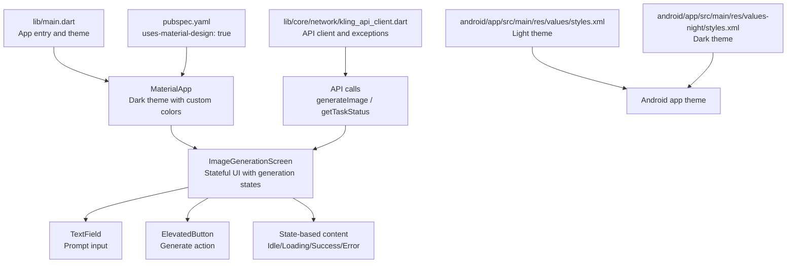
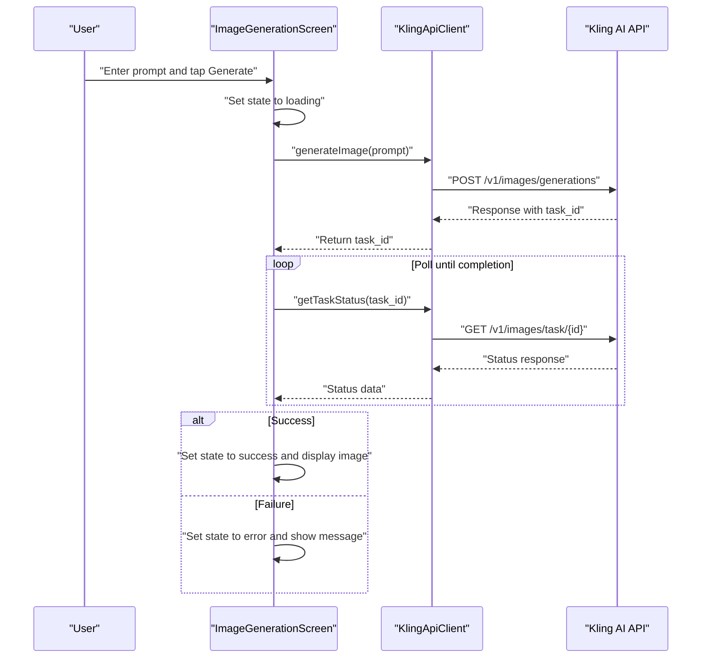
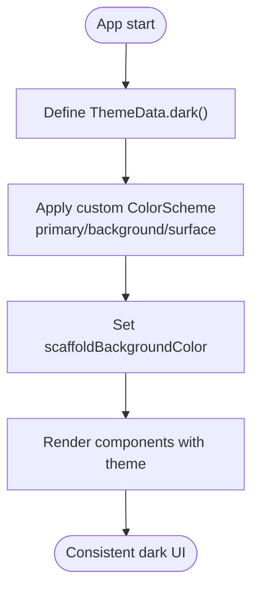
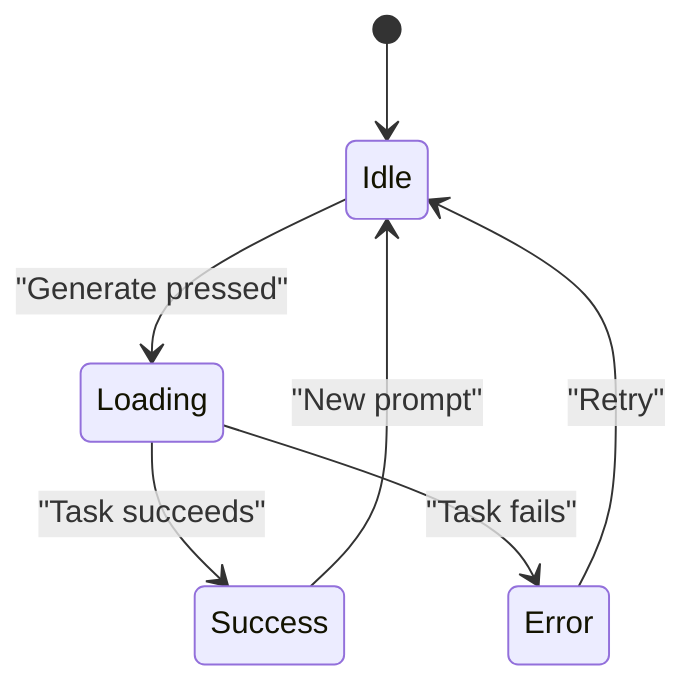
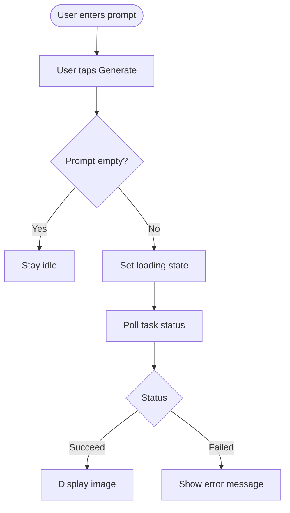
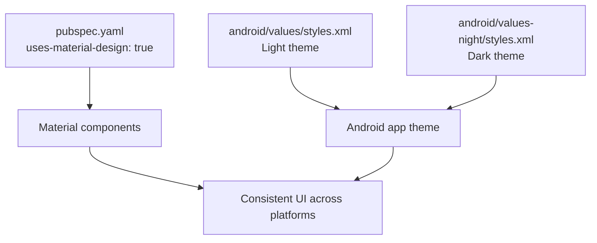
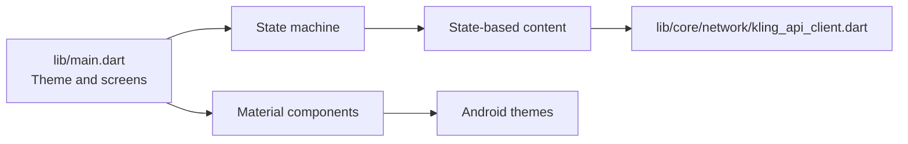

# UI/UX Design System

<cite>
**Referenced Files in This Document**
- [main.dart](file://lib/main.dart)
- [DESIGN.md](file://DESIGN.md)
- [pubspec.yaml](file://pubspec.yaml)
- [kling_api_client.dart](file://lib/core/network/kling_api_client.dart)
- [styles.xml](file://android/app/src/main/res/values/styles.xml)
- [styles.xml](file://android/app/src/main/res/values-night/styles.xml)
</cite>

## Table of Contents
1. [Introduction](#introduction)
2. [Project Structure](#project-structure)
3. [Core Components](#core-components)
4. [Architecture Overview](#architecture-overview)
5. [Detailed Component Analysis](#detailed-component-analysis)
6. [Dependency Analysis](#dependency-analysis)
7. [Performance Considerations](#performance-considerations)
8. [Troubleshooting Guide](#troubleshooting-guide)
9. [Conclusion](#conclusion)

## Introduction
This document describes the UI/UX design system of the Kling AI Image Generation App built with Flutter. It covers design principles, color scheme, typography, spacing, visual hierarchy, component library approach, state-based rendering, progress indicators, user feedback mechanisms, responsive design, accessibility, and cross-platform consistency. The application follows a dark theme aesthetic inspired by Linear and Notion, emphasizing minimalism, content focus, and smooth animations.

## Project Structure
The design system is implemented primarily in the main application entry point and supported by platform-specific Android themes. The Flutter application adheres to Material Design by enabling the Material icon set and using Material components. The design system documentation outlines a structured theme with dedicated color palettes, typography scales, spacing units, and component behaviors.

**Diagram sources**
- [main.dart:13-25](file://lib/main.dart#L13-L25)
- [main.dart:30-191](file://lib/main.dart#L30-L191)
- [kling_api_client.dart:21-99](file://lib/core/network/kling_api_client.dart#L21-L99)
- [pubspec.yaml:49-49](file://pubspec.yaml#L49-L49)
- [styles.xml:1-19](file://android/app/src/main/res/values/styles.xml#L1-L19)
- [styles.xml:1-19](file://android/app/src/main/res/values-night/styles.xml#L1-L19)

**Section sources**
- [main.dart:1-191](file://lib/main.dart#L1-L191)
- [pubspec.yaml:49-49](file://pubspec.yaml#L49-L49)
- [DESIGN.md:1-59](file://DESIGN.md#L1-L59)

## Core Components
The design system centers around a cohesive dark theme, consistent Material Design components, and a state-driven UI that communicates progress and outcomes clearly.

- Dark theme implementation
  - The app sets a dark theme with custom colorScheme values for primary, background, and surface colors. The scaffold background color is also customized to match the dark palette.
  - Android platform themes are configured for light and dark modes to ensure consistent appearance across platforms.

- Material Design guidelines adherence
  - Material icons are enabled via the pubspec configuration.
  - Components such as TextField, ElevatedButton, and AppBar are used consistently to align with Material Design patterns.

- Visual hierarchy and spacing
  - Typography scale includes headline, title, body, and label styles with distinct sizes and weights.
  - Spacing units are defined in terms of base multiples (e.g., 8px) and consistent paddings/margins across components.

- Component library approach
  - Reusable UI elements include a styled TextField for prompts, a primary ElevatedButton for actions, and state-aware content areas for idle, loading, success, and error states.

- State-based rendering system
  - A centralized enum defines four states: idle, loading, success, error.
  - The UI switches content based on state, displaying appropriate messages, progress indicators, and actionable feedback.

- Progress indicators and user feedback
  - Loading state uses a centered circular progress indicator with a white spinner for visibility against the dark background.
  - Success state displays the generated image with a rounded clip and appropriate fit.
  - Error state shows a red-colored error message with centered alignment for emphasis.

**Section sources**
- [main.dart:13-25](file://lib/main.dart#L13-L25)
- [main.dart:28-28](file://lib/main.dart#L28-L28)
- [main.dart:94-147](file://lib/main.dart#L94-L147)
- [main.dart:149-189](file://lib/main.dart#L149-L189)
- [pubspec.yaml:49-49](file://pubspec.yaml#L49-L49)
- [DESIGN.md:3-24](file://DESIGN.md#L3-L24)
- [DESIGN.md:25-30](file://DESIGN.md#L25-L30)
- [DESIGN.md:31-39](file://DESIGN.md#L31-L39)
- [DESIGN.md:41-44](file://DESIGN.md#L41-L44)

## Architecture Overview
The UI/UX design system integrates tightly with the application’s state machine and API client. The state machine controls the visual representation of the image generation flow, while the API client manages asynchronous requests and error propagation.

**Diagram sources**
- [main.dart:50-90](file://lib/main.dart#L50-L90)
- [kling_api_client.dart:79-97](file://lib/core/network/kling_api_client.dart#L79-L97)

## Detailed Component Analysis

### Dark Theme Implementation
The application establishes a cohesive dark theme with carefully chosen colors for primary, background, and surface tones. These colors are applied globally through the Material theme and locally within specific components to maintain consistency.

**Diagram sources**
- [main.dart:13-25](file://lib/main.dart#L13-L25)

**Section sources**
- [main.dart:13-25](file://lib/main.dart#L13-L25)

### State-Based Rendering System
The UI transitions between four states: idle, loading, success, and error. Each state renders different content and controls interactivity to guide the user through the image generation process.

**Diagram sources**
- [main.dart:28-28](file://lib/main.dart#L28-L28)
- [main.dart:149-189](file://lib/main.dart#L149-L189)

**Section sources**
- [main.dart:28-28](file://lib/main.dart#L28-L28)
- [main.dart:149-189](file://lib/main.dart#L149-L189)

### Progress Indicators and Feedback
During the loading phase, the UI presents a centered circular progress indicator along with a status message. On success, the generated image is displayed with rounded corners and appropriate scaling. On error, a red-colored message is shown to communicate failure.

**Diagram sources**
- [main.dart:50-90](file://lib/main.dart#L50-L90)
- [main.dart:158-187](file://lib/main.dart#L158-L187)

**Section sources**
- [main.dart:118-138](file://lib/main.dart#L118-L138)
- [main.dart:158-187](file://lib/main.dart#L158-L187)

### Cross-Platform UI Consistency
The design system ensures consistent UI across platforms by:
- Enabling Material Design icons via pubspec configuration.
- Defining Android themes for both light and dark modes to align with system preferences.
- Using Flutter Material components that adapt to platform conventions.

**Diagram sources**
- [pubspec.yaml:49-49](file://pubspec.yaml#L49-L49)
- [styles.xml:1-19](file://android/app/src/main/res/values/styles.xml#L1-L19)
- [styles.xml:1-19](file://android/app/src/main/res/values-night/styles.xml#L1-L19)

**Section sources**
- [pubspec.yaml:49-49](file://pubspec.yaml#L49-L49)
- [styles.xml:1-19](file://android/app/src/main/res/values/styles.xml#L1-L19)
- [styles.xml:1-19](file://android/app/src/main/res/values-night/styles.xml#L1-L19)

## Dependency Analysis
The design system relies on the Material framework and platform themes, while the state machine orchestrates UI updates. The API client encapsulates network concerns and exceptions, feeding the UI with reliable state transitions.

**Diagram sources**
- [main.dart:13-25](file://lib/main.dart#L13-L25)
- [main.dart:30-191](file://lib/main.dart#L30-L191)
- [kling_api_client.dart:21-99](file://lib/core/network/kling_api_client.dart#L21-L99)

**Section sources**
- [main.dart:13-25](file://lib/main.dart#L13-L25)
- [kling_api_client.dart:21-99](file://lib/core/network/kling_api_client.dart#L21-L99)

## Performance Considerations
- Minimize rebuilds by scoping state changes to the smallest widget subtree necessary.
- Use placeholder or skeleton loaders during polling to reduce perceived latency.
- Optimize image rendering by controlling aspect ratio and fit to avoid layout thrashing.
- Debounce user input where appropriate to reduce unnecessary API calls.

## Troubleshooting Guide
Common issues and resolutions grounded in the current implementation:

- Empty prompt handling
  - The generate action is disabled when the prompt is empty, preventing invalid requests. Ensure the UI remains responsive and provides clear feedback when the field is empty.

- Network errors and rate limiting
  - The API client throws specific exceptions for network failures and rate limits. Surface user-friendly messages and provide retry mechanisms in the UI.

- Task polling reliability
  - The UI polls for task completion with a fixed interval. Consider exponential backoff or cancellation to improve responsiveness under load.

- Platform theme mismatches
  - Verify Android light/dark themes are applied correctly to avoid jarring transitions during app startup.

**Section sources**
- [main.dart:50-90](file://lib/main.dart#L50-L90)
- [kling_api_client.dart:6-19](file://lib/core/network/kling_api_client.dart#L6-L19)
- [kling_api_client.dart:59-77](file://lib/core/network/kling_api_client.dart#L59-L77)
- [styles.xml:1-19](file://android/app/src/main/res/values-night/styles.xml#L1-L19)

## Conclusion
The Kling AI Image Generation App employs a focused design system rooted in a dark theme, Material Design components, and a clear state machine. The system emphasizes visual consistency, meaningful feedback, and cross-platform harmony. By adhering to the documented design principles—color palette, typography, spacing, and component behaviors—the app delivers a polished and accessible user experience aligned with modern UI/UX best practices.